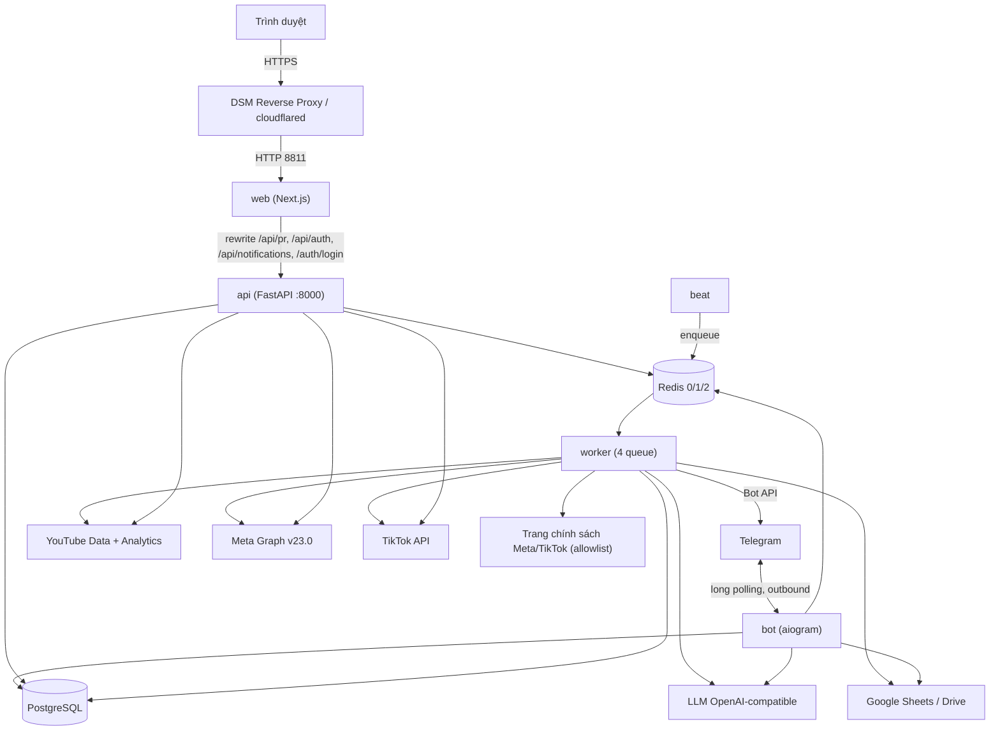

# 02 — Kiến trúc hệ thống

Tài liệu này mô tả kiến trúc runtime của MeoChat: service, luồng mạng, lưu trữ, worker và cấu hình.

## 1. Hình dạng tổng thể

**Modular monolith.** Một image Python (`meobot-app`) phục vụ bốn tiến trình chỉ khác nhau
ở `command`: `api` (uvicorn), `bot` (aiogram long polling), `worker` (Celery), `beat`
(Celery beat). Bảng điều khiển web là một image Node riêng (Next.js `output: "standalone"`,
`frontend/Dockerfile`). Không có microservice nghiệp vụ; mọi service dùng chung một
PostgreSQL và một Redis.

### Chiều phụ thuộc bắt buộc (`README.md` §2)

```
api/   bot/   tasks/          ← transport, entry point: parse → gọi service → format
        │
   application/               ← use case, ranh giới transaction, dựng đồ thị Pr* services
        │
 domain/   db/   integrations/ ← quy tắc thuần | ORM + session | bên thứ ba (protocol + fake + NotConfigured)
        │
      core/                   ← config, logging (có redaction), errors, time, request context
```

Quy tắc cứng:

- `domain/` không import aiogram, FastAPI, SQLAlchemy model hay SDK vendor; ví dụ máy trạng
  thái nội dung `src/meobot/domain/pr/workflow.py` và luật kế toán
  `src/meobot/domain/pr/work_results.py` là Python + Pydantic thuần.
- Router và handler không chứa nghiệp vụ; thẩm quyền quyết trong service qua
  `PrCapabilityService.require` (`src/meobot/application/pr_capability_service.py:164-231`).
  Ngoại lệ đã biết: `PATCH /contents/{id}/targets/{tid}` ghi ORM thẳng trong router
  (`src/meobot/api/routers/pr.py:1622-1646`), xem [07_CODEBASE_MAP.md](07_CODEBASE_MAP.md) §"chưa nhất quán".
- `tools/` được phép import `application/`; `application/__init__.py` cố ý rỗng để tránh vòng import.
- Một chỗ duy nhất dựng đồ thị service: `build_pr_services`
  (`src/meobot/application/pr_services.py`), được cả `api/deps.py:209-219` lẫn
  `tools/pr_support.py:49-58` gọi.

## 2. Topology service (`docker-compose.yml`)

| Service | Mục đích | Image / build | Command | Cổng | depends_on | Volume | Healthcheck | RAM |
|---|---|---|---|---|---|---|---|---|
| `postgres` | DB nghiệp vụ | `postgres:17-alpine` | mặc định | **không publish** | — | `meobot_postgres_data:/var/lib/postgresql/data` | `pg_isready` 10s | 768M |
| `redis` | broker + result backend | `redis:7-alpine` | `redis-server --appendonly yes --maxmemory 192mb --maxmemory-policy noeviction` | **không publish** | — | `meobot_redis_data:/data` | `redis-cli ping` | 256M |
| `api` | FastAPI | build `./Dockerfile` → `meobot-app:0.3.0` | `uvicorn meobot.api.main:app --host 0.0.0.0 --port 8000 --workers 1 --no-access-log` | `127.0.0.1:8810→8000` | postgres, redis (healthy) | `./secrets:/run/secrets:ro` | `python -c urlopen /health/live` 30s | 512M |
| `bot` | aiogram | cùng image | `python -m meobot.bot.main` | không | postgres, redis | `./secrets:/run/secrets:ro` | không có | 384M |
| `worker` | Celery | cùng image | `celery -A meobot.tasks.celery_app worker --queues q_default,q_integrations,q_reports,q_notifications --concurrency 2` | không | postgres, redis | `./secrets:/run/secrets:ro` | `celery inspect ping -t 10` 60s | 512M |
| `beat` | lịch định kỳ | cùng image | `celery -A meobot.tasks.celery_app beat --schedule /var/lib/meobot-beat/celerybeat-schedule` | không | postgres, redis | `meobot_beat_data:/var/lib/meobot-beat` | không có | 256M |
| `web` (profile `web`) | Next.js | build `./frontend/Dockerfile` | `node server.js` | `127.0.0.1:8811→3000` | api (healthy) | không | `node fetch /auth/failed` 30s | 256M |
| `cloudflared` (profile `tunnel`) | tunnel OAuth callback | `cloudflare/cloudflared:2025.2.0` | `tunnel --no-autoupdate run` | không | api | không | không | 128M |

Ghi chú:

- Mọi service app dùng chung anchor `x-app-env` (`docker-compose.yml:5-92`) và **không có
  `env_file:`**. Chỉ biến nằm trong anchor mới tới container; `.env` chỉ được Compose dùng để
  nội suy `${VAR}`. 44 biến trong `.env.example` không có trong anchor → xem
  [13_KNOWN_ISSUES_AND_TECH_DEBT.md](13_KNOWN_ISSUES_AND_TECH_DEBT.md) (P1-1).
- `web` nhận riêng `MEOBOT_API_URL=http://api:8000`, `HOSTNAME=0.0.0.0`, `WEB_COOKIE_SECURE`, `TZ`
  (`docker-compose.yml:232-249`). Trình duyệt không bao giờ thấy địa chỉ API.
- Log: `json-file`, `max-size 10m`, `max-file 3` cho mọi service (`docker-compose.yml:105-109`).
- `secrets/` mount theo **thư mục** để file thiếu không bị Docker tạo thành thư mục rỗng
  (`docker-compose.yml:94-103`). Tệp `docker-compose.override.yml` được Compose tự nạp ở mọi
  lệnh và đặc thù cho một host: nó bind-mount **tệp** `./secrets/google-service-account.json`
  (`docker-compose.override.yml:4,8,12`), trái với lý do mount theo thư mục ở trên; chỉ giữ
  tệp này nếu host của bạn thực sự cần nó.
- `docker-compose.dev.yml` mount `./src ./alembic ./tests` chỉ đọc, bật `--reload` với polling,
  nhưng worker dev **bỏ `q_notifications`** (`docker-compose.dev.yml:53-54`) → outbox và lịch
  nhắc không bao giờ được gửi khi `make up-dev` (P1-6).

## 3. Luồng mạng



- **Web → API:** `frontend/next.config.mjs:36-55` rewrite bốn tiền tố sang
  `MEOBOT_API_URL`; fetch phía client dùng đường dẫn tương đối và `credentials: "same-origin"`
  (`frontend/src/lib/api.ts:108-140`). Cookie `meobot_web_session` do FastAPI đặt
  (`src/meobot/api/routers/web_auth.py:53-63`). CSRF dựa trên `SameSite=Strict` + cùng origin;
  CORS chỉ bật khi `WEB_EXTRA_ALLOWED_ORIGINS` có giá trị (`src/meobot/api/main.py:98-116`).
- **Reverse proxy:** DSM Login Portal trỏ HTTPS → `localhost:8811` (web, **không** phải 8810),
  theo `docs/pr/STEP_1E1_DEPLOYMENT_CHECKLIST.md` §7. Uvicorn không bật `proxy_headers`
  nên `created_ip` của phiên là địa chỉ proxy.
- **Telegram:** chỉ outbound (`bot/main.py:221-223`); không có webhook. Worker gửi tin qua
  `TelegramNotifier`.
- **OAuth callback:** `GET /api/pr/channels/connections/{youtube|meta|tiktok}/callback` cần
  URL công khai (`WEB_BASE_URL`), vì vậy mới có profile `tunnel`.

### Đường đi một thao tác ghi trên web

```mermaid
sequenceDiagram
  participant B as Trình duyệt
  participant W as Next.js (rewrite)
  participant A as FastAPI route
  participant D as CurrentActorDep
  participant S as Pr* service
  participant DB as PostgreSQL
  participant BE as beat
  participant WK as worker
  B->>W: POST /api/pr/contents/{id}/reviews (cookie)
  W->>A: proxy tới api:8000, cookie đi theo
  A->>D: resolve_session(cookie) → Actor (401 nếu không có)
  A->>S: record_decision(actor, ...)
  S->>DB: SELECT ... FOR UPDATE content
  S->>S: capabilities.require + require_approval (403 nếu thiếu)
  S->>DB: approval event + transition event + audit + request projection
  A->>DB: COMMIT (deps.py sở hữu transaction)
  A-->>B: 200 + body; frontend invalidate query
  BE->>WK: pr.sweep_content_work (30 s)
  WK->>DB: claim PENDING → RUNNING, project_content, SETTLED
```

Ranh giới transaction: request session commit khi route trả về bình thường
(`src/meobot/api/deps.py:71-78, 209-219`; `src/meobot/db/session.py:67-82`). Lỗi
`MeoBotError` được ánh xạ sang HTTP qua `_STATUS_MAP` (`src/meobot/api/main.py:74-82`) với
envelope `{"error": {code, message, details}}` cho `/api/pr`, `/api/auth`,
`/api/notifications`, `/auth/`.

## 4. Lưu trữ

### PostgreSQL (một database, Alembic head `0041`)

| Nhóm | Bảng / model tiêu biểu |
|---|---|
| Danh tính, truy cập | `users`, `audit_logs`, `confirmation_requests`, `web_sessions`, mã mời, chính sách group / khách / hạn mức (`src/meobot/db/models/access.py`) |
| Kịch bản legacy, Sheet, Drive | `scripts`, `script_versions`, `script_reviews`, `script_approvals`, `script_types`, sheet profile, thư mục Drive và spreadsheet đã tạo |
| Hội thoại, HR | bảng lượt hội thoại / tóm tắt (`PostgresStorage` FSM), `hr_requests` |
| Thông báo | `outbound_messages`, `delivery_attempts`, `telegram_chats`, `reminders`, `reminder_occurrences`, `deferred_guest_messages`, `message_dispatch_*`, `user_notifications` |
| PR core | `pr_content_items`, `pr_content_versions`, `pr_content_targets`, `pr_content_transition_events`, `pr_approval_events`, `pr_production_submissions`, `pr_content_resources`, `pr_content_derivatives`, `pr_content_comments`, `pr_tasks`, `pr_brands`, `pr_platforms`, `pr_channels`, phân công kênh |
| PR phân quyền, mã | `pr_user_capabilities`, `pr_user_capability_content_types`, `pr_user_capability_channels`, bộ đếm mã `CNT-`/`PUB-`/`WRK-` |
| AI review, chính sách | `pr_ai_reviews`, `pr_ai_review_runs`, `pr_ai_review_run_policy_packs`, `pr_platform_policy_sources/snapshots/packs/rules` |
| Báo cáo, kênh | `pr_reporting_periods`, `pr_publications`, `pr_channel_metric_snapshots`, `pr_issues`, `pr_channel_connections`, `pr_channel_oauth_states` |
| Work | `pr_work_types`, `pr_work_items`, `pr_work_contributions`, `pr_work_results`, `pr_work_evidence`, `pr_work_history`, `pr_work_recurring_templates`, `pr_work_recurring_template_contributors`, `pr_work_recurring_occurrences`, `pr_content_work_rules`, `pr_content_work_projections` |
| KPI, hiệu suất | `pr_work_plans`, `pr_work_quotas`, `pr_work_quota_allocations`, `pr_work_scoring_rules`, `pr_performance_policies`, `pr_performance_reviews`, `pr_performance_results`, `pr_performance_target_overrides`, `pr_work_score_allocations` |

Tên bảng chính xác: `src/meobot/db/models/*.py`. Mọi FK của module PR là `ON DELETE RESTRICT`
(test parity `tests/unit/test_pr_core_schema_parity.py:210`); ngoại lệ `audit_logs.actor_user_id`
là `SET NULL`. Xem [08_DATABASE_AND_MIGRATIONS.md](08_DATABASE_AND_MIGRATIONS.md).

### Redis

| DB | Dùng cho | Biến |
|---|---|---|
| 0 | chỉ dùng cho probe `/health/ready` (`health_service.py:117`); không có cache ứng dụng nào khác đọc nó | `REDIS_URL` |
| 1 | Celery broker | `CELERY_BROKER_URL` |
| 2 | Celery result backend (`result_expires=3600`) | `CELERY_RESULT_BACKEND` |

Redis chạy `noeviction` 192 MB với AOF `everysec`: nếu đầy, enqueue sẽ lỗi thay vì mất task.

### Khác

- `meobot_beat_data`: file lịch của beat, tái tạo được khi xoá (`docker/README.md`).
- `./secrets/` trên host: service account Google và (tuỳ chọn) tệp key mã hoá
  `PR_SECRET_ENCRYPTION_KEY_FILE`; không bao giờ vào git hay rsync.
- **Không lưu media.** Bản dựng, tài nguyên, bản phái sinh chỉ là liên kết/đường dẫn
  (`PrProductionArtifactType`: `DRIVE_LINK`, `NAS_LINK`, `NAS_PATH`, `EXTERNAL_LINK`).

## 5. Worker và lịch định kỳ

Cấu hình `src/meobot/tasks/celery_app.py`: JSON serializer, `timezone="UTC"`,
`task_acks_late=True`, `task_reject_on_worker_lost=True`, `task_time_limit=600` /
`soft=540`, `worker_prefetch_multiplier=1`, `worker_max_tasks_per_child=200`; danh sách
module `include=[...]` tường minh, **không autodiscover**. Bốn queue: `q_default`,
`q_integrations`, `q_reports` (không task nào enqueue vào), `q_notifications`.

`task_routes` gửi `pr.*` sang `q_integrations`, nhưng decorator `queue=` thắng: năm task
`pr.sweep_content_work`, `pr.project_content_work`, `pr.recover_stale_content_work`,
`pr.sweep_recurring_work`, `pr.generate_recurring_work` chạy ở `q_default`.

| Beat key | Task | Chu kỳ (biến · mặc định) | Queue |
|---|---|---|---|
| system-periodic-heartbeat | `system.periodic_heartbeat` | 300 s | q_default |
| sheets-sync-all-active-profiles | `sheets.sync_all_active_profiles` | `SHEET_SYNC_INTERVAL_SECONDS` · 1800 | q_integrations |
| scripts-review-pending | `scripts.review_pending` (legacy) | 900 s | q_default |
| notifications-drain-outbox | `notifications.drain_outbox` | 20 s | q_notifications |
| pr-sweep-content-work | `pr.sweep_content_work` | 30 s | q_default |
| pr-recover-stale-content-work | `pr.recover_stale_content_work` | 600 s | q_default |
| notifications-recover-stale | `notifications.recover_stale` | 300 s | q_notifications |
| conversations-cleanup-expired | `conversations.cleanup_expired` | 3600 s | q_default |
| drive-reconcile-created-spreadsheets | `drive.reconcile_created_spreadsheets` | 1800 s | q_integrations |
| reminders-sweep-due | `reminders.sweep_due` | `REMINDER_SWEEP_INTERVAL_SECONDS` · 60 | q_notifications |
| pr-sweep-channel-syncs | `pr.sweep_channel_syncs` | `PR_CHANNEL_SYNC_SWEEP_INTERVAL_SECONDS` · 3600 | q_integrations |
| pr-sweep-recurring-work | `pr.sweep_recurring_work` | `PR_RECURRING_SWEEP_INTERVAL_SECONDS` · 300 | q_default |
| pr-release-stale-channel-syncs | `pr.release_stale_channel_syncs` | 1800 s | q_integrations |
| notifications-sweep-destination-health | `notifications.sweep_destination_health` | `NOTIFICATION_DESTINATION_HEALTH_INTERVAL_SECONDS` · 1800 | q_notifications |
| pr-sweep-ai-review-runs | `pr.sweep_ai_review_runs` | `PR_AI_REVIEW_SWEEP_INTERVAL_SECONDS` · 20 | q_integrations |
| pr-refresh-policy-sources | `pr.refresh_policy_sources` | `PR_POLICY_REFRESH_INTERVAL_SECONDS` · 86400 | q_integrations |
| pr-recover-stale-ai-review-runs | `pr.recover_stale_ai_review_runs` | 300 s | q_integrations |
| notifications-purge-deferred-guest-messages | `notifications.purge_deferred_guest_messages` | 3600 s | q_notifications |

Các task "sweep" claim trong một transaction đã commit rồi mới `apply_async` từng mục; task
thực thi không có Celery retry (`pr.run_ai_review`, `pr.project_content_work`) mà ghi trạng
thái lỗi vào bảng chạy của mình. Bảng beat trong `README.md` §3 chỉ liệt kê 10/18 mục.
Chi tiết từng task: [05_WORK_KPI_PERFORMANCE.md](05_WORK_KPI_PERFORMANCE.md) (projection),
[04_CONTENT_WORKFLOW.md](04_CONTENT_WORKFLOW.md) (AI review), [12_TROUBLESHOOTING.md](12_TROUBLESHOOTING.md).

## 6. Sức khoẻ, log, cấu hình

- `GET /health/live`: 200 với tên app và `__version__`, không chạm gì
  (`src/meobot/api/routers/health.py:14-21`). Compose dùng cho healthcheck.
- `GET /health/ready`: ping PostgreSQL và Redis song song có timeout; 503 `degraded` nếu
  một bên hỏng (`src/meobot/application/health_service.py:80-127`). **Không bao giờ báo
  trạng thái worker**: `HealthService` được dựng không có `worker_ping`
  (`src/meobot/api/main.py:200`). Kiểm tra worker bằng `make worker-ping`.
- Log ra stdout, JSON (`LOG_FORMAT=json`) hoặc console; `RedactingFilter` che token bot,
  `Bearer`, mật khẩu DSN, `refresh_token`, `client_secret`... (`src/meobot/core/logging.py:22-104`);
  mỗi dòng mang `request_id` (middleware HTTP, header task Celery, bot middleware).
- Cấu hình: `Settings(BaseSettings)` với `env_file=".env"` đọc **từ CWD của tiến trình**
  (`src/meobot/core/config.py:40-46`); trong image không có `.env` (`.dockerignore:22-24`)
  nên container chỉ nhận biến từ anchor compose. Không trường nào bắt buộc ở tầng pydantic;
  `DATABASE_URL`/`POSTGRES_PASSWORD` bắt buộc ở tầng Compose, `TELEGRAM_BOT_TOKEN` ở `bot/main.py`.
  `APP_ENV=production` từ chối khởi động nếu `WEB_COOKIE_SECURE=false` hoặc `WEB_BASE_URL`
  không phải `https://` (`config.py:422-465`). Bảng biến: [11_DEPLOYMENT_AND_OPERATIONS.md](11_DEPLOYMENT_AND_OPERATIONS.md).

## 7. Quan sát được gì, chưa có gì

| Có | Chưa có |
|---|---|
| Healthcheck Compose từng service, `/health/ready` | Metrics (Prometheus/StatsD), tracing |
| Bảng chạy trong DB: `pr_ai_review_runs`, `pr_content_work_projections`, `outbound_messages` + `delivery_attempts`, `pr_work_recurring_occurrences`, `pr_channel_connections` (cột sync) | Cảnh báo chủ động cho hàng `FAILED` (projection, AI run) |
| Cảnh báo Telegram khi gửi tin thất bại vĩnh viễn (`DeliveryAlertService`) | Phân loại lỗi Telegram thực sự (luôn `UNKNOWN`, P1-4) |
| Log có `request_id` và redaction | Tập trung log ngoài `docker compose logs` |
| `scripts/check.sh` chạy tay | CI/CD, môi trường staging |
