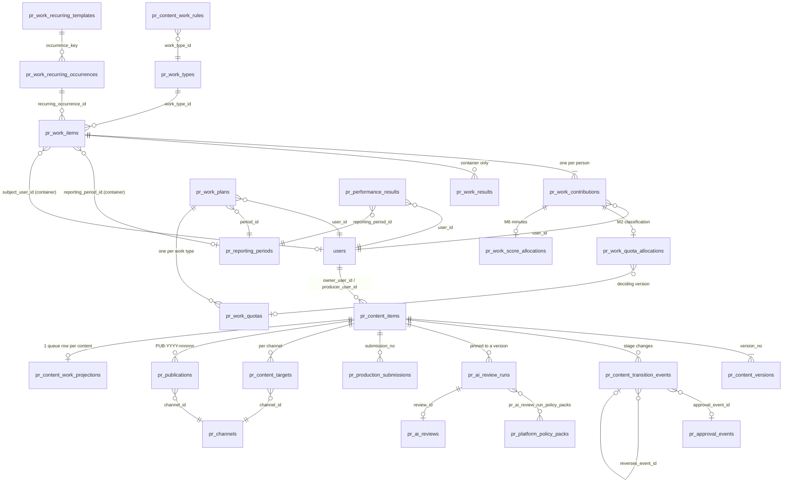
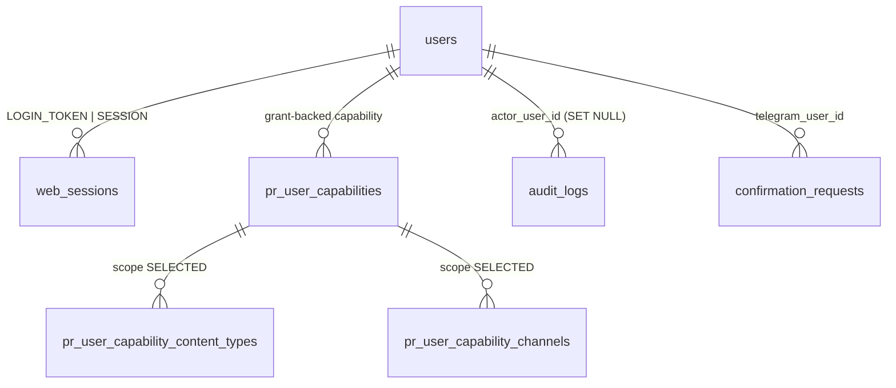

# 03 — Mô hình miền (Domain Model)

Tài liệu này mô tả **khái niệm** và **quan hệ** giữa các thực thể, không liệt kê từng cột. Mỗi miền có: mục đích, thực thể chính (bảng + lớp ORM), thành phần quyết định giá trị, service quan trọng, vòng đời, bất biến (và vì sao có), quyền, quan hệ. Chi tiết luồng xem [04_CONTENT_WORKFLOW.md](04_CONTENT_WORKFLOW.md), [05_WORK_KPI_PERFORMANCE.md](05_WORK_KPI_PERFORMANCE.md), [06_PERMISSIONS_AND_SECURITY.md](06_PERMISSIONS_AND_SECURITY.md).

Quy ước: `(legacy)` = còn trong mã chỉ để tương thích dữ liệu cũ.

## Sơ đồ tổng thể PR + Work

## Sơ đồ danh tính và xác thực

---

## 1. Người dùng / Thành viên (Users, Membership)

- **Mục đích:** một người thật dùng MeoBot (Telegram) và MeoChat (web). Không có bảng membership riêng: **một dòng `users` chính là tư cách thành viên** (`src/meobot/application/pr_membership_service.py:14-19`).
- **Thực thể:** `users` (`src/meobot/db/models/user.py`) với `telegram_user_id` unique nullable (`:261-263`), `role` một cột chuỗi (`:266-270`), `status` + cột bool `active` giữ đồng bộ (`:271-279`, `may_use_meobot` yêu cầu cả hai `:314-322`). Phiên web: `web_sessions` (`src/meobot/db/models/web_session.py:365-430`).
- **Enum:** `Role` = OWNER, ADMIN, TEAM_LEAD, EMPLOYEE (`src/meobot/domain/identity/models.py:11-17`, rank 40/30/20/10). `UserStatus` = pending, active, suspended, revoked (`src/meobot/domain/access/models.py:45-60`). **`PENDING` không bao giờ được gán** trong mã; nó chỉ được đếm ở roster (`pr_membership_service.py:191`).
- **Thành phần quyết định:** dòng `users`. Actor được dựng lại từ dòng này ở **mỗi** request web (`web_auth_service.py:270-290`) và mỗi update Telegram (`identity_service.py:43-80`).
- **Service:** `UserService` (vòng đời), `IdentityService` (resolve actor, bootstrap owner), `PrMembershipService` (chỉ đọc), `WebAuthService`.
- **Vòng đời:** `add_user` → active; `suspend` ↔ `enable`; `revoke` là cuối (không `enable` lại, `user_service.py:321-325`); `restore` tồn tại nhưng **không có nơi gọi** (`:381-404`). Người bị suspend/revoke: Telegram bị `ActorMiddleware` chặn (`bot/middlewares.py:281-293`), web nhận 401 ở request kế tiếp vì `resolve_session` kiểm tra `user.active` (`web_auth_service.py:287-290`).
- **Bootstrap owner:** `MEOBOT_OWNER_TELEGRAM_ID` tạo actor OWNER tổng hợp khi chưa có dòng (`identity_service.py:66-77`); `/start` vật chất hoá dòng và `_repair_owner` ép `role=OWNER, status=ACTIVE` (`:82-196`). Owner không có dòng thì không giữ grant và không dùng được `/web` (`pr_capability_service.py:191-199`, `bot/handlers/web.py:238-242`).
- **Bất biến:** chủ sở hữu không bị ai đụng tới, không tự đổi trạng thái/vai trò của mình, người thao tác phải có rank cao hơn mục tiêu (`_guard_target` `user_service.py:209-247`); không bao giờ cấp vai trò OWNER qua invite/role change (`domain/identity/invites.py:30-31`). Lý do: tránh tự thăng cấp và tránh mất chủ hệ thống.
- **Quyền:** `user.manage` (thêm), `user.status.manage` (OWNER), `user.role.manage` (OWNER), `user.read` (ADMIN+). Xem [06](06_PERMISSIONS_AND_SECURITY.md).

## 2. Quyền (Permissions)

Hai tầng: (a) ma trận `Permission` theo vai trò (`src/meobot/domain/permissions/matrix.py:263-408`); (b) 20 `PrCapability` (`src/meobot/domain/pr/policy.py:96-210`) mỗi cái ánh xạ tới một `Permission` nền (`:249-298`), trong đó **ba cổng duyệt** (`PR_TEAM_LEAD_REVIEW`, `PR_HEAD_REVIEW`, `PR_INTERNAL_REVIEW`) là **grant-backed** (`:306-312`): phải có dòng `pr_user_capabilities` còn hiệu lực, với phạm vi theo loại nội dung (`pr_user_capability_content_types`) và theo kênh (`pr_user_capability_channels`) (`src/meobot/db/models/pr_authorization.py:103-277`). Không có chiều "team". Chi tiết và bảng 20 capability: [06_PERMISSIONS_AND_SECURITY.md](06_PERMISSIONS_AND_SECURITY.md).

## 3. Nội dung (Content)

- **Mục đích:** một sản phẩm truyền thông (bài, video) đi từ ý tưởng đến đăng bài.
- **Thực thể chính (`src/meobot/db/models/pr.py`):**
  - `pr_content_items` (`PrContentItem`): mã `CNT-YYYY-nnnnnn`, `workflow_stage` (`:445-451`), `priority` (`:423-428`, enum `PrPriority` NORMAL/HIGH/URGENT/CRITICAL), `content_type` (`:442-444`), `owner_user_id`, `producer_user_id` (`:466-468`), `production_started_at` (`:473-475`), `archived_at` (`:486`), `brand_id`.
  - `pr_content_versions`: nội dung thật (title/topic/hook/brief) theo `version_no`; mọi cổng duyệt và AI review **ghim theo version** (xem [04](04_CONTENT_WORKFLOW.md)).
  - `pr_content_targets` (đích theo kênh, `PrContentTargetStatus` PLANNED/READY/PUBLISHED/CANCELLED, `PrDistributionMode` UNSPECIFIED/ORGANIC/PAID_AD) và `pr_content_destinations`.
  - `pr_content_resources` (tài nguyên khi tạo), `pr_content_derivatives` (đầu ra phái sinh), `pr_production_submissions` (bản dựng, `submission_no`, `PrProductionArtifactType` DRIVE_LINK/NAS_LINK/NAS_PATH/EXTERNAL_LINK), `pr_content_comments` (xoá mềm), `pr_publications` (mã `PUB-YYYY-nnnnnn`, `PrPublicationStatus` PUBLISHED/REMOVED/UNAVAILABLE/REVERSED, `src/meobot/domain/pr/reporting.py:75-97`).
  - Danh mục: `pr_brands`, `pr_platforms`, `pr_channels` (+ assignment người phụ trách kênh), `pr_channel_connections` (OAuth, xem §22).
- **Thành phần quyết định:** `workflow_stage` chỉ được ghi bởi `PrContentWorkflowService.apply` (`src/meobot/application/pr_workflow_service.py:300`; test grep `tests/unit/test_pr_workflow_policy.py:516-546`).
- **Service:** `PrContentService` (tạo/sửa/version), `PrContentWorkflowService`, `PrApprovalService`, `PrProductionService`, `PrPublicationService`, `PrContentLifecycleService` (xoá vĩnh viễn), `PrAvailableActionService`, `PrQueryService`/`pr_content_query.py` (đọc, bảng, phân trang).
- **Bất biến:** mã nội dung và mã đăng bài do service cấp, không bao giờ `MAX+1` (test `tests/unit/test_pr_authorization_schema_parity.py:23-31`); mọi FK trong PR là RESTRICT, xoá là nghiệp vụ tường minh (§24).

## 4. Luồng trạng thái nội dung (Content workflow)

- **Thực thể:** `pr_content_transition_events` (`src/meobot/db/models/pr_transition.py:83-134`): mỗi lần đổi stage một dòng, có `trigger` (`PrTransitionTrigger` MANUAL/AI_REVIEW/HUMAN_APPROVAL/UNDO/PUBLICATION), `approval_event_id`, `production_submission_id`, `content_version_id`, `reverses_event_id` và `reversed_by_event_id`. Một sự kiện "còn sống" là sự kiện có `reversed_by_event_id IS NULL`; đây là cách Undo và projection Work biết một mốc còn hiệu lực hay không.
- `pr_approval_events` (`PrApprovalEvent`): quyết định ở ba cổng (`PrApprovalStage` TEAM_LEAD_REVIEW/HEAD_REVIEW/INTERNAL_REVIEW, `PrApprovalDecision` APPROVED/REVISION_REQUIRED/REJECTED). Một approval bị undo **vẫn ở lại** bảng nhưng không còn là thẩm quyền (`is_effective_approval`, `pr_approval_service.py:116-134,652-664`).
- Chi tiết máy trạng thái, ma trận chuyển, Undo: [04_CONTENT_WORKFLOW.md](04_CONTENT_WORKFLOW.md).

## 5. AI review

- **Thực thể:** `pr_ai_review_runs` (`src/meobot/db/models/pr_ai_review_run.py`): trạng thái `PrAiReviewRunStatus` QUEUED/RUNNING/SUCCEEDED/FAILED/SUPERSEDED, `attempt_count`, `error_code`, ghim `content_version_id`; chỉ số partial unique cho run đang hoạt động (`:123-131`). `pr_ai_reviews`: kết quả (`PrAiReviewResult` PASS/PASS_WITH_WARNINGS/REVISION_REQUIRED), chỉ `FULL_REVIEW` là cổng (`src/meobot/domain/pr/workflow.py:219`). `pr_ai_review_run_policy_packs` ghim **gói chính sách** đã ACTIVE tại thời điểm xếp hàng.
- **Chính sách nền tảng:** `pr_platform_policy_sources/snapshots/packs/rules` (`src/meobot/db/models/pr_platform_policy.py:79-381`), ingest bằng CLI `meobot-policy`, kích hoạt pack **chỉ bằng CLI** (`src/meobot/cli/policy.py:21-28`); task `pr.refresh_policy_sources` chỉ chụp snapshot, không kích hoạt.
- **Thành phần quyết định:** run row ghi tiến trình; `pr_ai_reviews` ghi kết luận; verdict do Python suy từ mức độ phát hiện, không do model tự tuyên (`src/meobot/domain/pr/ai_review.py:161-172`).
- **Quyền:** ghi kết quả cần `Permission.SCRIPT_REVIEW` (`policy.py:362`); worker chạy với `system_actor` (`user_id=None`).

## 6–8. Ba cổng duyệt: Trưởng nhóm, Trưởng phòng, Nội bộ

Cùng một đường mã `PrApprovalService.record_decision` (`src/meobot/application/pr_approval_service.py:222`), cổng được **suy từ stage hiện tại** chứ không nhận từ request. Thẩm quyền = capability tương ứng **có grant** và phạm vi bao phủ nội dung (`require_approval`, `pr_capability_service.py:274-286`). "Trưởng phòng" là **capability `PR_HEAD_REVIEW`**, không phải vai trò; OWNER không có grant thì không duyệt được (`policy.py:70-79`). HEAD cần một approval Trưởng nhóm còn hiệu lực cho **cùng version** (`pr_approval_service.py:301-307,583-633`). Cổng nội bộ (INTERNAL_REVIEW) duyệt **bản dựng**, sự kiện mang `production_submission_id` (`:441-462`).

## 8. Sản xuất (Production)

- Trạng thái chuyển giao sản xuất `PrProductionHandoff` (WAITING_FOR_PRODUCER / READY_FOR_PRODUCTION / IN_PRODUCTION / IN_INTERNAL_REVIEW) là **suy ra**, không lưu (`src/meobot/domain/pr/production.py:71-94`).
- Người dựng: gán (`assign_producer`, cần `PR_PRODUCTION_ASSIGN`) hoặc tự nhận (`claim_production`, `UPDATE ... WHERE producer_user_id IS NULL`, `pr_production_service.py:315-319`). `START_PRODUCTION` đóng dấu `production_started_at` một lần; đây là mốc quyết định quy tắc xoá (§24).
- Bản dựng `pr_production_submissions` tăng `submission_no`; sửa chỉ được artifact/location/note và không được khi đã có publication tham chiếu (`:653-665`).

## 9. Loại công việc (PrWorkType)

- **Bảng** `pr_work_types` (`src/meobot/db/models/pr_work.py:103-187`): `code` unique, `category` (`PrWorkCategory`), `default_unit` (`PrWorkUnit`), `default_quota_basis` (`PrWorkQuotaBasis` ITEM_COUNT/QUANTITY), `requires_evidence`, `is_active`.
- Danh mục khởi tạo 13 dòng `BOOTSTRAP_WORK_TYPES` (`src/meobot/domain/pr/work_types.py:88-180`), CLI `meobot-work-types bootstrap` idempotent.
- **Không gian tên dành riêng** `CONTENT_AUTO_{KIND}_{CONTENT_TYPE}` (`src/meobot/domain/pr/content_work.py:361,380-394`): chỉ projector được tạo, người dùng bị từ chối (`pr_work_service.py:390-398`).
- **Bất biến:** `code` và `default_quota_basis` bị khoá khi đã có dữ liệu dùng (`work_types.py:56`, `pr_work_service.py:582-609`); không vô hiệu hoá loại đang được rule mapping active tham chiếu (`:763-803`). Lý do: đổi cơ sở tính sẽ làm sai số đã chốt.

## 10. Việc (PrWorkItem) — một việc hoặc một "container" theo tháng

- **Bảng** `pr_work_items` (`pr_work.py:190-423`). Hai hình thái trong một bảng:
  - **Việc đơn lẻ** (`reporting_period_id IS NULL`): một công việc thật có `quantity` cố định sao chép từ loại, vòng đời `PrWorkStatus` PROPOSED/ACCEPTED/IN_PROGRESS/COMPLETED/APPROVED/REJECTED/CANCELLED.
  - **Container theo kỳ** (`reporting_period_id` + `subject_user_id` đặt, `is_period_container` `:420-423`): một "dòng chảy" cho (loại việc × người × tháng), `quantity` là **tổng kết quả COUNTED**, không có hành động vòng đời (`_refuse_container`, `pr_work_service.py:3324-3344`).
- Nguồn gốc `PrWorkSourceType` MANUAL/CONTENT/TASK/RECURRING/SYSTEM, `source_key` dạng `{kind}:{uuid}:{UPPER}` chỉ được tạo bởi `work_source_key` (`src/meobot/domain/pr/work.py:534-577`), **so sánh chứ không parse**.
- **Việc nội dung legacy** `(legacy)`: `source_type=CONTENT AND reporting_period_id IS NULL`, tạo trước migration 0039 (`is_legacy_content_work_item`, `content_work.py:317-336`); các hàm `create_source_work/count_source_work/retype_source_work/reverse_source_work` còn phục vụ chúng.
- **Bất biến DB** (`pr_work.py:211-265`): `uq_pr_work_items_source` (idempotent theo nguồn), `uq_pr_work_items_period_container` (một container cho mỗi bộ ba), `derived_work_is_keyed`, `quantity_and_unit_together`.

## 11. Đóng góp (PrWorkContribution)

`pr_work_contributions` (`pr_work.py:426-512`): phần của **một người** trên **một việc** với `contribution_role` PRIMARY/CONTRIBUTOR/SUPPORT, `credit_weight` (0,1], và **`count_status` PENDING/COUNTED/EXCLUDED + `counted_at`** — đây là dòng mà M2 và M6 đọc. CHECK `counted_at_matches_status` (`:451-454`). Container luôn có đúng một contribution PRIMARY của subject, được `_sync_container` đồng bộ từ kết quả.

## 12. Kết quả (PrWorkResult)

`pr_work_results` (`src/meobot/db/models/pr_work_result.py:62-148`): một khai báo vào container ("+3 khách hàng", hoặc một mốc nội dung), `quantity > 0`, `source_type` `PrWorkResultSource` (hôm nay chỉ MANUAL và CONTENT được ghi), `status` tái dùng `PrWorkCountStatus`, `exclusion_kind` `PrWorkExclusionKind` ADMIN_REMOVED / VALIDATOR_REJECTED / SOURCE_REVERSED (`src/meobot/domain/pr/work_results.py:73-75`; NULL = loại trừ trước 0041). `uq_pr_work_results_source` (`:84-91`) là chốt idempotent cho projection. Chi tiết trạng thái, ai được xác nhận, cái gì không được hồi sinh: [05](05_WORK_KPI_PERFORMANCE.md).

## 13. Bằng chứng và lịch sử việc

`pr_work_evidence` (`pr_work.py:515-541`) và `pr_work_history` append-only (`:545-610`, `PrWorkEventType` 24 giá trị). **Khoá `origin` trong `event_metadata`** (SOURCE / WORK_VALIDATOR) là dữ liệu vận hành: thuật toán hội tụ đọc nó để biết ai đã đếm (`pr_work_result_service.py:1265-1307`). Không được bỏ ghi.

## 14. Chiếu Nội dung → Việc (Content→Work projection)

- `pr_content_work_rules` (`src/meobot/db/models/pr_content_work.py:79-178`): `(contribution_kind, content_type NULLABLE) → work_type_id`, `is_active`, `created_by_user_id` NULL = tự cấp (0040).
- `pr_content_work_projections` (`:226-263`): **đúng một dòng hàng đợi cho mỗi nội dung** (`uq_pr_content_work_projections_content` `:217`), trạng thái PENDING/RUNNING/SETTLED/FAILED, `attempts`, `last_outcome`, `last_error_code`.
- Mốc chiếu: `KIND_STAGE_MILESTONES` (`content_work.py:149-164`): CONTENT_CREATION = cạnh HEAD_REVIEW→APPROVED còn sống; PRODUCTION = bản dựng mới nhất + cạnh INTERNAL_REVIEW→READY_TO_PUBLISH còn sống; PUBLICATION đã thôi tự chiếu (`:106-111`).
- Khoá nguồn `content:{content_uuid}:{KIND}` (`:263-285`). Chi tiết pipeline, hội tụ, hồi sinh: [05](05_WORK_KPI_PERFORMANCE.md).

## 15. Việc định kỳ (Recurring work)

`pr_work_recurring_templates` (`src/meobot/db/models/pr_work_recurring.py:86-238`): tần suất `PrRecurringFrequency` DAILY/WEEKLY/MONTHLY, `run_time` giờ địa phương, `assignment_mode` SHARED_WORK/SEPARATE_PER_ASSIGNEE, `accumulate_by_period`, trạng thái `PrRecurringTemplateStatus` DRAFT/ACTIVE/PAUSED/ENDED, **con trỏ** `last_evaluated_occurrence_at`, `activated_by_user_id` là thẩm quyền thường trực. Người tham gia: `pr_work_recurring_template_contributors` (CASCADE duy nhất trong module). Lần phát sinh: `pr_work_recurring_occurrences` với `occurrence_key` `YYYYMMDDTHHMM` địa phương, `uq_template_occurrence`, trạng thái PENDING/GENERATED/SKIPPED_CLOSED_PERIOD/FAILED_RETRYABLE. Giới hạn bù `MAX_CATCH_UP_DAYS=45`, `MAX_OCCURRENCES_PER_SWEEP=30` (`src/meobot/domain/pr/recurring.py:180,188`).

## 16–18. KPI: kế hoạch, chỉ tiêu, phân loại (M2)

- `pr_work_plans` (`src/meobot/db/models/pr_work_quota.py`): **một người × một kỳ tháng × một phiên bản**, `PrWorkPlanStatus` DRAFT/APPROVED/SUPERSEDED/DISCARDED (`src/meobot/domain/pr/work_quota.py:97-118`), partial unique **≤1 APPROVED** và **≤1 DRAFT** mỗi (user, period) (`pr_work_quota.py:174-190`). Trạng thái xét duyệt EDITING/SUBMITTED/RETURNED là suy ra (`work_quota.py:121-159`). Không có kế hoạch theo team.
- `pr_work_quotas`: một dòng cho mỗi loại việc, `basis`, `target_value`, `eligibility_cap ≥ target_value`, unit theo loại. Chỉ tiêu nhập tay, không suy từ lịch.
- `pr_work_quota_allocations`: **một dòng cho mỗi contribution** (`:498`), trạng thái `PrWorkQuotaStatus` NO_QUOTA/UNMEASURABLE/ELIGIBLE/PARTIALLY_ELIGIBLE/OVER_QUOTA (PENDING_EVALUATION chỉ khi đọc), `basis_amount = eligible + over_quota`. Đây là **phân loại**, không phải "thực tế".

## 19. Hiệu suất (M6)

`pr_work_scoring_rules` (phút chuẩn cho mỗi đơn vị, có hiệu lực theo ngày, phiên bản), `pr_performance_policies` (trọng số 4 chiều tổng 100, `daily_target_minutes`, `workload_score_cap`), `pr_performance_target_overrides`, `pr_performance_reviews` (một dòng/người/kỳ, không tự đánh giá), `pr_performance_results` (dòng lưu; **chỉ bản chốt mới có ý nghĩa**, snapshot luôn tính lại trực tiếp), `pr_work_score_allocations` (phút theo contribution; **được ghi cả khi GET**). Mô hình: `src/meobot/db/models/pr_performance.py`. Chi tiết công thức: [05](05_WORK_KPI_PERFORMANCE.md).

## 20. Kỳ báo cáo (Reporting periods) và số liệu kênh

- `pr_reporting_periods` (`src/meobot/db/models/pr_reporting.py:235-292`): `code` `2026-09`, `period_type` WEEK/MONTH (KPI chỉ nhận MONTH), `status` OPEN/CLOSED/LOCKED. **Không có mã nào ghi CLOSED/LOCKED** (`pr_work_period_service.py:206-208`); mọi "từ chối vì kỳ đã đóng" hiện chỉ xảy ra nếu sửa DB tay.
- Cùng một dòng được dùng bởi container Work, kế hoạch KPI, allocation M2, kết quả M6. Tạo tháng: `ensure_month_period` (cần `PR_WORK_CONFIGURE`) hoặc tự tạo nội bộ khi mở container.
- **Khác với "Kỳ báo cáo" trên bảng nội dung** (STEP_1F23F6): đó là bộ lọc tháng của bảng content (`ContentQuery.period_month`), không tham chiếu `pr_reporting_periods`; "tháng đã đóng" ở đó nghĩa là tháng dương lịch đã qua (`pr_bulk_archive_service.py:204-215`).
- `pr_channel_metric_snapshots` (`pr_reporting.py:539-619`): append-only, nguồn API/MANUAL, khử trùng theo fingerprint; `PrChannelMetricsService` không có update/delete.

## 21. Kiểm toán và lịch sử

- `audit_logs` (`src/meobot/db/models/audit_log.py:42-63`): `request_id`, `actor_user_id` (FK SET NULL), `actor_telegram_id`, `action` (`AuditAction`, `src/meobot/domain/audit/models.py:26-445`), `before/after_data` đã redact, cắt 4000 ký tự. Mọi service PR ghi qua `record_pr_event` trong cùng transaction (`pr_support.py:403-437`).
- Lịch sử nghiệp vụ nằm ở bảng riêng: `pr_content_transition_events` (nội dung), `pr_work_history` (việc), `pr_approval_events`, `delivery_attempts` (thông báo).

## 22. Thông báo

- **Outbox** `outbound_messages` (`src/meobot/db/models/notifications.py:302-395`) + `delivery_attempts` append-only: trạng thái PENDING/PROCESSING/DELIVERED/RETRY_WAIT/PERMANENT_FAILURE/CANCELLED, `idempotency_key` unique, `max_attempts` mặc định 5, phân loại riêng tư (`privacy_classification`). Gửi **ít nhất một lần**.
- Registry chat Telegram `telegram_chats` (sức khoẻ nơi nhận), `reminders`/`reminder_occurrences`, `deferred_guest_messages`.
- **Hộp thư web** `user_notifications` (`src/meobot/db/models/user_notification.py:76-121`): sự kiện PR workflow ghi vào đây **trước**, rồi Telegram riêng tư nếu có; sự kiện Work/KPI **chỉ** vào hộp thư web (`pr_work_notifications.py:1-13`).
- Kết nối kênh `pr_channel_connections`: cột **`encrypted_credential`** là cột mã hoá duy nhất của hệ thống (AES-256-GCM, [06](06_PERMISSIONS_AND_SECURITY.md)); `pr_channel_oauth_states` lưu hash state dùng một lần.

## 23. Telegram (tóm tắt)

`confirmation_requests` (token `/confirm`, `idempotency_key`), bộ nhớ hội thoại (FSM `PostgresStorage`, tóm tắt cuộn), bảng access gate / guest / quota (`src/meobot/db/models/access.py`), `deferred_guest_messages`. Bot là **kênh phát** credential web (`/web`), không phải thứ xác thực web. Chi tiết: [02_SYSTEM_ARCHITECTURE.md](02_SYSTEM_ARCHITECTURE.md).

## 24. Thao tác bảo trì / quản trị: xoá cứng hay loại trừ?

| Thao tác                                                             | Kiểu                                                                            | Điều kiện chính                                                                                                  | Nơi                                                                                        |
| --------------------------------------------------------------------- | -------------------------------------------------------------------------------- | -------------------------------------------------------------------------------------------------------------------- | ------------------------------------------------------------------------------------------- |
| Xoá nội dung vĩnh viễn                                            | **Xoá cứng cả aggregate** (ứng dụng liệt kê con trước, `_plan`) | chưa từng PUBLISHED trở đi; không có publication (kể cả REVERSED); không có việc/kết quả chiếu từ nó | `pr_lifecycle_service.py:241-319,547-624`                                                 |
| Huỷ / lưu trữ nội dung                                            | Chuyển stage                                                                    | theo ma trận                                                                                                        | [04](04_CONTENT_WORKFLOW.md)                                                                 |
| Kết quả việc bị người xác nhận bác / admin gỡ / nguồn rút | **Loại trừ**, giữ dòng, ghi `exclusion_kind`                         | —                                                                                                                   | `pr_work_result_service.py:684-758,1180-1263`; `pr_work_maintenance_service.py:589-714` |
| Rút kết quả tự khai (PENDING, MANUAL)                             | **Xoá dòng**                                                             | chỉ người khai                                                                                                    | `pr_work_result_service.py:889-936`                                                       |
| Xoá việc terminal (CANCELLED/REJECTED)                              | **Xoá cứng** việc + history + evidence + contribution chưa đếm       | không có kết quả, không có contribution COUNTED, không allocation, kỳ OPEN                                   | `pr_work_maintenance_service.py:1163-1360`                                                |
| Xoá việc nội dung legacy                                           | **Xoá cứng** kể cả allocation M2/M6                                    | `is_legacy_content_work_item`, không có kết quả, kỳ OPEN, không có bản chốt                               | `:834-1087`                                                                               |
| Gỡ container rỗng                                                   | Xoá cứng                                                                       | không có kết quả                                                                                                 | `:716-804`                                                                                |
| Xoá loại việc                                                      | Xoá cứng                                                                       | không có bất kỳ tham chiếu                                                                                      | `:1474-1529`                                                                              |
| Gỡ contributor                                                       | Xoá cứng dòng contribution                                                    | chưa COUNTED, không phải người cuối                                                                            | `pr_work_service.py:2414-2465`                                                            |
| Ngắt kết nối kênh                                                 | Giữ dòng,**xoá ciphertext**                                             | `PR_CHANNEL_MANAGE`                                                                                                | `pr_channel_connection_service.py:768-772`                                                |
| Thành viên                                                          | Không bao giờ xoá: suspend/revoke                                             | OWNER                                                                                                                | `user_service.py`                                                                         |

Tất cả thao tác trên đều ghi `audit_logs` trước hoặc cùng transaction.

## Thành phần nào quyết định giá trị nào

| Câu hỏi                                         | Nơi giá trị được quyết định                                                                                                                         | Ghi bởi                                                                         |
| ------------------------------------------------- | ------------------------------------------------------------------------------------------------------------------------------------------------------------ | -------------------------------------------------------------------------------- |
| Nội dung đang ở stage nào                     | `pr_content_items.workflow_stage`, do `PrContentWorkflowService.apply()` ghi                                                                             | duy nhất`PrContentWorkflowService.apply`                                      |
| Một mốc duyệt còn hiệu lực không           | `pr_content_transition_events` với `reversed_by_event_id IS NULL`; `is_effective_approval`                                                            | `apply` (trigger HUMAN_APPROVAL/UNDO)                                          |
| AI đã xem bản này chưa                       | `pr_ai_reviews` cho `FULL_REVIEW` theo `version_no`, **hoặc** sự kiện MANUAL SCRIPTING→TEAM_LEAD_REVIEW ghim cùng version                   | `record_review` / `submit_to_team_lead_review`                               |
| Ai được làm gì trên nội dung               | Backend quyết định qua`GET /api/pr/contents/{id}/available-actions` (`PrAvailableActionService`); frontend chỉ hiển thị; mọi write kiểm tra lại | backend                                                                          |
| Ai được làm gì trên việc/kế hoạch/kênh  | cờ`can_*` trên response                                                                                                                                  | backend                                                                          |
| "Thực tế" công việc một người trong tháng | Actual được tính từ`pr_work_results.status = COUNTED` cộng vào `quantity` của container; việc đơn lẻ: `pr_work_contributions.count_status` | `validate_results`, `record_source_result`, `approve`, `_sync_container` |
| Việc được đếm vào tháng nào              | container →`reporting_period_id` của container; việc đơn lẻ → tháng của `counted_at` (`counted_in_period`)                                    | `pr_work_quota_service.py:154-181`                                             |
| Phần nào trong chỉ tiêu (ELIGIBLE/OVER_QUOTA) | Phân loại eligibility được ghi trong`pr_work_quota_allocations` (số lượng đọc lại trực tiếp)                                                  | `PrWorkQuotaEligibilityService.evaluate`                                       |
| Điểm hiệu suất                                | Điểm được**tính lại trực tiếp** ở mỗi lần đọc; dòng `pr_performance_results` chỉ dùng khi đã `finalize`                         | `PrPerformanceService`                                                         |
| Kỳ tháng tồn tại/mở                          | `pr_reporting_periods` (không có người ghi CLOSED/LOCKED)                                                                                              | `PrWorkPeriodService`                                                          |
| Ai đã làm gì                                  | `audit_logs` (+ bảng lịch sử miền)                                                                                                                     | `record_pr_event`, `AuditService`                                            |
| Người này còn được dùng hệ thống không | `users.status` + `users.active`, kiểm tra mỗi request                                                                                                  | `UserService`                                                                  |
| Thông báo đã gửi chưa                       | `outbound_messages.status` + `delivery_attempts` (ít nhất một lần)                                                                                   | worker`notifications.drain_outbox`                                             |
