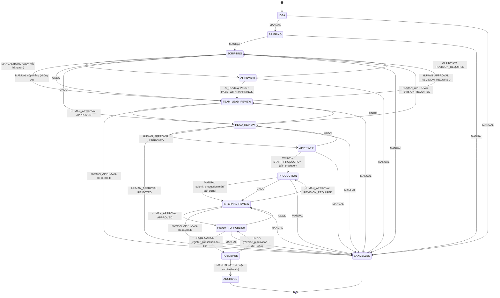

# 04 — Luồng trạng thái nội dung (Content Workflow)

Tài liệu này mô tả máy trạng thái nội dung như mã hiện thực; các tài liệu bước (STEP_*) trong `docs/pr/` chỉ là bối cảnh thiết kế. Mọi đường dẫn tính từ gốc repo. Thực thể liên quan xem [03_DOMAIN_MODEL.md](03_DOMAIN_MODEL.md); projection sang Work xem [05_WORK_KPI_PERFORMANCE.md](05_WORK_KPI_PERFORMANCE.md); quyền xem [06_PERMISSIONS_AND_SECURITY.md](06_PERMISSIONS_AND_SECURITY.md).

## 1. Danh sách stage

`PrWorkflowStage` (`src/meobot/domain/pr/models.py:258-273`), 14 thành viên:

| Stage | Nhãn (`src/meobot/domain/pr/labels.py`) | Ghi chú |
|---|---|---|
| IDEA | Ý tưởng | khởi tạo |
| BRIEFING | Brief | |
| SCRIPTING | Kịch bản | stage có thể sửa, điểm nộp AI hoặc nộp thẳng Trưởng nhóm |
| AI_REVIEW | Chờ AI review | chỉ ra bằng kết quả AI hoặc CANCELLED |
| TEAM_LEAD_REVIEW | Chờ Trưởng nhóm duyệt | cổng 1 |
| HEAD_REVIEW | Chờ Trưởng phòng duyệt | cổng 2 |
| APPROVED | Đã duyệt | mốc `CONTENT_CREATION` cho Work |
| PRODUCTION | Đang dựng | cần `producer_user_id` |
| INTERNAL_REVIEW | Duyệt nội bộ | cổng 3, duyệt bản dựng |
| READY_TO_PUBLISH | Sẵn sàng đăng | mốc `PRODUCTION` cho Work |
| PUBLISHED | Đã đăng | chỉ vào bằng `register_publication` |
| MEASURED | — | **đã thôi dùng**: `RETIRED_STAGES` (`workflow.py:132`), không có cạnh nào, yêu cầu vào bị từ chối `measured_stage_retired` (`:404-414`) |
| ARCHIVED | Lưu trữ | terminal |
| CANCELLED | Đã huỷ | terminal |

Các tập hợp (`src/meobot/domain/pr/workflow.py`): `TERMINAL_STAGES` = {ARCHIVED, CANCELLED} (`:136-138`); `CANCELLABLE_STAGES` = IDEA … READY_TO_PUBLISH, 10 stage (`:103-116`); `PUBLISHABLE_STAGES` = {READY_TO_PUBLISH, PUBLISHED} (`:157-162`); `EDITABLE_STAGES` = {IDEA, BRIEFING, SCRIPTING} (`:201-203`); `GATING_AI_REVIEW_TYPE = FULL_REVIEW` (`:219`).

## 2. Loại trigger

`PrTransitionTrigger` (`workflow.py:68-96`), lưu ở `pr_content_transition_events.trigger` (`src/meobot/db/models/pr_transition.py:103-105`):

| Trigger | Ai tạo | Ý nghĩa |
|---|---|---|
| MANUAL | người dùng qua `/transition`, các route sản xuất, tool Telegram | cạnh thủ công |
| AI_REVIEW | `PrAiReviewService.record_review` | kết quả AI đẩy nội dung |
| HUMAN_APPROVAL | `PrApprovalService.record_decision` | quyết định ở 3 cổng |
| UNDO | `PrUndoService.undo_last` | cạnh ngược, có `reverses_event_id` |
| PUBLICATION | `PrPublicationService.register_publication` | READY_TO_PUBLISH → PUBLISHED (duy nhất) |

Ma trận được dựng một lần trong `_content_transitions()` (`workflow.py:266-356`) thành `CONTENT_TRANSITIONS` (`:361-363`), mỗi cạnh mang **tập** trigger hợp lệ; `assert_content_transition` (`:386-418`) kiểm tra.

## 3. Hiệu ứng chung của mọi `apply()`

Người ghi `workflow_stage` **duy nhất** là `PrContentWorkflowService.apply` (`src/meobot/application/pr_workflow_service.py:300`; test grep `tests/unit/test_pr_workflow_policy.py:516-546`). Mỗi lần gọi, dưới khoá dòng (`lock()` `:516-527`, `SELECT FOR UPDATE` trên PostgreSQL):

1. Kiểm tra cạnh cho trigger (`:293`), từ chối tự cạnh (`:275-277`).
2. Đọc version hiện tại (`:299`), ghi stage (`:300`).
3. Đóng dấu **một lần**: `archived_at` (`:301-304`), `production_started_at` (`:305-312`).
4. Audit `pr.content.stage_changed` (`:330-339`).
5. Ghi dòng `pr_content_transition_events` (`_record_transition` `:367-423`) nối `approval_event_id`, `production_submission_id`, `content_version_id`; với UNDO đặt `reverses_event_id` và cập nhật `reversed_by_event_id` của sự kiện bị đảo (`:401,406-408`).
6. **Upsert yêu cầu projection Work** (`request_content_work_projection`, `:422`) — cùng transaction.
7. Nếu đích là AI_REVIEW: xếp hàng run (`_queue_ai_review` `:425-457`).

`request_transition` (`:132-199`) chỉ chấp nhận cạnh MANUAL; capability = `capability_for_target` (`:78-96`): CANCELLED → `PR_CONTENT_CANCEL`, còn lại `PR_CONTENT_TRANSITION`.

Lưu ý: vào lại PRODUCTION sau khi bị trả từ INTERNAL_REVIEW **không** đóng dấu lại `production_started_at` và **không** xoá `producer_user_id` (`apply` không đụng; test `tests/unit/test_pr_production_lifecycle.py:499`).

## 4. Ma trận chuyển trạng thái

| Từ → Đến | Trigger | Điểm vào (web / Telegram) | Ai (kiểm tra ở) | Điều kiện | Hiệu ứng thêm ngoài §3 | Undo được? |
|---|---|---|---|---|---|---|
| IDEA→BRIEFING, BRIEFING→SCRIPTING | MANUAL (`workflow.py:291-292`) | `POST /api/pr/contents/{id}/transition` (`src/meobot/api/routers/pr.py:968-1012`); tool `pr.content.transition` (`src/meobot/tools/pr_content_tools.py:478-503,596-606`) | `PR_CONTENT_TRANSITION` (`pr_workflow_service.py:154`) | không | — | không (`pr_undo_service.py:392-393` chỉ nhận HUMAN_APPROVAL) |
| SCRIPTING→AI_REVIEW | MANUAL (`:293`) | cùng route; tool `pr.ai_review.submit` (`pr_content_tools.py:506-541`, HIGH, cần `/confirm`) | `PR_CONTENT_TRANSITION` | **Policy readiness** (`_require_policy_ready` `:482-493` → `PrPolicyReadinessService.evaluate` `src/meobot/application/pr_policy_readiness_service.py:132-165`): ≥1 target; mọi target FACEBOOK/TIKTOK có mode ≠ UNSPECIFIED; có pack ACTIVE cho (platform, mode) | xếp hàng run QUEUED ghim version hiện tại + pack (`pr_ai_review_run_service.py:94-174`); không có version thì không có run (`:446-451`) | không |
| **SCRIPTING→TEAM_LEAD_REVIEW** | MANUAL (`workflow.py:179-182,300`) | route `/transition` với target TEAM_LEAD_REVIEW (`pr.py:993-1003`) → `submit_to_team_lead_review` (`pr_workflow_service.py:218-252`); tool transition (target trong danh sách `pr_content_tools.py:76-77`) | `PR_CONTENT_TRANSITION` | `_require_human_review_ready` (`:459-480`): có version (`no_content_version`), `evaluate_for_human_review` (`pr_policy_readiness_service.py:171-189`: target + mode, **không kiểm pack**) | audit `after.action=submit_team_lead_review`, `ai_review_bypassed=true`, `content_version_no` (`:321-329`); **không** có run/review/approval nào | không |
| AI_REVIEW→TEAM_LEAD_REVIEW (PASS, PASS_WITH_WARNINGS); AI_REVIEW→SCRIPTING (REVISION_REQUIRED) | AI_REVIEW (`workflow.py:225-231,332-333`) | chỉ `PrAiReviewService.record_review` (`src/meobot/application/pr_ai_review_service.py:134-246`), gọi từ executor (`pr_ai_review_executor.py:260-295`) hoặc `POST /contents/{id}/submit-ai-review` (`pr.py:1550-1595`) | `Permission.SCRIPT_REVIEW` (`policy.py:362`; `pr_ai_review_service.py:151`) | stage phải là AI_REVIEW (`:158-166`); version được review = hiện tại (`:168-177`); chỉ FULL_REVIEW mới chuyển (`:204-205`) | dòng `pr_ai_reviews` (`:184-201`); audit `pr.ai_review.recorded`; note `ai_review:<RESULT>` | không |
| TEAM_LEAD_REVIEW→HEAD_REVIEW / →SCRIPTING / →CANCELLED; HEAD_REVIEW→APPROVED / →SCRIPTING / →CANCELLED; INTERNAL_REVIEW→READY_TO_PUBLISH / →PRODUCTION / →CANCELLED | HUMAN_APPROVAL (`workflow.py:237-263,335-337`) | `POST /contents/{id}/reviews` (`pr.py:1452-1498`, cổng suy từ stage `_stage_gate_for` `:1501-1520`, reviewer = phiên `:339-351`); tool `pr.review.approve/request_revision/reject` (`src/meobot/tools/pr_review_tools.py:195,231,261-285`, HIGH); `POST /reviews/bulk-approve` (`pr.py:1404`) | capability cổng không phạm vi (`pr_approval_service.py:239`) rồi **có phạm vi** `require_approval(actor, content, gate)` (`:254`; `pr_capability_service.py:274-286`) | gate == stage (`:255-274`); reviewer tồn tại (`:276`); `version_reviewed == current` (`:286-295`); cổng AI chỉ ở TEAM_LEAD (`_require_ai_gate` `:465-509`); HEAD APPROVED cần TL APPROVED còn hiệu lực cùng version (`:301-307,583-633`) | `pr_approval_events` (INTERNAL mang `production_submission_id` bản dựng mới nhất `:318-320,441-462`); sự kiện chuyển nối `approval_event_id` (`:336`); audit `pr.approval.recorded`; thông báo (§13) | APPROVED và REVISION_REQUIRED: **có**; REJECTED: không (`workflow.py:344-347,426-434`) |
| APPROVED→PRODUCTION | MANUAL (`workflow.py:301`) | `POST /contents/{id}/production/start` (`pr.py:1136-1162`) → `start_production` (`src/meobot/application/pr_production_service.py:352-404`); cũng tới được qua `/transition` chung và Telegram | route start: `PR_PRODUCTION_EXECUTE` **và** là producer hoặc có `PR_PRODUCTION_ASSIGN` (`:381-383,840-870`); route chung: chỉ `PR_CONTENT_TRANSITION` | `producer_user_id` đã đặt (`_require_producer` `pr_workflow_service.py:160-167,556-579`, `no_producer_assigned`) | `production_started_at` một lần; note `production_started` | **không** (`pr_undo_service.py:49-52`; test `tests/unit/test_pr_handoff_and_undo.py:699`) |
| PRODUCTION→INTERNAL_REVIEW | MANUAL (`workflow.py:302`) | `POST /contents/{id}/production-submissions` (`pr.py:1165-1205`) → `submit_production` (`pr_production_service.py:407-501`, gọi `apply` trực tiếp `:469-476`) | `PR_PRODUCTION_EXECUTE` + producer hoặc `PR_PRODUCTION_ASSIGN` (`:433,448`) | stage PRODUCTION; producer đã đặt; artifact hợp lệ (`normalize_artifact` `src/meobot/domain/pr/production.py:155-177`); route chung yêu cầu ≥1 bản dựng (`_require_submission` `pr_workflow_service.py:529-544`) | dòng `pr_production_submissions` (`submission_no` = max+1 `:902-911`); audit `pr.production.submitted` | không |
| READY_TO_PUBLISH→PUBLISHED | **chỉ PUBLICATION** (`workflow.py:325-329`; test `test_pr_workflow_policy.py:143`) | `POST /contents/{id}/publications` (`pr.py:2599`) → `register_publication` (`src/meobot/application/pr_publication_service.py:275-407`); tool `pr.publication.register` (`src/meobot/tools/pr_admin_tools.py:806`) | **quy tắc xem** `require_viewable_content` (`:301`; `may_record_publication` `:714-742`) | stage ∈ PUBLISHABLE (`:306-314`); đúng một trong submission/derivative, thuộc nội dung này (`:628-711`); kênh tồn tại (`:935-951`) | dòng `pr_publications` PUBLISHED mã PUB (`:337-350`); target tương ứng → PUBLISHED (`:352-353`); stage chỉ đổi ở **publication đầu tiên** (`:357-366`); audit; yêu cầu projection (`:406`) | chỉ qua `reverse_publication` |
| PUBLISHED→READY_TO_PUBLISH | UNDO (`workflow.py:330`) | `POST …/publications/{pid}/reverse` (`pr.py:2685-2725`) → `reverse_publication` (`pr_publication_service.py:481-604`) | `PR_PUBLICATION_REGISTER` (`:531-534,768-778`) | publication còn active (`:538`); stage PUBLISHED (`:540-546`); publication **không có metrics** (`:547-550`); stage chỉ lùi nếu không còn publication active nào khác (REMOVED/UNAVAILABLE vẫn tính là active), nội dung không có metrics, và còn một sự kiện PUBLICATION chưa bị đảo (`:860-880,908-933`) | dòng → REVERSED (`:552`); audit `pr.publication.reversed`; projection (`:603`) | — |
| PUBLISHED→ARCHIVED | MANUAL (`workflow.py:312`) | `/transition`; hàng loạt `POST /contents/archive-batch` (`pr.py:757-799` → `src/meobot/application/pr_bulk_archive_service.py:220,233-239`, all-or-nothing, chỉ tháng đã qua `:204-216`) | `PR_CONTENT_TRANSITION` | — | `archived_at`; audit lô `pr.content.archive_batch_recorded` | không |
| mọi CANCELLABLE→CANCELLED | MANUAL (`workflow.py:317-318`) và HUMAN_APPROVAL(REJECTED) ở 3 cổng | `/transition` target CANCELLED → `cancel()` (`pr.py:989-992`, `pr_workflow_service.py:201-216`) | `PR_CONTENT_CANCEL` | — | — | không (không có cạnh UNDO rời CANCELLED) |
| HEAD_REVIEW→TEAM_LEAD_REVIEW, SCRIPTING→TEAM_LEAD_REVIEW, APPROVED→HEAD_REVIEW, SCRIPTING→HEAD_REVIEW, READY_TO_PUBLISH→INTERNAL_REVIEW, PRODUCTION→INTERNAL_REVIEW | UNDO (suy từ các kết cục không REJECTED, `workflow.py:344-347`) | `POST /contents/{id}/undo` (`pr.py:1208-1239`) → `undo_last` (`src/meobot/application/pr_undo_service.py:241-316`; không có tham số đích) | §10 | §10 | sự kiện đảo có `reverses_event_id`, sự kiện gốc có `reversed_by_event_id`; audit `pr.workflow.undone`; thông báo `pr_workflow_undone` | — |

**Không hợp lệ ở bất kỳ đâu:** TEAM_LEAD_REVIEW→APPROVED; cạnh thủ công vào HEAD_REVIEW/APPROVED; mọi cạnh rời ARCHIVED/CANCELLED; mọi cạnh vào MEASURED (`test_pr_workflow_policy.py:197,217,265,273,326,570`).

## 5. Sơ đồ trạng thái

(MEASURED còn trên enum nhưng không có cạnh.)

## 6. AI review

- **Tạo run:** chỉ trong `apply` khi đích là AI_REVIEW (`pr_workflow_service.py:363-364,425-457`), cùng transaction. `enqueue` (`src/meobot/application/pr_ai_review_run_service.py:94-174`): trả `None` nếu đã có run hoạt động (`:114-115`); QUEUED, `prompt_version=FULL_REVIEW_PROMPT_VERSION` (`src/meobot/domain/pr/ai_review.py:51`); partial unique `uq_pr_ai_review_runs_active` (`src/meobot/db/models/pr_ai_review_run.py:123-131`), IntegrityError nuốt trong savepoint (`:128-145`); ghim pack (`pr_ai_review_run_policy_packs`, `:151-161`).
- **Điều phối (Celery, queue `q_integrations`):** beat `pr.sweep_ai_review_runs` mỗi `PR_AI_REVIEW_SWEEP_INTERVAL_SECONDS` (mặc định **20 s**, `src/meobot/core/config.py:235`; `src/meobot/tasks/celery_app.py:240-247`) → `claim_batch` **5 run** (`pr_ai_review_run_service.py:75`), `FOR UPDATE SKIP LOCKED`, QUEUED→RUNNING, `attempt_count += 1` (`:238-269`); run đã hết lượt (`attempt_count >= max_attempts`) được chốt FAILED `attempts_exhausted` (`:258-262`); commit rồi mới `run_ai_review.apply_async` từng run (`src/meobot/tasks/pr_reviews.py:58-83`). `pr.run_ai_review` (`:86-138`) chạy với `system_actor` (`user_id=None`, role OWNER, `src/meobot/tasks/runtime.py:50-67`) — dòng chuyển do AI có `actor_user_id NULL`. **Không có retry cấp Celery** (`:90-95`).
- **Executor** (`src/meobot/application/pr_ai_review_executor.py:140-338`): không RUNNING → bỏ qua; thiếu nội dung/version → FAILED `content_missing`; pack đọc từ DB, không bao giờ gọi mạng (`:182,341-355`); pack rỗng → FAILED; trích dẫn chính sách bịa → `requeue` `invalid_policy_citation` (`:213-228`); `LLMError` → `requeue` (`:229-239`); kết luận suy từ mức độ phát hiện (`derive_outcome`: BLOCKER → REVISION_REQUIRED, WARNING → PASS_WITH_WARNINGS, còn lại PASS, `ai_review.py:161-172`; model không được tự tuyên verdict, `extra="forbid"`); kiểm tra lỗi thời dưới khoá nội dung (`stage_moved` / `version_superseded`) → **SUPERSEDED, không ghi review, không chuyển** (`:244-258,406-424`); còn lại `record_review` (`:260-295`, score luôn None); `MeoBotError` từ recorder → FAILED không retry (`:296-306`).
- **Trạng thái run:** QUEUED→RUNNING→SUCCEEDED | FAILED | SUPERSEDED; RUNNING→QUEUED bởi `requeue` (`:378-401`) hoặc `recover_stale` (`:271-307`). `max_attempts` = `PR_AI_REVIEW_MAX_ATTEMPTS` (mặc định **3**). Quét treo: beat `pr.recover_stale_ai_review_runs` mỗi 300 s (`celery_app.py:260-264`), RUNNING quá `PR_AI_REVIEW_STALE_AFTER_SECONDS` (**900 s**) → QUEUED (còn lượt) hoặc FAILED `timed_out`.
- **Kết quả → stage:** `record_review` → `ai_review_target(result)` → `apply(trigger=AI_REVIEW)` (`pr_ai_review_service.py:204-213`). **Run FAILED để nội dung đứng ở AI_REVIEW**, không có review.
- **Thử lại tay:** `POST /contents/{id}/ai-review/retry` (202, `pr.py:2422-2496`): cần `SCRIPT_REVIEW`, stage AI_REVIEW, có version; `enqueue(trigger=MANUAL_RETRY)`; 409 nếu đang có run; audit `pr.ai_review.requested`. `GET /contents/{id}/ai-review` trả `can_retry` do server tính (`:2413-2418`). Nhập verdict ngoài: `POST /contents/{id}/submit-ai-review` (`:1550-1595`, không gọi model).
- **Cờ cấu hình:** `PR_AI_REVIEW_ENABLED` chỉ chặn **sweeper** (`pr_reviews.py:70-71`); xếp hàng, `run_ai_review`, `recover_stale` không bị chặn. Tắt ⇒ nội dung vẫn vào AI_REVIEW và **đứng đó**. `AUTO_REVIEW_ENABLED` là của task kịch bản legacy (`src/meobot/tasks/scripts.py:149`), **không liên quan PR**.

## 7. Nộp thẳng Trưởng nhóm (SCRIPTING → TEAM_LEAD_REVIEW)

- **Bỏ qua AI, không giả lập kết quả.** `submit_to_team_lead_review` chỉ gọi `request_transition(target=TEAM_LEAD_REVIEW)` (`pr_workflow_service.py:218-252`); `request_transition` chỉ chạy kiểm tra sẵn sàng (`:182-190`) rồi `apply` (`:192-199`); `apply` chỉ xếp hàng run khi `target is AI_REVIEW` (`:363-364`); file không import/ghi `PrAiReview` hay `PrApprovalEvent` (`:46-73`). Test `tests/unit/test_pr_direct_team_lead_submission.py:338-356` giữ bất biến: 0 `PrAiReview`, 0 `PrAiReviewRun`, 0 `PrApprovalEvent`, không có bản ghi audit `pr.ai_review.*`, `latest_gating_review is None`.
- **Tái dùng cổng Trưởng nhóm:** `_require_ai_gate` (`pr_approval_service.py:465-509`) chấp nhận **hoặc** một dòng `pr_ai_reviews` FULL_REVIEW cho version này (`:496-498`) **hoặc** một sự kiện MANUAL `SCRIPTING→TEAM_LEAD_REVIEW` nối với `pr_content_versions` có cùng `version_no` (`_submitted_directly` `:511-537`). Mọi thứ khác ở cổng (capability, phạm vi, version, kết cục, thông báo, undo) đi đúng đường `record_decision`. `PrAvailableActionService` dùng cùng vị từ `ai_gate_satisfied` (`src/meobot/application/pr_action_service.py:483-485`) và chào cạnh nộp thẳng với emphasis SECONDARY (`:311-325,450-461`).
- **Test đua trên PostgreSQL** `tests/integration/test_pr_direct_submission_race_pg.py`: AI vs nộp thẳng (`:262-301`) → đúng một chuyển tiến, run iff AI thắng, audit bypass iff nộp thẳng thắng, 0 review; nộp thẳng vs nộp thẳng (`:304-325`) → một dòng, bên thua nhận `PrWorkflowTransitionError`; nộp thẳng vs sửa bản (`:328-366`) → sự kiện ghim đúng version đang hiện hành; nộp thẳng vs huỷ (`:369-392`) → CANCELLED, 0 run.
- **Phân biệt dữ liệu:** nộp thẳng = sự kiện `(SCRIPTING→TEAM_LEAD_REVIEW, trigger=MANUAL, actor_user_id=<người>, content_version_id=<ghim>)` + audit `after.action="submit_team_lead_review"`, `ai_review_bypassed=true`; AI pass = `(AI_REVIEW→TEAM_LEAD_REVIEW, trigger=AI_REVIEW, actor_user_id=NULL, note="ai_review:PASS[_WITH_WARNINGS]")` + dòng `pr_ai_reviews` + run SUCCEEDED. UNDO của một lần trả về từ TL đi cùng cạnh với `trigger=UNDO` và **không** được coi là nộp thẳng (`pr_approval_service.py:516-519,532`).

## 8. Sản xuất và đăng bài

- **Gán** `assign_producer` (`pr_production_service.py:218-283`): `PR_PRODUCTION_ASSIGN`, stage ∈ HANDOFF_STAGES = {APPROVED, PRODUCTION} (`production.py:101-103`), `None` để bỏ gán, **ghi đè được**; người đủ điều kiện = active và có `PR_PRODUCTION_EXECUTE` (`:872-900`); thông báo producer trừ khi tự gán. **Tự nhận** `claim_production` (`:285-350`): UPDATE có điều kiện, bên thua nhận `PrProductionClaimConflictError` (`:320-334`). Cả hai không đổi stage.
- **Sửa bản dựng** `correct_submission` (`:504-612`): chỉ artifact_type/location/note, bởi người nộp hoặc quản lý sản xuất (`:614-642`); không được khi đã có publication tham chiếu kể cả REVERSED (`:653-665`) hoặc khi ARCHIVED (`:548-558`).
- **Đăng bài:** `register_publication` ghi **sự thật** đã đăng, không gọi nền tảng; derivative là nguồn thay thế cho submission (`pr_publication_service.py:685-694`). `update_publication` (`:410-479`) chỉ sửa url/published_at/note (người đăng với `PR_PUBLICATION_CREATE`, hoặc `PR_PUBLICATION_REGISTER`; từ chối khi REVERSED/ARCHIVED `:803-840`).
- **Lưu trữ:** PUBLISHED→ARCHIVED thủ công hoặc theo lô tháng đã qua (`pr_bulk_archive_service.py:186-275`, `PrBulkArchiveStaleError` all-or-nothing). ARCHIVED là terminal, không đăng được.
- **Huỷ:** `PR_CONTENT_CANCEL` từ mọi stage CANCELLABLE; không từ PUBLISHED trở đi.

## 9. Xoá vĩnh viễn

`DELETE /contents/{id}` (204, `pr.py:1015-1057`) → `PrContentLifecycleService.delete_content` (`src/meobot/application/pr_lifecycle_service.py:241-319`). Quy tắc `may_hard_delete` (`src/meobot/domain/pr/lifecycle.py:126-166`): cần `PR_CONTENT_DELETE`; **không ai** xoá được từ `PUBLISHED_ONWARD_STAGES` (PUBLISHED, MEASURED, ARCHIVED, `:106`) → `PrPublishedContentError`; quản lý (`PR_CONTENT_CANCEL`) xoá mọi thứ dưới ngưỡng; thành viên chỉ xoá nội dung mình chịu trách nhiệm và **chưa từng sản xuất** (`production_started_at` hoặc stage ≥ PRODUCTION, `:109-118`). Từ chối thêm theo dữ liệu: có bất kỳ `pr_publications` (kể cả REVERSED, `pr_lifecycle_service.py:372-373,448-463`); có `pr_work_items`/`pr_work_results` theo `source_key` (`:386-401,420-446`) → `PrContentHasRecordedWorkError`. Cascade do ứng dụng sở hữu, con trước (`_plan` `:547-624`): projection, transition events, run policy packs, AI runs, AI reviews, approvals, derivatives, submissions, task assignments, tasks, targets, resources, destinations, versions, comments, rồi item; `pr_issues.content_id` đặt NULL; publications/metrics không bao giờ xoá. Audit `pr.content.deleted_permanently` ghi **trước** khi xoá (`:283-300`).

## 10. Vòng sửa và Undo

- **Trả về:** TL/HEAD REVISION_REQUIRED → SCRIPTING; INTERNAL REVISION_REQUIRED → PRODUCTION; AI REVISION_REQUIRED → SCRIPTING; REJECTED ở cổng nào cũng → CANCELLED. `apply` không "reset" gì ngoài stage và hai dấu một lần: producer, submissions, approvals, reviews, targets giữ nguyên.
- **Version:** `revise_content` (`src/meobot/application/pr_content_service.py:407-488`): `PR_CONTENT_EDIT`, stage ∈ EDITABLE_STAGES (`:428-436`), `expected_version == current` nếu không `PrStaleVersionError` (`:444-452`), tạo `version_no+1` (`:459-469`), sao chép title/topic/hook/brief lên item (`:473-478`). **Không bắt buộc sửa bản sau khi bị trả**: nộp lại cùng version được cả hai đường (`test_pr_direct_team_lead_submission.py:667,708`). Cổng AI, cổng nộp thẳng và điều kiện HEAD đều ghim theo `version_no` (`pr_approval_service.py:496,533,618-619`); run bị SUPERSEDED nếu bản nháp đổi.
- **Undo** (`pr_undo_service.py`): ứng viên = sự kiện mới nhất không phải UNDO, chưa bị đảo, có `to_stage == stage hiện tại` (`:186-201,363-382`); chỉ HUMAN_APPROVAL có link approval và không REJECTED (`:384-411`). Ai: phải `can_approve` ở cổng gốc cho nội dung này **và** là người thao tác gốc hoặc có `PR_CONTENT_CANCEL` (`:413-435`). Chặn hạ nguồn (`:437-510`): approval HEAD bị chặn nếu đã có producer / `production_started_at` / bản dựng; approval INTERNAL bị chặn nếu có publication; undo của một lần trả về bị chặn nếu đã có bản nháp mới / bản dựng mới. **Không undo được:** START_PRODUCTION, từ chối (REJECTED), vào AI_REVIEW, mọi thứ từ PUBLISHED trở đi (`:196,327-335`), xoá, gán producer. Đảo đăng bài là hành động riêng (§8). Approval bị undo ở lại `pr_approval_events` nhưng không còn thẩm quyền (`is_effective_approval`, `pr_approval_service.py:116-134,652-664`).

## 11. Hành động khả dụng (backend quyết định)

`PrAvailableActionService.for_content` (`src/meobot/application/pr_action_service.py:397-625`), chỉ đọc, không khoá; lộ qua `GET /api/pr/contents/{id}/available-actions` (`pr.py:1267-1299`) dạng `{content_id, workflow_stage, available_actions[{kind, emphasis, target_stage?, decision?, undo_kind?}]}`. `PrActionKind` (`:119-241`): TRANSITION, APPROVAL, EDIT_CONTENT, SET_PRIORITY, SET_CONTENT_TYPE, MANAGE_CONTENT_RESOURCES, MANAGE_CONTENT_DERIVATIVES, ADD_CONTENT_DERIVATIVE, ADD_CONTENT_COMMENT, MANAGE_CONTENT_DESTINATIONS, RECORD_PUBLICATION, CORRECT_PRODUCTION_OUTPUT, EDIT_ANY_PUBLICATION, REVERSE_PUBLICATION, DELETE_CONTENT, ASSIGN_PRODUCER, CLAIM_PRODUCTION, START_PRODUCTION, SUBMIT_PRODUCTION, UNDO_LAST_ACTION. Mỗi mục hỏi đúng vị từ của đường ghi: `capability_for_target` (`:428-439`), sẵn sàng AI (`:441-449`), sẵn sàng nộp thẳng (`:450-461`), chuyển thường tới PRODUCTION/INTERNAL_REVIEW bị giữ lại nhường cho START/SUBMIT (`:302-304,432-438`), approval qua `can_approve` + `ai_gate_satisfied` + `head_approval_permitted` (`:470-503,713-738`), sản xuất qua `may_claim/may_start/may_submit/may_assign` (`:627-698`), publications (`:569-594`), undo (`:599-609`), xoá (`:617-622`). Frontend chỉ tiêu thụ danh sách này (`frontend/src/app/pr/content/[id]/page.tsx:155,251-390,1295`). **Mọi write kiểm tra lại** (`:69-70`); danh sách không có trường "lý do bị giữ lại".

## 12. Móc nối sang Work

`request_content_work_projection(session, content_id)` (`src/meobot/application/pr_content_work_projector.py:122-170`, upsert PENDING, RUNNING→PENDING) được gọi từ **mọi** `apply` (`pr_workflow_service.py:422`, kể cả UNDO), cộng `register_publication` (`pr_publication_service.py:406`) và `reverse_publication` (`:603`). Mốc đủ điều kiện (`src/meobot/domain/pr/content_work.py:149-164`): CONTENT_CREATION = cạnh HUMAN_APPROVAL HEAD_REVIEW→APPROVED **còn sống**; PRODUCTION = cạnh HUMAN_APPROVAL INTERNAL_REVIEW→READY_TO_PUBLISH còn sống; PUBLICATION không tự chiếu nữa (`:106-111`). "Còn sống" = `reversed_by_event_id IS NULL`. Undo làm mốc biến mất → projector chuyển kết quả sang `SOURCE_REVERSED` ở lần chạy sau. Chi tiết: [05_WORK_KPI_PERFORMANCE.md](05_WORK_KPI_PERFORMANCE.md).

## 13. Thông báo do luồng phát ra

Tất cả `PERSONAL_PRIVATE` (`src/meobot/domain/notifications/templates.py:568-617`): ghi hộp thư web trước, rồi Telegram riêng nếu có (`src/meobot/application/pr_notifications.py:313-393`).

| Sự kiện | Kích hoạt | Người nhận | Nguồn |
|---|---|---|---|
| `pr_content_approved` | HEAD APPROVED | người chịu trách nhiệm | `pr_approval_service.py:420-425`; `pr_notifications.py:130-145` |
| `pr_content_team_lead_approved` | TL APPROVED | người chịu trách nhiệm (bỏ nếu là chính mình) | `:147-181` |
| `pr_internal_review_approved` | INTERNAL APPROVED | producer + người chịu trách nhiệm (khử trùng, trừ người thao tác) | `:216-258` |
| `pr_production_revision_required` | INTERNAL REVISION_REQUIRED | producer (dự phòng người chịu trách nhiệm), kèm ghi chú | `:183-214` |
| `pr_production_assigned` | assign_producer | producer, không khi tự nhận | `:260-278` |
| `pr_workflow_undone` | undo_last | producer nếu có, nếu không người chịu trách nhiệm, trừ người thao tác | `:280-310` |

**Không gửi:** từ chối, trả về ở cổng kịch bản, vào AI_REVIEW/TEAM_LEAD_REVIEW (cả hai đường, `test_pr_direct_team_lead_submission.py:731-760`), đổi ưu tiên, bất cứ gì tới group. "Người chịu trách nhiệm" thực tế luôn là owner (`pr_notifications.py:414-419`).

## 14. Lưu ý về tài liệu trong docs/pr

1. `../pr/STEP_1C_APPLICATION_SERVICES.md:108-131` mô tả ma trận không có `SCRIPTING→TEAM_LEAD_REVIEW`, ghi READY_TO_PUBLISH→PUBLISHED là "M" và không có cạnh UNDO; mã hiện tại chỉ chấp nhận trigger PUBLICATION cho cạnh đó, có đủ cạnh UNDO, và cổng TL chấp nhận cả đường nộp thẳng (dòng 188 của tài liệu nói cần "verdict AI").
2. `../pr/STEP_1A1_AI_REVIEW_WORKFLOW.md:18-31` mô tả luồng kết thúc `PUBLISHED → MEASURED → ARCHIVED`; mã hiện tại không dùng MEASURED.
3. `../pr/STEP_1E21_WEB_UX_CORRECTNESS.md:16,32,118` và docstring `pr_action_service.py:37-52` nhắc `is_measurable` và điều kiện `PUBLISHED → MEASURED`; phương thức này không tồn tại trong mã.
4. `../pr/STEP_1F23_PRODUCTION_AND_LIFECYCLE.md` mô tả xoá mềm và gán/nhận chỉ ở PRODUCTION; mã hiện tại xoá cứng và HANDOFF_STAGES gồm cả APPROVED.
5. `../pr/STEP_1F23A_PERMANENT_DELETE.md:71` nói `MEASURED → ARCHIVED` là cạnh thường; cạnh này không còn trong ma trận.
6. `README.md:408` mô tả `AUTO_REVIEW_ENABLED` là tự động review kịch bản PR; biến này điều khiển task kịch bản legacy (`tasks/scripts.py`), không phải AI review PR.
7. `src/meobot/tools/pr_content_tools.py:67-71` nói `MANUAL_TARGETS` là "đúng các cạnh MANUAL" nhưng danh sách có `PUBLISHED` (`:80`), service luôn từ chối (409).
8. `../pr/STEP_1F210_DIRECT_TEAM_LEAD_SUBMISSION.md`, `../pr/STEP_1F_AI_REVIEW_EXECUTION.md`, `../pr/STEP_1F23B_HANDOFF_AND_UNDO.md`, `../pr/STEP_1F23D_NOTIFICATIONS_AND_PRIORITY.md` (bảng người nhận) mô tả đúng hành vi hiện tại.

## 15. Rủi ro cần biết

- `PR_AI_REVIEW_ENABLED=false` **kẹt nội dung** ở AI_REVIEW: không có lối ra thủ công ngoài CANCELLED; cứu bằng `POST /submit-ai-review` (cần `SCRIPT_REVIEW`) hoặc huỷ và tạo lại; bản đã vào AI_REVIEW không đi đường nộp thẳng được (chỉ từ SCRIPTING).
- `/transition` chung tới PRODUCTION hoặc INTERNAL_REVIEW vẫn được nhận với chỉ `PR_CONTENT_TRANSITION` (có điều kiện producer/bản dựng), **bỏ qua kiểm tra danh tính producer/quản lý** mà route START/SUBMIT áp dụng (`pr_workflow_service.py:160-175` so với `pr_production_service.py:383,448`).
- Nộp thẳng **không cần pack chính sách** (thiết kế): nền tảng có chính sách vẫn tới Trưởng nhóm mà không qua kiểm chính sách nào.
- `assign_producer` ở APPROVED/PRODUCTION có thể **ghi đè im lặng** producer hiện tại (`pr_production_service.py:251-253`); chỉ claim là có điều kiện.
- Chuyển do AI ghi `actor_user_id NULL` (system actor OWNER, `runtime.py:58-67`).
- Telegram: tool `pr.content.transition` chào `PUBLISHED` nhưng luôn bị từ chối; **không có tool** undo, sản xuất, xoá (`pr_content_tools.py:554-608`, `pr_review_tools.py:303-348`, `pr_admin_tools.py:698-806`) — web only.
- `recover_stale` và `run_ai_review` không bị cờ enable chặn (nhỏ).
- **Khuyến nghị:** thêm lối ra thủ công khỏi AI_REVIEW về SCRIPTING khi AI tắt/hỏng; siết `/transition` chung cho PRODUCTION/INTERNAL_REVIEW về cùng kiểm tra danh tính như route chuyên biệt; bỏ `PUBLISHED` khỏi `MANUAL_TARGETS` của tool Telegram.
