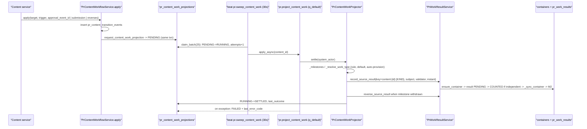

# 05 — Work, KPI và Hiệu suất (M1 → M6)

Tài liệu này mô tả module Work, KPI và Hiệu suất chi tiết nhất trong bộ tài liệu. Module Work là **sổ cái hạch toán** công việc của phòng: nó ghi nhận *việc thật đã làm*, phân loại việc đó so với *chỉ tiêu KPI* đã duyệt (M2), và quy đổi ra *điểm hiệu suất* theo tháng (M6). Ba lớp này được tách bạch có chủ đích:

```
WORK  = việc thật đã làm (Actual).  KPI = chỉ tiêu, chỉ để so sánh.  M6 = điểm, tính từ Actual.
```

Một chỉ tiêu KPI **không bao giờ** quyết định việc có được ghi nhận hay không, ghi nhận bao nhiêu, hay được bao nhiêu điểm. Nó chỉ được đem ra so với Actual. Quy tắc này được mô tả trong `../pr/WORK_RESULTS_BY_PERIOD.md` và được mã thực thi như mô tả dưới đây.

Các tài liệu liên quan: [03_DOMAIN_MODEL.md](03_DOMAIN_MODEL.md) (tổng quan thực thể), [04_CONTENT_WORKFLOW.md](04_CONTENT_WORKFLOW.md) (nguồn sinh ra milestone), [06_PERMISSIONS_AND_SECURITY.md](06_PERMISSIONS_AND_SECURITY.md) (capability), [08_DATABASE_AND_MIGRATIONS.md](08_DATABASE_AND_MIGRATIONS.md) (ràng buộc DB), [13_KNOWN_ISSUES_AND_TECH_DEBT.md](13_KNOWN_ISSUES_AND_TECH_DEBT.md).

---

## A. Từ vựng

**Kiến trúc hiện hành là result-grain (migration `0039`).** Mỗi kết quả công việc là một dòng `pr_work_results` nằm trong một *container theo kỳ*. Các đường mã item-grain cũ (`create_source_work` / `count_source_work` / `retype_source_work` / `reverse_source_work` trong `src/meobot/application/pr_work_service.py:1739-2186`) vẫn tồn tại **chỉ để phục vụ các dòng tạo trước 0039** (legacy) và không được dùng cho dữ liệu mới.

| Khái niệm | Bảng / lớp | Ý nghĩa | Nguồn |
|---|---|---|---|
| **WorkType** | `pr_work_types` / `PrWorkType` | Danh mục loại việc do nghiệp vụ sở hữu (`code`, `name`, `category` enum `PrWorkCategory`, `default_unit` enum `PrWorkUnit`, `default_quota_basis` ITEM_COUNT/QUANTITY, `requires_evidence`, `is_active`). Khoá cấu trúc `{code, default_quota_basis}` không đổi được khi đã dùng; `default_unit` đổi được và lan sang container tháng đang OPEN. Mã `CONTENT_AUTO_*` là namespace dành riêng cho projector. 13 loại bootstrap. | `src/meobot/db/models/pr_work.py:103-187`; `src/meobot/domain/pr/work_types.py:56,88-180`; `pr_work_service.py:390-398,582-609,689-738,822-874`; CLI `src/meobot/cli/work_types.py:76-126` |
| **WorkItem (one-off)** | `pr_work_items` / `PrWorkItem` với `reporting_period_id IS NULL` | **Một việc thật**: mã `WRK-YYYY-NNNNNN`, `work_type_id`, `status` (`PrWorkStatus`), `quantity`+`unit` cố định sao chép từ loại việc lúc tạo, `source_type` (`MANUAL CONTENT TASK RECURRING SYSTEM`), `source_key`, `execution_at` (0037), `due_at`, các mốc thời gian và người. | `pr_work.py:190-423`; `src/meobot/domain/pr/work.py:136-144,158-173` |
| **Period container** | cũng là `PrWorkItem`, có `reporting_period_id` **và** `subject_user_id` | **Một luồng việc** của một người × một loại việc × một tháng. Duy nhất theo `uq_pr_work_items_period_container`. Tạo ra với `status=ACCEPTED`, `quantity=0`, `execution_at` = nửa đêm ngày đầu tháng, đúng một contribution PRIMARY cho chủ thể. `quantity` là **giá trị dẫn xuất** (xem B). Mọi hành động vòng đời bị `_refuse_container` từ chối. | `pr_work.py:234-242,376-393,420-423`; `src/meobot/application/pr_work_result_service.py:284-443`; `pr_work_service.py:3324-3344` |
| **WorkContribution** | `pr_work_contributions` / `PrWorkContribution` | Phần của **một người** trên một việc: `contribution_role` (PRIMARY/CONTRIBUTOR/SUPPORT), `credit_weight` (0,1], `count_status` (`PrWorkCountStatus` PENDING/COUNTED/EXCLUDED), `counted_at`. **Đây là dòng mà M2 và M6 đọc.** | `pr_work.py:426-512`; `work.py:185-188,246-251` |
| **WorkResult** | `pr_work_results` / `PrWorkResult` | Một kết quả khai báo hoặc do hệ thống đóng góp **vào một container** ("+3 khách hàng", hay một milestone nội dung). `quantity>0`, `source_type` (`PrWorkResultSource`: hôm nay chỉ MANUAL và CONTENT được ghi), `source_key`, `status` (dùng lại `PrWorkCountStatus`), `reported_at` (thời điểm nghiệp vụ), `counted_at/counted_by_user_id`, `excluded_*`, `exclusion_kind` (`PrWorkExclusionKind`: ADMIN_REMOVED / VALIDATOR_REJECTED / SOURCE_REVERSED; `NULL` = loại trừ legacy trước 0041). | `src/meobot/db/models/pr_work_result.py:62-148`; `src/meobot/domain/pr/work_results.py:32-47,73-75` |
| **Việc thủ công** | `source_type=MANUAL`, `source_key NULL` | Tạo bằng `propose_work`, `assign_work`, `assign_work_batch`. | `pr_work_service.py:948-1074` |
| **Việc từ nội dung** (hiện hành) | `PrWorkResult` với `source_type=CONTENT`, key `content:{uuid}:{KIND}` | Do projector ghi qua `record_source_result`, đảo bằng `reverse_source_result`. Xem phần D. | `pr_work_result_service.py:941-1210` |
| **Việc định kỳ** | `source_type=RECURRING`, key `recurring:{occurrence-uuid}:SHARED\|A_{hex32}` (one-off) hoặc container mở theo occurrence | Sinh bởi generator từ template. Xem phần E. | `src/meobot/domain/pr/recurring.py:360-400`; `pr_work_service.py:1076-1143` |
| **Legacy content WorkItem** (legacy) | `PrWorkItem` với `source_type=CONTENT` **và** `reporting_period_id IS NULL` | Dòng tạo bởi kiến trúc trước 0039 (một item/milestone, COMPLETED, quantity 1). Vị từ chuẩn: `is_legacy_content_work_item`. | `src/meobot/domain/pr/content_work.py:317-336` |
| **source_key** | cột `source_key` trên item và result | Định dạng `{content\|task\|recurring\|system}:{uuid}:{UPPER_SNAKE}`; chỉ được tạo bởi `work_source_key`, kiểm tra bởi `assert_source_key`, **so sánh chứ không phân tích** trong service (riêng maintenance `_entity_of` có tách). Hai partial unique index `uq_pr_work_items_source` và `uq_pr_work_results_source` là cơ chế idempotent. | `work.py:524-595`; `pr_work.py:249-256`; `pr_work_result.py:84-91` |
| **Evidence** | `pr_work_evidence` / `PrWorkEvidence` | Bằng chứng (label/location/note); sentinel `EVIDENCE_TEXT_ONLY_LOCATION="text-only"`. | `pr_work.py:515-541`; `work.py:616` |
| **History** | `pr_work_history` / `PrWorkHistory` | Timeline chỉ ghi thêm; `event_type` (`PrWorkEventType`, 25 giá trị); `event_metadata` JSON. **Khoá `origin` trong JSON (`SOURCE` / `WORK_VALIDATOR`) là dữ liệu quyết định hội tụ** (xem B.4). | `pr_work.py:545-610`; `work.py:266-304` |
| **Reporting period** | `pr_reporting_periods` / `PrReportingPeriod` | Kỳ MONTH, `status` OPEN/CLOSED/LOCKED. Xem phần H. | `src/meobot/db/models/pr_reporting.py:235-292` |

---

## B. Hạch toán (accounting)

### B.1 Thành phần nào quyết định giá trị nào

- Với **việc one-off**: `pr_work_contributions.count_status` + `counted_at` quyết định việc đó có được đếm và đếm vào tháng nào.
- Với **container**: `pr_work_results.status` quyết định; các result COUNTED được **cộng dồn lên** `pr_work_items.quantity` và **phản chiếu** lên contribution PRIMARY duy nhất của container bởi `_sync_container` (`pr_work_result_service.py:1534-1617`).
- Mọi bên đọc (M2, M6, màn hình) đi qua đúng hai vị từ: `counted_in_period` (`src/meobot/application/pr_work_quota_service.py:154-181`: container → kỳ của chính nó; one-off → tháng chứa `counted_at`) và `measure_counted` (`:183-222`: container đo bằng `item.quantity` dù basis nào).

### B.2 `quantity` nghĩa là gì

| Trên | Ý nghĩa | Ràng buộc |
|---|---|---|
| WorkItem one-off | Lượng cố định của việc, đơn vị `unit` sao chép từ loại việc lúc tạo (`pr_work_service.py:1240-1257`). Loại việc basis QUANTITY mà khai không có số bị `require_quantity_for_basis` từ chối — nhưng chỉ trên lệnh vận hành (`_validate_operational_command` `:1145-1175`), không phải trong `_create`. | `(0, 100000]` (`:3473-3486`); CHECK `quantity_positive`, `quantity_and_unit_together` |
| WorkResult | Lượng khai báo, mặc định 1 (`require_result_quantity`, `work_results.py:192-211`). | `>0`, ≤100000, làm tròn 0.01 |
| Container | **Dẫn xuất**: `SUM(results.quantity) WHERE status='COUNTED'`. Được **tính lại**, không bao giờ cộng dồn tăng dần. | CHECK `quantity_positive` nới lỏng cho container (0039) |

### B.3 Container được duy trì thế nào

`_sync_container` (`pr_work_result_service.py:1534-1617`):
1. Đọc `_result_sums` (`:1619-1670`) và `MIN(counted_at)` của các result COUNTED (`:1552-1559`).
2. `item.quantity = counted` (`:1561`).
3. Contribution PRIMARY → `COUNTED` với `counted_at` = sớm nhất, hoặc về `PENDING` khi không còn gì (`:1578-1595`); contribution đã `EXCLUDED` thì để nguyên.
4. Giao cho M2 `on_contributions_counted` / `on_contributions_uncounted` **trong savepoint** (`:1603-1617`): M2 hỏng không làm hỏng việc ghi nhận.

Hàm này được gọi **ở mọi điểm ghi result**, trong cùng transaction, **sau khi khoá container** (`_lock_container` `:1724-1735` → `lock_row` `src/meobot/application/pr_support.py:68-81`, `SELECT … FOR UPDATE` trên PostgreSQL; trên SQLite chỉ là `get`): `report_result:530`, `validate_results:658`, `exclude_result:728`, `reconsider_result:835`, `withdraw_result:921`, `record_source_result:1148`, `_reverse:1234`, `_refile:1379-1380`; maintenance `admin_remove_result` gọi `sync_container` công khai (`src/meobot/application/pr_work_maintenance_service.py:667`).

### B.4 "Actual" và COUNTED

**Actual work** = `ContainerSummary.counted_quantity` từ `summaries_for` (`pr_work_result_service.py:1416-1519`). So với chỉ tiêu chỉ qua `compare_to_target` (`work_results.py:240-269`, phần trăm **không cap**, `None` khi không có chỉ tiêu).

**COUNTED cho việc one-off** — `PrWorkService.approve` (`pr_work_service.py:1579-1710`):
- cần `PR_WORK_VALIDATE` (`:1619`); khoá dòng; container bị từ chối; cạnh `COMPLETED→APPROVED`;
- **tự xác nhận bị từ chối**: bất kỳ contributor nào của việc đó, dù vai trò gì, nhận `self_validation` (`:1625-1634`);
- guard tháng đã chốt hiệu suất (`_require_not_finalized` `:3197-3216` → `PrWorkPeriodService.performance_finalized`);
- mọi contribution PENDING → COUNTED, một `counted_at=now` chung (`:1649-1656`); history `APPROVED` ghi `origin=WORK_VALIDATOR` (`:1667`);
- M2 chạy trong savepoint, lỗi chỉ ghi log (`:1709`).

Đường nguồn (legacy) `count_source_work` (`:1858-2007`) áp cùng luật tự xác nhận với **người xác nhận của nguồn** (`:1904-1913`), đóng `counted_at=effective_validation_at` (`:1946`), `origin=SOURCE`; chỉ hồi sinh contribution EXCLUDED nếu history EXCLUDED mới nhất ghi `origin=SOURCE` (`:1938-1943`).

**COUNTED cho result** — `validate_results` (`pr_work_result_service.py:560-682`):
- `PR_WORK_VALIDATE` (`:580`); **chủ thể không bao giờ được đếm luồng của chính mình** (`:583-588`);
- `_require_open` (`:1779-1815`): container không CANCELLED, kỳ OPEN, hiệu suất chưa chốt; ≤500 id;
- với result PENDING có nguồn: hỏi `SourceTruth.source_is_eligible` (`:612-634`) — result nêu đích danh mà nguồn không còn đủ điều kiện → 409 `work_result_source_not_eligible`, không ghi gì; "đếm tất cả pending" → dòng không đủ điều kiện bị hội tụ về `SOURCE_REVERSED`, phần còn lại được đếm;
- `COUNTED`, `counted_at=now`, `counted_by=actor`, history `RESULT_COUNTED` với `origin=WORK_VALIDATOR` (`:654`).

`record_source_result` (`:941-1178`) đếm theo **thời điểm của nguồn** với `counted_by=validated_by_user_id` khi `validated_by != subject` (`independent` `:985`); nếu không thì để PENDING; `origin=SOURCE` (`:1159`).

### B.5 Ma trận trạng thái result

| Từ | Hành động | Đến / `exclusion_kind` | Ai | Nguồn |
|---|---|---|---|---|
| PENDING | `validate_results` | COUNTED | `PR_WORK_VALIDATE`, không phải chủ thể | `:560-682` |
| PENDING/COUNTED | `exclude_result` | EXCLUDED / `VALIDATOR_REJECTED`, bắt buộc có lý do | `PR_WORK_VALIDATE`, không phải chủ thể | `:684-758` |
| EXCLUDED (`VALIDATOR_REJECTED` hoặc `NULL`) | `reconsider_result` | PENDING (từ chối nếu nguồn không còn đủ điều kiện `:810-822`) | `PR_WORK_VALIDATE`, không phải chủ thể | `:760-870` |
| PENDING/COUNTED | `admin_remove_result` | EXCLUDED / `ADMIN_REMOVED`; **từ chối** trên `VALIDATOR_REJECTED` (`work_result_validator_rejected`) và trên mọi dòng đã EXCLUDED | `PR_WORK_CONFIGURE`, kỳ OPEN, chưa chốt | `pr_work_maintenance_service.py:589-714` |
| PENDING/COUNTED | `reverse_source_result` | EXCLUDED / `SOURCE_REVERSED`; dòng đã EXCLUDED **không bị ghi đè** | projector / rebuild | `:1180-1263` |
| PENDING (MANUAL) | `withdraw_result` | **dòng bị xoá vật lý** (`:919`) | chỉ người khai | `:889-936` |

Mọi lần loại trừ đều xoá `counted_at` và `counted_by_user_id` (`:721-722, 828-829, 1227-1228`; maintenance `:660-661`). CHECK `counted_at_matches_status` trên cả contribution và result bảo đảm `COUNTED ⇔ counted_at IS NOT NULL`.

### B.6 Điều projector **không được** hồi sinh

Hai luật thuần trong `src/meobot/domain/pr/work_results.py`:

- `source_may_restore(kind)` (`:92-102`): chỉ `ADMIN_REMOVED` và `SOURCE_REVERSED` được khôi phục; **`VALIDATOR_REJECTED` và `NULL` (legacy) không bao giờ**. Thực thi hai lần: projector trả `HELD_BY_VALIDATOR` trước mọi lần ghi, kể cả dry run và refile (`src/meobot/application/pr_content_work_projector.py:951-973`); `record_source_result` trả dòng nguyên trạng như một sàn (`pr_work_result_service.py:988-998`). Rebuild không chạm được vì bước 1 chỉ đảo phát hiện `WRONG_WORK_TYPE` (`pr_work_maintenance_service.py:557-566`) và dòng bị giữ được phân loại `CORRECT` (`:1670-1674`). Cách duy nhất để thả: `reconsider_result`.
- `source_may_reverse_count(source_eligible, source_independent, origin)` (`:135-166`): một lần đếm do **người xác nhận Work** thực hiện (`origin=WORK_VALIDATOR`) **sống sót qua replay** khi milestone còn hợp lệ; chỉ lần đếm do nguồn thực hiện mới bị đảo. `origin` được đọc lại từ history bởi `PrWorkResultService.count_origin` (`:1265-1307`) và `PrWorkService.count_origin` (`pr_work_service.py:3135-3171`); dòng không có `origin` được coi là của WORK_VALIDATOR (heuristic cho dữ liệu trước bản vá).

`counted_at` là **thời điểm quy kỳ**: one-off → tháng của `counted_at`; container → kỳ của container, `counted_at` = result sớm nhất (`pr_work.py:502-506`).

---

## C. Vòng đời WorkItem

### C.1 Ma trận chuyển trạng thái — `WORK_TRANSITIONS` (`src/meobot/domain/pr/work.py:324-343`)

| Từ | Đến |
|---|---|
| PROPOSED | ACCEPTED, REJECTED, CANCELLED |
| ACCEPTED | IN_PROGRESS, COMPLETED, CANCELLED |
| IN_PROGRESS | COMPLETED, CANCELLED |
| COMPLETED | APPROVED, IN_PROGRESS, CANCELLED |
| APPROVED | COMPLETED — **chỉ nguồn** (`SOURCE_ONLY_TRANSITIONS` `:361-363`, mở khi `source_derived=True` trong `allowed_work_transitions` `:413-428`) |
| REJECTED, CANCELLED | ∅ |

`TERMINAL_WORK_STATUSES = {APPROVED, REJECTED, CANCELLED}` (`:376-378`); `OVERDUE_STATUSES = {ACCEPTED, IN_PROGRESS}`.

### C.2 Ai được làm gì (tất cả trong `src/meobot/application/pr_work_service.py`)

| Lệnh | Cạnh | Điều kiện |
|---|---|---|
| `propose_work` `:948` | →PROPOSED | `PR_WORK_EXECUTE`; người đề xuất luôn là contributor |
| `assign_work` `:978` / `assign_work_batch` `:1009` | →ACCEPTED | `PR_WORK_MANAGE`; ≥1 contributor; batch mode `SHARED_WORK` = 1 việc n contribution, `SEPARATE_PER_ASSIGNEE` = n việc (`:1048-1066`); thông báo `work_assigned` |
| `accept` `:1315` | PROPOSED→ACCEPTED | `PR_WORK_MANAGE`; người đề xuất bị từ chối (`self_acceptance`) |
| `reject` `:1373` | PROPOSED→REJECTED | `PR_WORK_MANAGE`; người đề xuất bị từ chối; contribution PENDING → EXCLUDED |
| `start` `:1431` | **chỉ** ACCEPTED→IN_PROGRESS | contributor có `PR_WORK_EXECUTE` hoặc người quản lý việc (`_require_contributor_or_manager` `:3073-3108`) |
| `complete` `:1468` | →COMPLETED | như trên; bắt buộc evidence nếu loại việc yêu cầu (`:1491-1496`); thông báo `awaiting_validation` cho người giao |
| `reopen` `:1525` | **chỉ** COMPLETED→IN_PROGRESS | `PR_WORK_VALIDATE`; xoá `completed_at` |
| `approve` `:1579` | COMPLETED→APPROVED | xem B.4 |
| `cancel` `:2267` | mở→CANCELLED | người quản lý việc (`_require_item_manager` = MANAGE **và** là người tạo/giao, hoặc VIEW_ALL `:2905-2927`); chỉ việc thủ công (`_refuse_source_mutation` `:2869-2903`); APPROVED từ chối (`approved_is_final`); contribution → EXCLUDED; **dòng được giữ** |
| `add_contributor` `:2339` / `remove_contributor` `:2414` | — | người quản lý việc, thủ công, chưa chung cuộc; remove là xoá cứng, từ chối với COUNTED và với contributor cuối |
| `change_deadline` `:2480` / `change_priority` `:2524` | — | người quản lý việc, thủ công, chưa chung cuộc (`_refuse_final`) |
| evidence add `:2561-2657` / remove `:2659-2699` | — | contributor hoặc quản lý; remove bị từ chối khi APPROVED |
| `create_source_work` / `count_source_work` / `retype_source_work` / `reverse_source_work` (legacy) | — | nội bộ, không có route; `_require_source_derived`; retype bị từ chối khi đã có COUNTED |

Ánh xạ capability → permission (`src/meobot/domain/pr/policy.py:283-297`): EXECUTE→`script.submit` (mọi vai trò), MANAGE→`video.approve` (TEAM_LEAD+), VALIDATE→`script.approve` (TEAM_LEAD+), CONFIGURE→`settings.write` (ADMIN+), VIEW_ALL→`user.read` (ADMIN+).

**Hợp đồng hành động**: `resolve_work_actions` (`:237-300`) suy ra `can_accept … can_cancel` từ chính các guard trên; container → tất cả false. Frontend chỉ vẽ nút từ các cờ này (xem [07_CODEBASE_MAP.md](07_CODEBASE_MAP.md)). Tầm nhìn: `_may_see` (`:2778-2809`) — contributor, người tạo/giao, hàng đợi quyết định, VIEW_ALL; container có result PENDING nằm trong hàng đợi của mọi validator. Danh sách mặc định loại CANCELLED; scope mặc định ALL khi có VIEW_ALL, nếu không MINE.

`execution_at` (0037) chỉ được ghi bởi `create_source_work:1812` và `generate_recurring_work:1139`; việc thủ công để NULL; tháng hiển thị = `coalesce(execution_at, accepted_at, created_at)` (`work_period_instant` `:91-124`).

**Xác nhận hàng loạt** (`src/meobot/application/pr_work_bulk_validation_service.py`): ≤200 id; `preflight` không khoá; `validate` khoá mọi dòng theo thứ tự id, sàng lọc (`missing`, `self_validation`, `not_completed`, `evidence_required`), **từ chối cả lô** bằng `PrBulkApprovalStaleError` nếu có gì đổi, rồi gọi `approve` từng việc và ghi một audit lô.

### C.3 Xoá bảo trì (hard delete) ≠ chuyển trạng thái

`src/meobot/application/pr_work_maintenance_service.py`, mọi lệnh ghi đều cần `PR_WORK_CONFIGURE`.

- **Xoá việc chung cuộc** (`DELETE /api/pr/work/maintenance/terminal-items/{id}`): `TERMINAL_DELETABLE_STATUSES = {CANCELLED, REJECTED}` (`:163-165`) — **REJECTED và CANCELLED được admin xoá**; trạng thái khác → `work_item_not_terminal`; container → `terminal_work_item_delete_blocked / period_container`.
  - **Chặn** (`_terminal_blockers` `:1386-1424`): bất kỳ `pr_work_results`, bất kỳ contribution COUNTED, bất kỳ `PrWorkQuotaAllocation` hay `PrWorkScoreAllocation` → `blocking_references` kèm số đếm, không cascade; kỳ không OPEN → `work_period_not_open_for_cleanup`; tháng được giải bằng `_legacy_period` (`counted_at`, rồi `execution_at`/`completed_at`/`created_at`).
  - **Xoá**: history, evidence, contribution (chưa đếm), item (`:1339-1349`). Audit `PR_WORK_ITEM_ADMIN_DELETED` (`pr.work.item_admin_deleted`) ghi `operation`, `previous_status`, lý do huỷ, số đếm. Không tính lại M2/M6 vì không có tín dụng đã đếm bị động tới.
  - **Khác với vòng đời**: không phải một cạnh của `WORK_TRANSITIONS` (REJECTED bị xoá mà không qua CANCELLED); `cancel`/`reject` không bao giờ xoá. Chỉ người có CONFIGURE mới thấy `terminal_delete_eligibility` trên chi tiết.
- **Xoá legacy** `admin_delete_legacy_work_item` (`:834-1087`): vị từ `is_legacy_content_work_item`; từ chối nếu có result; kỳ OPEN và chưa chốt hiệu suất; xoá cả allocation M2+M6 trên contribution, history, evidence, contribution, item; **có thể gỡ tín dụng COUNTED** (Actual giảm và giữ nguyên) rồi tính lại M2 cho từng người và làm mới M6 lưu trữ (`:1053-1065`); không bao giờ chiếu lại.
- `remove_empty_container` (`:716-804`): đường sửa chữa duy nhất cho container (kể cả container cũ bị CANCELLED).
- `delete_work_type` (`:1474-1529`): từ chối khi còn bất kỳ tham chiếu (`WorkTypeReferences.blocking`); xoá kèm rule ánh xạ không còn hoạt động.

---

## D. Chiếu Content → Work (projection)

Milestone của nội dung (duyệt Trưởng phòng, duyệt bản dựng) được **chiếu** thành result trong sổ cái Work bởi `PrContentWorkProjector` (`src/meobot/application/pr_content_work_projector.py`). Nguồn gốc milestone xem [04_CONTENT_WORKFLOW.md](04_CONTENT_WORKFLOW.md).

### D.1 Đường đi đầy đủ

1. Mọi đổi stage đi qua `PrContentWorkflowService.apply` → `_record_transition` (`src/meobot/application/pr_workflow_service.py:367-423`) ghi `pr_content_transition_events` rồi gọi `request_content_work_projection(session, content_id)` (`:422`) **trong cùng transaction**. Ngoài ra `register_publication` (`pr_publication_service.py:406`) và `reverse_publication` (`:603`) cũng gọi. Xoá vĩnh viễn nội dung xoá dòng hàng đợi (`pr_lifecycle_service.py:574`) và **bị từ chối** khi còn bất kỳ dòng `content:{id}:%` trong `pr_work_items`/`pr_work_results` (`:386-401`).
2. `request_content_work_projection` (`pr_content_work_projector.py:122-171`): select-then-upsert `pr_content_work_projections` theo `content_id` (unique `uq_pr_content_work_projections_content`), `status=PENDING`; dòng đang RUNNING bị đẩy về PENDING (`:168-170`) để worker đang cầm dữ kiện cũ không phải là lời cuối. Không kiểm tra capability, không raise. An toàn chèn đua dựa vào khoá dòng nội dung của `workflow.lock` (`pr_workflow_service.py:516`), không phải khoá trên bảng hàng đợi.
3. Beat `pr.sweep_content_work` mỗi 30 s (`src/meobot/tasks/celery_app.py:144-148`): `claim_batch(25)` (PENDING→RUNNING, `attempts+1`, **không** `FOR UPDATE SKIP LOCKED`, `:362-386`), commit, rồi `pr.project_content_work.apply_async(content_id)` cho từng dòng (`src/meobot/tasks/pr_content_work.py:72-95`). Cả ba task khai báo `queue=q_default` trên decorator, thắng `task_routes` `"pr.*"→q_integrations` (đã kiểm tra với Celery 5.5.3).
4. `pr.project_content_work` (`:98-145`): một lần hội tụ dưới `context.system_actor()` (`user_id=None`); **không có Celery retry**; mọi exception → `_mark_failed` ở transaction riêng: `status=FAILED`, `last_error_code=<tên exception>` (`:168-201`). `pr.recover_stale_content_work` mỗi 600 s trả RUNNING cũ hơn 10 phút về PENDING.
5. `PrContentWorkProjector.settle` → `project_content`: `_milestones()` đọc `KIND_STAGE_MILESTONES` (`src/meobot/domain/pr/content_work.py:149-164`):

| Kind | "Live" khi | Contributor | Validator / thời điểm |
|---|---|---|---|
| `CONTENT_CREATION` | transition mới nhất `HEAD_REVIEW→APPROVED`, `trigger=HUMAN_APPROVAL`, `reversed_by_event_id IS NULL` và `PrApprovalEvent` tồn tại (`:624-650`) | `PrContentVersion.created_by_user_id` của version được ghim | `approval.reviewer_user_id`; `occurred_at = validated_at = approval.decided_at` |
| `PRODUCTION` | có `pr_production_submissions` mới nhất (`:743-756`); chấp nhận = `INTERNAL_REVIEW→READY_TO_PUBLISH` HUMAN_APPROVAL chưa đảo | `producer_user_id` của bản dựng được chấp nhận, nếu không thì bản mới nhất | `occurred_at = submission.created_at`; `validated_at = approval.decided_at` hoặc `None` |
| `PUBLICATION` | **không bao giờ** (đã rút khỏi M3.1, `content_work.py:109-111`) | — | dòng cũ được giữ nguyên trong `_converge_orphans` |

6. `_resolve_work_type` (`:1203-1323`): (1) rule đúng cặp `(contribution_kind, content_type)`; (2) rule mặc định theo kind; (3) **tự cấp phát** loại việc `CONTENT_AUTO_{KIND}_{CONTENT_TYPE}` (unit ITEM, basis ITEM_COUNT, không có scoring rule) qua `ensure_source_work_type` (`pr_work_service.py:427-512`) và rule `created_by_user_id=NULL` qua `ensure_auto_rule` (`pr_content_work_service.py:292-368`), cả hai dùng savepoint + đọc lại khi `IntegrityError`. Trả `NO_MAPPING`, không ghi gì, khi: nội dung chưa có `content_type`; kind ngoài `AUTO_WORK_TYPE_CATEGORIES`; rule tồn tại nhưng `is_active=False`; loại tự cấp bị vô hiệu.
7. `record_source_result` (`pr_work_result_service.py:941-1178`): kỳ = `period_for_moment(validated_at or occurred_at)` (**tự tạo tháng nếu thiếu**, `pr_work_period_service.py:243-262`); `ensure_container` (từ chối kỳ không OPEN, loại việc inactive, người dùng inactive); `PrWorkResult` `quantity=1`, `label="{code} · {title}"`, `reported_by=subject`, **`status=PENDING`**; nếu `independent` (validator ≠ subject, và kind không thuộc `SELF_RECORDED_KINDS`) và kỳ OPEN/chưa chốt → `COUNTED`, `counted_at=validation_instant`, `counted_by=validator`, history `origin=SOURCE`; `_sync_container`; audit `PR_CONTENT_WORK_PROJECTED`. Không independent → PENDING, outcome `PENDING_VALIDATION`, phải có người có `PR_WORK_VALIDATE` khác chủ thể đếm.
8. `settle` đánh dấu `SETTLED` **chỉ khi** dòng vẫn RUNNING (`:505`); `last_outcome` = outcome xấu nhất.

Đúng **một** contributor mỗi kind (tác giả version / producer); không đồng tác giả, không trọng số khác 1; người xác nhận không được tín dụng gì.



### D.2 Quản trị ánh xạ

- Bảng `pr_content_work_rules` (`src/meobot/db/models/pr_content_work.py:79-178`): `(contribution_kind, content_type NULL-able) → work_type_id`, `is_active`, `created_by_user_id` (NULL = hệ thống cấp, từ 0040). Hai partial unique index: một rule mỗi cặp có kiểu, một mặc định mỗi kind.
- Route `GET/PUT /api/pr/work/content/rules` (`src/meobot/api/routers/pr_content_work.py:63-116`), `upsert_rule` cần `PR_WORK_CONFIGURE`, từ chối loại việc inactive, idempotent theo cặp. UI `frontend/src/app/pr/work/mapping.tsx:52-196` chỉ cho chọn `CONTENT_CREATION`/`PRODUCTION`; **`is_active` không có trên form — vô hiệu rule chỉ qua API**.
- Vô hiệu một loại việc đang được rule hoạt động trỏ tới bị từ chối (`pr_work_service.py:763-803`).

### D.3 Khoá nguồn và idempotent

- Key `content:{content_uuid}:{KIND}` (`content_work.py:263-285`), entity là **id nội dung** cho cả hai kind, không phải id transition/submission.
- Unique: `uq_pr_work_results_source` (hiện hành) và `uq_pr_work_items_source` (legacy).
- `record_source_result` đọc theo key trước, chỉ chèn khi vắng trong `begin_nested()`, `IntegrityError` → expunge, đọc lại người thắng, tiếp tục (`:1024-1039`). Container cũng vậy (`:385-404`) và được khoá `FOR UPDATE` trước mọi lần ghi.
- Không khoá dòng hàng đợi khi claim, không khoá nội dung khi chiếu: an toàn đồng thời dựa vào hai unique index + khoá container.
- `tests/integration/test_pr_content_work_atomicity.py` kiểm tra trên PostgreSQL thật: hai lần chiếu đồng thời → một result, một container, một contribution; tám request → một dòng hàng đợi; undo→redo qua nhiều commit → một result đếm một lần tại thời điểm mới; M2 cùng transaction; loại việc chưa có được cấp và đếm trong một commit; hai nội dung đua cấp một lần; ba replay → `UNCHANGED`; lỗi sau khi cấp phát rollback cả loại+rule; không có cờ `force`. `test_pr_content_work_resync_pg.py` kiểm tra sync/worker/admin removal đua nhau vẫn kết thúc với đúng một dòng COUNTED.

### D.4 Nguồn cũ và đảo ngược

- **Xác nhận bị rút, milestone còn**: `source_may_reverse_count` — giữ lần đếm của WORK_VALIDATOR, đảo lần đếm của nguồn qua `reverse_source_result` → `SOURCE_REVERSED`, xoá `counted_*`, `excluded_by=None` với worker. Dòng đã EXCLUDED không bị ghi đè lý do.
- **Milestone biến mất** (undo duyệt Trưởng phòng trước khi có bản dựng): `_converge_orphan_results` (`:1353-1433`) đảo mọi result COUNTED **hoặc PENDING** của cả hai kind trừ khi kỳ chặn.
- **Guard kỳ** `_period_block` (`:1852-1874`): CLOSED/LOCKED hoặc hiệu suất đã chốt → `BLOCKED_BY_PERIOD` + audit `PR_CONTENT_WORK_BLOCKED`. Không có cờ force.
- **Redo**: cùng dòng trở lại COUNTED tại thời điểm mới (`record_source_result:1136-1147`), không bao giờ tạo dòng thứ hai.
- **Guard phía validator**: `validate_results` hỏi `source_is_eligible` và từ chối/đảo dòng PENDING đã cũ; `reconsider_result` từ chối thả nếu nguồn không còn hợp lệ.

### D.5 Đồng bộ lại / rebuild

| Route | Capability | Hành vi | Giữ nguyên |
|---|---|---|---|
| `POST /api/pr/work/content/reconcile` (`pr_content_work.py:122-156`) | `PR_WORK_CONFIGURE` | `content_ids` tường minh (≤200) hoặc mặc định `_open_period_candidates` (**không lọc theo kỳ**, `:1901-1925`); `dry_run`; audit `PR_CONTENT_WORK_RECONCILED`; **không chạm dòng hàng đợi** | dòng bị giữ (HELD), dòng đã đếm đúng loại |
| `POST …/{content_id}/project?dry_run=` (`:159-190`) | như trên | một nội dung; nút "Đồng bộ lại từ Nội dung" trên chi tiết nội dung và trang Work | như trên |
| `GET …/projections?limit=` (`:196-221`) | `PR_WORK_CONFIGURE` | dòng hàng đợi mới nhất trước (chẩn đoán) | — |
| `POST /api/pr/work/maintenance/content-sync/preview\|run` (`pr_work_maintenance.py:53-84`) | `PR_WORK_CONFIGURE` | preview = phân loại dry-run; run = chỉ chiếu `MISSING`/`NEW_WORK_TYPE`, kỳ OPEN; **cộng thêm, không đảo, không refile** | mọi thứ khác |
| `POST …/content-rebuild/preview\|run` (`:90-125`) | như trên | `rebuild` (`maint:508-584`): kỳ OPEN, chưa chốt; bước 1 đảo result COUNTED đang nằm dưới loại mà ánh xạ không còn trỏ tới; bước 2 chiếu mọi ứng viên; tính lại hiệu suất; phạm vi = kỳ (+ người, content_type), ≤200 kèm cờ `truncated` | dòng HELD, việc thủ công/định kỳ, result tháng khác |

Không đường nào là "rebuild từ đầu"; tất cả đều là `project_content` hội tụ. Result chưa đếm được refile sang container của loại đúng cùng kỳ (`_refile` `:1353-1391`); result đã đếm chỉ bị dời bởi rebuild qua loại trừ tường minh.

### D.6 Admin removal và validator rejection

- `admin_remove_result` → `ADMIN_REMOVED`; lần chiếu sau **đánh giá lại**: independent → COUNTED trở lại, tự duyệt → PENDING. Không có cơ chế chặn vĩnh viễn (tài liệu M3 §7 thừa nhận).
- `exclude_result` → `VALIDATOR_REJECTED`; projector báo `HELD_BY_VALIDATOR` mãi mãi; chỉ `reconsider_result` thả về PENDING.
- Legacy: `count_source_work` chỉ hồi sinh loại trừ do nguồn tạo (`origin=SOURCE`).

### D.7 Quy kỳ

Tháng được chọn từ `validation_instant = validated_at or occurred_at` (`:1008`): CONTENT_CREATION → `approval.decided_at`; PRODUCTION → thời điểm chấp nhận, hoặc **thời điểm nộp bản dựng** khi chưa được chấp nhận. Không phải `counted_at` của replay, không phải đồng hồ worker, không phải `published_at`. Múi giờ: `period_for` chuyển về `settings.timezone` (mặc định `Asia/Ho_Chi_Minh`) và so `date_start <= day <= date_end` (`pr_work_period_service.py:172-196`). Tháng thiếu được tạo âm thầm, không cần capability. `counted_at` trên result = `validation_instant`; `reported_at = occurred_at`. Kỳ của container không đổi sau khi tạo.

### D.8 Kịch bản lỗi và nơi tìm

| Tình huống | Mã làm gì | Nhìn ở đâu |
|---|---|---|
| Worker/beat chết | Dòng dồn `PENDING`, không mất gì | `GET /api/pr/work/content/projections`; bảng `pr_content_work_projections`; log `pr_content_work_dispatched` |
| Mất dispatch sau claim | RUNNING ≤10 phút rồi `recover_stale` → PENDING | `claimed_at`; log WARNING `pr_content_work_recovered` |
| Task raise (lỗi DB, người dùng inactive, kỳ không OPEN khi tạo container, loại việc inactive) | rollback toàn bộ; dòng → `FAILED` + `last_error_code`; **FAILED không bao giờ được quét lại tự động** (`claim_batch` chỉ đọc PENDING, `recover_stale` chỉ đọc RUNNING) | log exception `pr_content_work_projection_failed`; cần sự kiện nội dung mới hoặc `/project`/reconcile thủ công |
| Không có ánh xạ / rule bị vô hiệu / kind không cấp được | `NO_MAPPING`, không ghi gì, `SETTLED` với `last_outcome=NO_MAPPING` | `/projections`; `pr_content_work_rules.is_active` |
| Content type chưa có ánh xạ | tự cấp `CONTENT_AUTO_*` + rule trong một transaction | `pr_work_types.code LIKE 'CONTENT_AUTO_%'`; audit `pr.work_type.created` reason `content_auto_provision` |
| Không giải được contributor (transition không ghim version; approval không có submission) | `UNRESOLVED_CONTRIBUTOR`, không ghi | `pr_content_transition_events.content_version_id`, `pr_approval_events.production_submission_id` |
| Contributor bị vô hiệu | `ensure_container` raise `user_inactive` → task FAILED | `last_error_code=PrValidationError`; `users.active` |
| Tự duyệt (Trưởng phòng = tác giả) hoặc bản dựng chưa được chấp nhận | result PENDING, `PENDING_VALIDATION` | `pr_work_results.status=PENDING`; audit `pr.content_work.pending_validation` |
| Undo / rút duyệt | `SOURCE_REVERSED` (hoặc `BLOCKED_BY_PERIOD`) | `exclusion_kind`; audit `pr.work_result.excluded`; `reversed_by_event_id` |
| Chiếu trùng (hai sweep, retry + thủ công) | hấp thụ bởi unique index + savepoint; `UNCHANGED` | một dòng mỗi key; `attempts` |
| Migration lệch | 0034 hàng đợi/rule; 0039 result; 0040 creator NULL-able (downgrade từ chối khi có rule tự cấp); 0041 `exclusion_kind` (downgrade làm mọi loại trừ khôi phục được) | `alembic_version`; `tests/integration/test_pr_content_work_migrations.py` |
| Resync thủ công sau lỗi | `reconcile` không cập nhật dòng hàng đợi → `FAILED`/`last_outcome` cũ còn hiện dù sổ cái đúng | so `/projections` với phản hồi `/project` |
| `decided_at` lùi ngày | `approval.decided_at` do caller cung cấp (`pr_approval_service.py:317`) → result rơi vào tháng đó; chỉ CLOSED/LOCKED/chốt mới chặn | `pr_approval_events.decided_at` |

### D.9 Bất biến của projection

1. Một dòng yêu cầu chiếu mỗi nội dung, mãi mãi; ghi trong transaction của nội dung.
2. Một `pr_work_results` mỗi `(CONTENT, content:{id}:{KIND})`; một container mỗi `(work_type, period, subject)`.
3. Result chỉ COUNTED khi validator ≠ subject; worker không bao giờ tự xác nhận.
4. `counted_at` = thời điểm xác nhận của nguồn, không phải đồng hồ.
5. `VALIDATOR_REJECTED` và `NULL` không bao giờ được chiếu khôi phục.
6. Lần đếm của WORK_VALIDATOR sống sót replay khi milestone còn hợp lệ.
7. Result đã đếm không bị đổi loại bởi thay đổi ánh xạ; chỉ rebuild dời được.
8. Tháng CLOSED/LOCKED và hiệu suất đã chốt không bao giờ bị ghi lại; không có `force`.
9. Nội dung có bất kỳ dòng nguồn không thể xoá cứng.
10. Projector chỉ ghi trạng thái Work qua `PrWorkService`/`PrWorkResultService` (`tests/unit/test_pr_content_work_projection.py:650`).

---

## E. Công việc thủ công và định kỳ

### E.1 Thủ công

`propose_work` (→PROPOSED, người đề xuất là contributor), `assign_work` (→ACCEPTED), `assign_work_batch` với hai mode (`PrWorkAssignmentMode`): `SHARED_WORK` = 1 việc, n contribution; `SEPARATE_PER_ASSIGNEE` = n việc. Không body nào mang `source_type` (`src/meobot/api/routers/pr_work.py:1222-1240`). Container thủ công mở lần đầu khi một người khai result (`pr_work_result_service.py:500-507`).

### E.2 Template định kỳ (`src/meobot/db/models/pr_work_recurring.py`, `src/meobot/application/pr_work_recurring_service.py`)

| Thuộc tính | Giá trị |
|---|---|
| Trạng thái `PrRecurringTemplateStatus` | DRAFT → ACTIVE ⇄ PAUSED → ENDED; DRAFT và PAUSED cũng → ENDED trực tiếp (`RECURRING_TEMPLATE_TRANSITIONS`, `recurring.py:84-97`) |
| `frequency` | DAILY / WEEKLY (`weekdays`, Monday=0) / MONTHLY (`day_of_month`, kẹp cuối tháng) |
| `run_time` | giờ địa phương theo `settings.timezone`; `occurrence_key` = `YYYYMMDDTHHMM` địa phương |
| `assignment_mode` | SHARED_WORK / SEPARATE_PER_ASSIGNEE; `accumulate_by_period=true` ⇒ bắt buộc SEPARATE và không có `quantity` (`:894-910`) |
| `accumulate_by_period` | true → mỗi lần bắn **mở/đảm bảo container** tháng cho từng người; false → tạo việc one-off `source_type=RECURRING`, `execution_at=scheduled_for` |
| Con trỏ | `last_evaluated_occurrence_at`; `last_generated_at` chỉ để báo cáo |
| `activate` | `PR_WORK_MANAGE`; con trỏ = `max(nửa đêm start_date, now)`; mở container tháng hiện tại cho routine tích luỹ; ghi `activated_by_user_id` (uỷ quyền thường trực) |
| `pause` / `resume` | pause giữ con trỏ; resume đặt `max(cursor, now)` — **không bù quá khứ** |
| `end` | ENDED, việc đã sinh giữ nguyên. Template chỉ qua `end_date` **vẫn ACTIVE** (không ai auto-end), chỉ không còn được `due_templates` trả về |
| Đổi accounting mode | từ chối cho tháng đã có việc/result (`recurring_accounting_mode_locked_for_period`) |

### E.3 Generator (`src/meobot/application/pr_work_recurring_generator.py`)

- Task `pr.sweep_recurring_work` (beat mỗi `PR_RECURRING_SWEEP_INTERVAL_SECONDS`, mặc định 300 s, `q_default`) → `pr.generate_recurring_work` theo template; **tự commit** (`:147-151`).
- `due_templates`: ACTIVE, `end_date` chưa qua, con trỏ cũ nhất trước, ≤200.
- `_reserve_next`: khoá template, sàn con trỏ tại `now − MAX_CATCH_UP_DAYS (45)`, dừng khi lần bắn ở tương lai; chèn occurrence `PENDING` + tiến con trỏ **trong commit riêng**; thua đua `uq_template_occurrence` thì bỏ qua êm.
- `_generate`: khoá occurrence + template; tháng CLOSED/LOCKED → `SKIPPED_CLOSED_PERIOD` vĩnh viễn; actor = `activated_by_user_id` (phải còn active); tạo việc qua `PrWorkService.generate_recurring_work` (bỏ qua key đã tồn tại) hoặc đảm bảo container; đánh dấu `GENERATED` và commit **cùng nhau**; lỗi → `FAILED_RETRYABLE`, `attempts+1`, `last_error` ở commit riêng.
- Giới hạn: `MAX_OCCURRENCES_PER_SWEEP=30`, `MAX_CATCH_UP_DAYS=45`.
- **Kill switch** `PR_RECURRING_WORK_ENABLED` (`core/config.py:326`), kiểm tra tại `tasks/pr_work_recurring.py:74-75`. **Lưu ý:** biến này không có trong anchor `x-app-env` của `docker-compose.yml`, nên đặt trong `.env` **không tới được container** khi chạy bằng compose — xem [13_KNOWN_ISSUES_AND_TECH_DEBT.md](13_KNOWN_ISSUES_AND_TECH_DEBT.md).

---

## F. KPI (M2)

### F.1 Kế hoạch `PrWorkPlan` (`src/meobot/db/models/pr_work_quota.py`, `src/meobot/application/pr_work_plan_service.py`)

- **Hạt**: một người × một kỳ MONTH × một phiên bản. Không có kế hoạch nhóm/phòng (`user_id` NOT NULL, không có FK team). WEEK bị `assert_plan_period_type` từ chối.
- **Trạng thái** `PrWorkPlanStatus`: DRAFT, APPROVED, SUPERSEDED, DISCARDED. Trạng thái review (0038) **dẫn xuất**, không lưu: `plan_review_state` → EDITING / SUBMITTED / RETURNED, chỉ khi DRAFT.
- **Ràng buộc DB**: ≤1 APPROVED mỗi (user, period) (`uq_pr_work_plans_approved`), ≤1 DRAFT (`uq_pr_work_plans_draft`), unique `(user, period, version_no)`, các CHECK cặp thời điểm/trạng thái.

| Lệnh | Ai | Luật |
|---|---|---|
| `create_plan` (`PLAN:320-362`) | `PR_WORK_CONFIGURE` | từ chối khi đã có APPROVED (`approved_plan_requires_revision`) hoặc DRAFT (`draft_already_exists`) |
| `self_create_plan` (`:364-387`) | `PR_WORK_EXECUTE`, chủ thể = actor | như trên |
| `add/update/remove_quota` | `_require_draft` (`:1604-1645`): CONFIGURE **hoặc** chủ thể; DRAFT; chủ thể bị từ chối khi đã nộp; kỳ OPEN | |
| `submit` (`:963-1043`) | **chỉ chủ thể** | DRAFT, chưa nộp, không có blocker; đặt `submitted_at/by`; thông báo mọi ADMIN/OWNER active |
| `return_for_revision` (`:1045-1102`) | `PR_WORK_CONFIGURE` | DRAFT đã nộp; xoá nộp, ghi `returned_at/by`, `return_note`; cùng phiên bản |
| `approve` (`:689-821`) | `PR_WORK_CONFIGURE`; **tự duyệt bị từ chối** `self_approval_forbidden`, kể cả OWNER (`:730,1931-1941`) | DRAFT; kỳ MONTH+OPEN; chủ thể active; `_validate_for_approval`; supersede APPROVED hiện tại dưới khoá; **gọi `eligibility.evaluate` cùng transaction** (`:808`). Không cần đã nộp |
| `revise` (`:823-910`) | CONFIGURE hoặc chủ thể | nguồn APPROVED; kỳ OPEN; không có DRAFT; tạo DRAFT v(n+1), **sao chép quota theo giá trị** |
| `discard` (`:912-961`) | CONFIGURE hoặc chủ thể | chủ thể không huỷ được draft đã nộp; dòng giữ với `discarded_at` |

Blocker sẵn sàng (`PrPlanReadinessBlocker`): `period_not_open`, `subject_inactive`, `plan_has_no_quotas`, `work_type_inactive`, `quota_unit_mismatch`, `quota_bounds_invalid`. "Kế hoạch hiện hành" = APPROVED, nếu không DRAFT, nếu không none.

### F.2 Dòng chỉ tiêu `PrWorkQuota`

`work_type_id` (đúng một loại việc), `basis` ITEM_COUNT/QUANTITY, `target_value`, `eligibility_cap`, `unit`, `note`. CHECK: `target_value>0`, `eligibility_cap>=target_value`, `(basis='QUANTITY') = (unit IS NOT NULL)`, unique `(plan_id, work_type_id)`; ≤40 dòng/kế hoạch. `assert_quota_bounds` (0.01 … 1 000 000), `assert_quota_unit` (basis phải bằng `default_quota_basis` của loại; QUANTITY mang `default_unit`).

**Chỉ tiêu được nhập tay, và chỉ vậy.** Không có chỉ tiêu dẫn xuất từ lịch/template định kỳ, không có trường override (`PrPerformanceTargetOverride` là override *phút* của M6, không liên quan). `target_value` cũng là thứ "xem trước khối lượng" định giá: `target_value × standard_minutes_per_unit` (`src/meobot/application/pr_plan_workload.py:349-386`).

### F.3 Ai làm gì

| Việc | Nhân viên (`PR_WORK_EXECUTE`) | Quản lý (`PR_WORK_CONFIGURE` = ADMIN/OWNER) |
|---|---|---|
| Xem kỳ | có | có; mở tháng |
| Kế hoạch/tổng hợp của mình | có | của bất kỳ ai qua `PR_WORK_VIEW_ALL` |
| Tạo draft | của mình (`POST /plans/mine`) | cho bất kỳ ai |
| Sửa quota | draft của mình chưa nộp | mọi draft |
| Nộp | chỉ chủ thể | không cần |
| Trả lại / Duyệt | không | có, không phải của mình |
| Sửa đổi kế hoạch đã duyệt | của mình | bất kỳ |
| Reconcile | không | có |
| TEAM_LEAD | **như nhân viên** (`PR_WORK_MANAGE` không mở gì ở M2/M6) | — |

### F.4 M2 làm gì — và không làm gì

`PrWorkQuotaEligibilityService` (`src/meobot/application/pr_work_quota_service.py`) là **phân loại + chia tách** việc đã COUNTED so với **cap** đã duyệt, lưu thành dòng. Nó **không sở hữu Actual** và không trao điểm. Không có `SCORED` trong M2.

- Trạng thái `PrWorkQuotaStatus`: lưu `NO_QUOTA`, `UNMEASURABLE`, `ELIGIBLE`, `PARTIALLY_ELIGIBLE`, `OVER_QUOTA`; chỉ-đọc `PENDING_EVALUATION` (CHECK `status_is_materialisable` cấm lưu). `NO_QUOTA` ≠ không giới hạn.
- `measure_contribution` (`work_quota.py:666-720`): ITEM_COUNT → `1.00` luôn (bỏ qua `credit_weight`); QUANTITY → `quantity × credit_weight` làm tròn 0.01; thiếu dữ liệu → `MISSING_QUANTITY`/`UNIT_MISMATCH`/`INVALID_QUANTITY`. `measure_counted`: container luôn đo QUANTITY bằng `item.quantity`.
- `allocate` (`:561-621`): thuần; sắp `(counted_at, created_at, id)`; `cap=None` → mọi dòng `NO_QUOTA` với `basis_amount` thật; nếu không, điền first-counted-first, dòng cắt ngang được chia; bất biến `basis_amount = eligible + over_quota` (CHECK `amounts_reconcile`).
- `evaluate(user, period)` (`:462-644`): **khoá dòng kỳ**, chỉ OPEN (không có force), chỉ quota của kế hoạch **APPROVED**, ứng viên = contribution COUNTED theo `counted_in_period`, không so unit trong evaluator; `_write` cập nhật tại chỗ, chèn mới, **xoá dòng không còn là ứng viên**; `work_plan_id`/`work_quota_id` ghi phiên bản quyết định.
- **Khi tính lại**: duyệt kế hoạch (cùng transaction); hook `on_contributions_counted` từ `approve`/`_sync_container` trong savepoint — bỏ qua khi không có dòng kỳ, kỳ không OPEN, hoặc **người đó chưa có kế hoạch APPROVED**; `on_contributions_uncounted` đối xứng; `reconcile_period` thủ công (`PR_WORK_CONFIGURE`, ≤200 người, audit) — đường này **có** vật chất hoá NO_QUOTA cho người không có kế hoạch. Không có scheduler nào gọi.
- **Đọc không ghi**: với dòng có allocation, **lượng được đo lại trực tiếp**, chỉ phân loại/chia lấy từ dòng; thiếu dòng + có quota → `PENDING_EVALUATION`; thiếu dòng + không quota → `NO_QUOTA`.

### F.5 Actual và Target độc lập

- Actual sống ở M1/0039; không đường ghi result nào tra chỉ tiêu. M2 đọc Actual = `counted_amount` rồi chia theo cap; Target chỉ để so.
- **Actual có thể vượt target và vượt cap**: `allocate` không cắt `basis_amount`, phần dư thành `over_quota_amount`. `compare_to_target` không cap: `completion_percent = actual / target × 100` (HALF_UP 0.1), `over_target = max(actual−target,0)`, `remaining = max(target−actual,0)`.
- Nơi tính/hiển thị: `QuotaTypeProgress.comparison` (`ELIG:354-369`; schema `src/meobot/api/schemas/pr_work_quota.py:933-964`); thẻ container `completion_percent` không cap, `progress_percent = min(…,100)` cho thanh (`src/meobot/api/schemas/pr_work.py:490-563`); M6 `WorkTypeBreakdown.completion_percent`; UI `frontend/src/app/pr/work/kpi.tsx:577-596`.
- **Target=30, Actual=45 ⇒ 150%: đã xác nhận** (`work_results.py:262`; test `tests/unit/test_pr_performance.py:363-393` khẳng định 120/100 → 120.0).

---

## G. Hiệu suất (M6)

`src/meobot/application/pr_performance_service.py` (PERF), `pr_performance_config_service.py` (CFG), `pr_performance_review_service.py` (REV), `pr_performance_target_service.py` (TGT), `src/meobot/domain/pr/performance.py` (PERFD), `src/meobot/db/models/pr_performance.py` (PERFM).

- **Đầu vào** (`_project` PERF:394-544): contribution **COUNTED** của người đó theo `counted_in_period` (cùng vị từ với M2; **`execution_at` không dùng**). Left-join allocation M2 chỉ để lấy basis và số eligible/over. **Lượng được định giá = toàn bộ lượng đã đếm** (`counted_amount_of` → `measure_counted` trực tiếp); **việc vượt quota và NO_QUOTA kiếm phút như mọi việc khác, không thưởng, không cap phút**; UNMEASURABLE = 0 phút. Việc hoàn thành nhưng chưa COUNTED không được tính.
- **Scoring rule** `PrWorkScoringRule` (PERFM:70-129): theo loại việc, `version_no`, `mode` STANDARD_MINUTES / EXCLUDED_FROM_PERFORMANCE, `standard_minutes_per_unit` **trên một đơn vị quota** (không có batch size), `effective_from/to`, DRAFT/APPROVED/SUPERSEDED. Chọn bằng `rule_for(work_type, on=counted_at.date())`. Không có rule → `NO_SCORING_RULE` (chặn chốt); EXCLUDED → 0 phút, không chặn. Tạo/duyệt/liệt kê cần `PR_WORK_CONFIGURE`; duyệt đóng rule trước tại `effective_from − 1 ngày`.
- **Score allocation** `PrWorkScoreAllocation`: một dòng chứng cứ mỗi contribution (`counted_amount`, `eligible_amount`, rate, phút, status), được **upsert cả khi đọc** (xem dưới).
- **Policy** `PrPerformancePolicy` (PERFM:132-191): trọng số workload/quality/timeliness/business_contribution tổng 100 (CHECK + CFG), `daily_target_minutes` (mặc định 300), `workload_score_cap` (120), barem JSON, `quality_gate`, `performance_bands`; versioned; `policy_for(on=period.date_end)`. API tạo policy **chỉ nhận** effective_from, phút/ngày, 4 trọng số, cap, note — barem/gate/band luôn là mặc định.
- **Target phút** (TGT): override thắng tuyệt đối; nếu không: `WorkSchedule` đang hoạt động (thiếu → `no_active_work_schedule`) − `OrganizationHoliday` − phần ngày nghỉ đã duyệt (`LEAVE_DAY_FRACTIONS`: cả ngày 1, sáng/chiều 0.5, theo giờ/đi muộn 0) × `daily_target_minutes`. `set_target_override`: `PR_WORK_CONFIGURE`, kỳ OPEN, lý do bắt buộc.
- **Tính** (`_compute` PERF:264-381): `eligible_standard_minutes` = Σ phút (tên giữ lại, giá trị là lượng đã đếm); thứ tự trạng thái TARGET_UNRESOLVED > NO_SCORING_RULE > PERFORMANCE_REVIEW_PENDING > READY; `workload_score = round1(min(minutes/target×100, cap))`; `raw = round2(Σ component×weight/100)`; `gate = quality_gate_cap(quality)` (≥90 không cap, ≥80→100, ≥70→90, else 80); `final = round2(min(raw, gate))`; band ≥110 Vượt kỳ vọng, ≥100 Đạt, ≥90 Gần đạt, ≥80 Chưa đạt, else Cần cải thiện. Không có policy → không tính chỉ số, chẩn đoán `no_approved_performance_policy`.
- **Review** (REV): một dòng/(user, period); `submit` cần `PR_PERFORMANCE_REVIEW`, **không tự review** (service + CHECK), kỳ OPEN, mức khác `MEETS_EXPECTATIONS` bắt buộc có note; điểm ghi từ `DEFAULT_*_SCORES` (110/105/100/85/70 quality; 110/105/100/90/80 các chiều khác). Thiếu chiều → `PERFORMANCE_REVIEW_PENDING`.
- **Chốt** (`finalize` PERF:713-770): `PR_PERFORMANCE_REVIEW`; kỳ OPEN; tính lại; từ chối khi còn trạng thái BLOCKING hoặc không có policy; `already_finalized`; ghi `finalized_at/by`, `calculation_status=FINALIZED`; audit. **Chặn phía server**: đếm việc vào tháng đó cho người đó (`pr_work_service.py:3207-3215`; `pr_work_result_service.py:1806-1815`, sàn replay `:1095-1100`; maintenance `:1936`; projector `BLOCKED_BY_PERIOD`). **Không chặn**: sửa review (REV chỉ kiểm OPEN), override target, duyệt rule/policy, duyệt kế hoạch/reconcile M2. **Điểm có đóng băng không?** Dòng `PrPerformanceResult` lưu thì đóng băng, nhưng `snapshot()` luôn **tính lại trực tiếp** và chỉ đọc `is_finalized/finalized_at/by` từ dòng lưu → sửa review sau khi chốt làm API hiển thị khác với dòng đã chốt. UI ẩn form khi `is_finalized` **chỉ phía client** (`frontend/src/app/pr/work/performance.tsx:323,339,920`).
- **Đọc là ghi**: `snapshot` → `_compute` → `_project` → `_record_allocation` upsert `pr_work_score_allocations` và flush; `GET /api/pr/performance` và `GET /period/{id}` gọi snapshot, và session request **commit** khi trả về bình thường (`src/meobot/api/deps.py:71-78,209-219`). Docstring router "written nothing" là sai.
- **Kỳ**: `calculate`, `finalize`, `set_target_override`, review `submit` từ chối kỳ không OPEN; `snapshot` và `period_summary` chạy với mọi trạng thái; `period_summary` tính **tuần tự mọi người active** mỗi request, không cache.

---

## H. Kỳ báo cáo

- `pr_reporting_periods` (`src/meobot/db/models/pr_reporting.py:235-292`): `code` (`2026-09`), `period_type` WEEK|MONTH, `date_start/date_end`, `previous_period_id`, `status` OPEN|CLOSED|LOCKED mặc định OPEN, `closed_at`, `locked_at`. Docstring: trạng thái "không được DB thực thi", "kỳ không được sinh sẵn".
- **Cùng một dòng** được dùng bởi `PrWorkPlan.period_id`, `PrWorkQuotaAllocation.reporting_period_id`, mọi bảng M6, và `PrWorkItem.reporting_period_id` của container. M2 chỉ nhận MONTH.
- Tạo: `ensure_month_period` (`PR_WORK_CONFIGURE`, `pr_work_period_service.py:224-241`) hoặc nội bộ `period_for_or_create` cho container **không cần capability** (`:243-262`); race-safe qua savepoint; biên ngày theo múi giờ nghiệp vụ.
- **Vòng đời đóng/khoá kỳ không tồn tại.** Không service, route, scheduler hay tool Telegram nào ghi `CLOSED`/`LOCKED`/`closed_at`/`locked_at` (`pr_work_period_service.py:206-208` nói rõ "not implemented here"). Mọi guard "từ chối trên kỳ đã đóng" trong M2/M6/projector/generator **hôm nay chỉ kích hoạt được bằng sửa DB tay** hoặc qua chốt hiệu suất.
- "Kỳ báo cáo" trên bảng nội dung (`../pr/STEP_1F23F6_REPORTING_PERIOD.md`) là **thứ khác**: bộ lọc tháng `ContentQuery.period_month` trong `pr_content_query.py`, không tham chiếu bảng kỳ; "tháng đã đóng" của bulk archive nghĩa là tháng dương lịch đã qua.

---

## I. Ví dụ số

### I.1 Một người, một loại việc, một tháng (khớp mã)

Người A, loại việc SEEDING (`default_quota_basis=QUANTITY`, `default_unit=COMMENT`), kỳ `2026-09` OPEN, lịch Thứ 2–6, không nghỉ lễ, không nghỉ phép → 22 ngày × 300 = **6600.00** phút chỉ tiêu (TGT:526-549). Kế hoạch v1 APPROVED: quota `target_value=30`, `eligibility_cap=30`, unit COMMENT. Scoring rule APPROVED: 200.0000 phút/comment từ 2026-09-01. Policy v1 mặc định 50/30/10/10, cap 120.

| Bước | Kết quả |
|---|---|
| 1. Một việc quantity 45, một contribution `credit_weight=1`, được xác nhận 2026-09-10 | contribution COUNTED |
| 2. M2 `evaluate` | `measure_contribution(QUANTITY, 45, 1)` = 45.00; `allocate([45], cap=30)` → eligible 30.00, over 15.00, `PARTIALLY_ELIGIBLE`; dòng allocation `basis_amount=45, eligible=30, over=15` |
| 3. `GET /api/pr/work/eligibility/summary` | `counted_amount=45`, `eligible=30`, `over_quota=15`, `target_progress=30` (cap), **`completion_percent=150.0`**, `over_target_amount=15`. Xem trước khối lượng kế hoạch: 30 × 200 = 6000 phút = 90.9% của 6600 |
| 4. M6 `_project` | lượng đã đếm 45 (không phải 30) × 200 = **9000.00** phút, SCORED; breakdown `completion_percent=150.0` |
| 5. `workload_score` | `min(9000/6600×100 = 136.36…, 120)` → **120.0** |
| 6. Review mọi chiều `MEETS_EXPECTATIONS` → 100/100/100 | `raw = (120×50 + 100×30 + 100×10 + 100×10)/100 = 110.00`; gate: quality 100 ≥ 90 → không cap; **`final = 110.00`**, band **Vượt kỳ vọng** |
| 7. Biến thể: rule 0.9 phút/comment | 45 × 0.9 = 40.50 phút → workload 0.6 → raw 50.30 → final 50.30 → **Cần cải thiện**. Dòng KPI vẫn đọc **150%** |

Bước 7 minh hoạ chính xác sự độc lập: KPI (so với chỉ tiêu) và điểm hiệu suất (phút theo rule) là hai số khác nhau tính từ cùng một Actual.

### I.2 Một milestone nội dung

Nội dung `CNT-2026-000123`, content_type có rule `CONTENT_CREATION → WT-SCRIPT`. Tác giả B viết v2; Trưởng phòng C duyệt `HEAD_REVIEW→APPROVED` ngày 2026-09-10 (`decided_at`).

1. `apply` ghi transition + upsert hàng đợi PENDING. Sweep 30 s sau → `project_content_work`.
2. Milestone `CONTENT_CREATION` live; contributor = B (tác giả version ghim); validator = C ≠ B → `independent`.
3. Kỳ = tháng của `decided_at` = `2026-09`; container `(WT-SCRIPT, 2026-09, B)` được `ensure_container` (tạo nếu chưa có, hoặc tạo cả kỳ nếu thiếu).
4. `PrWorkResult` key `content:<uuid>:CONTENT_CREATION`, `quantity=1`, `reported_at=decided_at`, **COUNTED**, `counted_at=decided_at`, `counted_by=C`, history `origin=SOURCE`; `_sync_container` → `quantity=1`, contribution PRIMARY COUNTED; M2 hook (bỏ qua nếu B chưa có kế hoạch APPROVED); audit `PR_CONTENT_WORK_PROJECTED`.
5. C bấm **Hoàn tác** → transition UNDO đặt `reversed_by_event_id` → milestone không còn live → lần chiếu sau: `source_may_reverse_count(origin=SOURCE)` → `reverse_source_result` → result `EXCLUDED / SOURCE_REVERSED`, `counted_*` xoá, container `quantity=0`, contribution về PENDING.
6. C duyệt lại ngày 2026-09-12 → **cùng dòng** result trở lại COUNTED với `counted_at=2026-09-12`, không có dòng thứ hai (`uq_pr_work_results_source`).
7. Nếu thay vì undo, một validator D có `PR_WORK_VALIDATE` đã bấm "Loại trừ" với lý do → `VALIDATOR_REJECTED`; mọi lần chiếu, resync, rebuild sau đó trả `HELD_BY_VALIDATOR`; chỉ `reconsider_result` của D (hoặc validator khác ≠ B) thả về PENDING.

---

## J. Bất biến không được phá

1. `COUNTED` chỉ được ghi bởi `approve`, `count_source_work`, `validate_results`, `record_source_result` và gương `_sync_container`; không bao giờ từ router hay SQL riêng của projector (`pr_work_service.py`, `pr_work_result_service.py`).
2. Không ai đếm việc của chính mình: contributor check trong `approve:1625-1634`, `count_source_work:1904-1913`; subject check trong `validate_results/exclude_result/reconsider_result:583-588,707-711,790-794`; proposer check trong `accept/reject`.
3. `quantity` của container là dẫn xuất — luôn gọi `_sync_container`/`sync_container` sau mọi thay đổi result, bên trong khoá container.
4. `counted_at ⇔ COUNTED` (CHECK `counted_at_matches_status` trên contribution và result); mọi loại trừ xoá `counted_at` và `counted_by_user_id`.
5. `exclusion_kind` phải được đặt trên mọi đường loại trừ mới; `VALIDATOR_REJECTED`/`NULL` không bao giờ được chiếu khôi phục (`work_results.py:92-102`); metadata `origin` trên history `RESULT_COUNTED`/`COUNTED`/`APPROVED`/`EXCLUDED` phải tiếp tục được ghi — hội tụ đọc nó.
6. Lần đếm của WORK_VALIDATOR sống sót replay khi milestone còn hợp lệ (`work_results.py:135-166`).
7. `source_key` được so sánh, không phân tích, trong service; nguồn mới phải đi qua `work_source_key` và các partial unique index.
8. Container không có hành động vòng đời (`_refuse_container` đứng đầu mọi lệnh ghi) và không bao giờ bị huỷ; một container mỗi `(work_type, period, subject)`.
9. `_validate_operational_command` bảo vệ mọi đường tạo vận hành (kể cả generator); không đẩy luật quantity vào `_create`.
10. Thứ tự generator: reserve (commit riêng) → generate+settle (một commit) → con trỏ; con trỏ không lùi; pause ≠ downtime.
11. Xoá cứng chỉ ở: `remove_contributor` (chưa đếm), `withdraw_result` (pending thủ công của mình), `remove_empty_container`, hai lệnh admin xoá item; mọi thứ khác là loại trừ giữ dòng.
12. `counted_in_period` và `measure_counted` là hai vị từ quy kỳ/đo lường duy nhất (`pr_work_quota_service.py:154-222`).
13. Một dòng yêu cầu chiếu mỗi nội dung; ghi trong transaction của nội dung (`pr_workflow_service.py:422`).
14. Một `pr_work_results` mỗi `(CONTENT, content:{id}:{KIND})` (`uq_pr_work_results_source`).
15. `counted_at` của result từ nguồn = thời điểm xác nhận của nguồn, không phải đồng hồ (`pr_work_result_service.py:1141`; `pr_work_service.py:1946`).
16. Result đã đếm không bị đổi loại bởi thay đổi ánh xạ (`:1073-1076`); chỉ rebuild dời được, bằng loại trừ tường minh.
17. Tháng CLOSED/LOCKED và hiệu suất đã chốt không bao giờ bị ghi lại; không có `force` ở đâu cả (`pr_content_work_projector.py:1852-1874`; `tests/integration/test_pr_content_work_atomicity.py:1067`).
18. Nội dung có bất kỳ dòng nguồn không thể xoá cứng (`pr_lifecycle_service.py:386-401`).
19. ≤1 APPROVED và ≤1 DRAFT mỗi (user, period); số phiên bản không tái dùng (`src/meobot/db/models/pr_work_quota.py:174-190`; `PLAN:1711-1717`). Kế hoạch đã duyệt không bao giờ sửa; đổi = phiên bản mới.
20. Không tự duyệt kế hoạch (`PLAN:730`), không tự review hiệu suất (`REV:172-176`; `PERFM:217-220`).
21. Chỉ kế hoạch APPROVED quyết định eligibility; một allocation mỗi contribution; `basis = eligible + over`; `PENDING_EVALUATION` không bao giờ lưu (`PERFM`/`WQM` CHECK).
22. Rate/policy có phiên bản và hiệu lực theo ngày; rate chọn theo `counted_at` (`CFG:628-668`; `PERF:473-478`). Không có tiền hay hệ số lương ở bất kỳ đâu (`PERFM:11-15`).
23. Projector chỉ ghi trạng thái Work qua `PrWorkService`/`PrWorkResultService` (`tests/unit/test_pr_content_work_projection.py:650`).

---

## K. Lưu ý về tài liệu trong docs/pr, rủi ro và khoảng trống

### K.1 Tài liệu trong `docs/pr` mô tả khác mã hiện tại

Các tài liệu thiết kế theo từng bước trong `docs/pr` được viết trước khi mã hoàn thiện; những điểm sau đã khác với mã hiện tại.

| Tài liệu | Mô tả | Mã hiện tại |
|---|---|---|
| `../pr/WORK_RESULTS_BY_PERIOD.md:48` | container huỷ được khi không có result (`container_has_results`) | mọi container bị từ chối huỷ (`pr_work_service.py:2297`); mã lỗi đó không tồn tại; `../pr/WORK_ACCOUNTING_INTEGRITY.md` §2 đúng |
| `../pr/POST_M4_WORK_MANAGEMENT_VIEWS.md` "The backfill" | 0037 lấy `completed_at` cho content, không backfill `recurring_occurrence_id` | `0037:164-170` dùng `assigned_at`; `:178-190` backfill cả `execution_at` và `recurring_occurrence_id` |
| `../pr/WORK_TYPE_MANAGEMENT_M25.md` §8/§11, docstring `pr_work_service.py:932-934` | không có DELETE loại việc; `is_work_type_in_use` bỏ qua ánh xạ vì "bảng không ở nhánh này" | `DELETE /api/pr/work/maintenance/work-types/{id}` tồn tại; `PrContentWorkRule` được import và dùng ở `set_work_type_active` nhưng **vẫn không** được `is_work_type_in_use:936-943` tra → loại chỉ được rule hoạt động tham chiếu vẫn sửa cấu trúc được |
| `../pr/WORK_MAINTENANCE.md` | head 0040 | 0041 |
| `../pr/WORK_CORE_M1.md` §8 | key `recurring:…:2026-09-15` | không khớp `SOURCE_KEY_PATTERN` |
| `../pr/MANUAL_RECURRING_WORK_M4.md` vs `POST_M4_UNIFIED_WORK_ASSIGNMENT.md` | `/proposals` vs `/propose` | `POST /api/pr/work/proposals` |
| `../pr/CONTENT_WORK_PROJECTION_M3.md` §13 | `GET /api/pr/work/content/work-types` | route không tồn tại |
| cùng doc §12 | đọc projection cần `PR_WORK_VIEW_ALL` | cần `PR_WORK_CONFIGURE` (`pr_content_work.py:214`) |
| cùng doc §10, docstring `reconcile` | phạm vi mặc định = kỳ đang OPEN | `_open_period_candidates` **không lọc kỳ**; tháng đóng chỉ được bảo vệ lúc ghi |
| cùng doc §2/§6, `../pr/CONTENT_WORK_MILESTONES_M31.md` §5, `../pr/M3_CHECKPOINT.md` | PRODUCTION keyed theo acceptance, PUBLICATION được chiếu, panel ánh xạ trong `kpi.tsx`, "một PrWorkItem mỗi milestone" | kiến trúc trước 0039; hiện là result-grain, panel ở `mapping.tsx` |
| `PERFD:327-330` docstring, `../pr/WORK_KPI_WORKLOAD_VISIBILITY.md:12` | "chỉ eligible của M2 tới đây — việc vượt quota không đóng góp" | cũ; service định giá toàn bộ lượng đã đếm |
| `RP:392-395`, `PERF:146-150` | snapshot "written nothing" | GET upsert `pr_work_score_allocations` và commit |
| `../pr/SCORING_PERFORMANCE_M6.md:80,267,126-135,366-372,281-282,412-413` | nhắc tiền/pool; "90 không phải 108"; barem đọc từ policy; CLOSED/LOCKED từ chối mọi ghi; tháng chốt vô hiệu mọi control | không có tiền; định giá toàn bộ; barem từ `DEFAULT_*_SCORES`; không ai ghi CLOSED/LOCKED; chốt chỉ chặn đếm việc, UI ẩn form client-side |
| `../pr/WORK_QUOTA_M2.md` §15, §23 | nhân viên không cấu hình gì; không có view liên nhân viên; không thông báo | bị self-service (0038), `period_summary`, notifier thay thế; `../pr/WORK_KPI_SELF_SERVICE.md` đúng |
| `../pr/WORK_QUOTA_M2.md:9-10` | evaluator không còn sinh UNIT_MISMATCH | đúng cho `evaluate`, nhưng `_read` vẫn so unit → sau khi đổi unit loại việc, tổng hợp có thể **đếm thiếu** (hành vi suy ra từ mã, chưa có test bao phủ) |
| `RQ:427-445`, `PLAN:484,665` docstring | PATCH quota chỉ sửa target/cap; add/remove cần CONFIGURE | body cũng nhận `work_type_id`; chủ thể cũng được trên draft chưa nộp |

### K.2 Rủi ro và khoảng trống

- **Không có vòng đời đóng/khoá kỳ** và không có `force` hay đường mở lại; mọi guard liên quan đang ngủ (xem H).
- **Chốt hiệu suất không khoá** review, override, duyệt rule/policy, hay tính lại M2; snapshot sống có thể khác dòng đã chốt.
- **Không có reconcile/recalculate theo lịch**; hai việc này đều thủ công.
- Orphan sweep khoá "live" theo **id nội dung**, không theo (kind, id) (`projector:458,1393,1649`): nếu một kind còn live, orphan của kind kia không bị đảo — hiện chưa với tới được vì undo duyệt Trưởng phòng bị từ chối khi đã có bản dựng, nhưng là lỗi tiềm ẩn.
- Dòng `FAILED` là **chung cuộc** cho tới khi có sự kiện nội dung mới hoặc resync tay; resync không xoá `FAILED`/`last_outcome`.
- Quy kỳ PRODUCTION: bản dựng chưa chấp nhận tạo result PENDING ở tháng nộp; chấp nhận ở tháng sau đếm vào **cùng container** trong khi `_period_block` kiểm tra tháng chấp nhận → tháng của container có thể khác tháng của `counted_at` (hành vi suy ra từ mã, chưa có test bao phủ).
- `claim_batch` không khoá dòng; hai beat sẽ dispatch kép (an toàn nhưng tăng `attempts`).
- `reconcile` không id có thể ghi vào bất kỳ tháng OPEN nào trong quá khứ.
- `approval.decided_at` do caller cung cấp; lùi ngày dời việc giữa các tháng OPEN mà projector không kiểm.
- Task chiếu dùng chung `q_default` với task hệ thống; độ trễ ≥30 s theo thiết kế.
- `withdraw_result` xoá vật lý dòng; history giữ id nhưng không còn dòng.
- `ADMIN_REMOVED` được khôi phục ở lần chiếu kế tiếp; không có cơ chế chặn vĩnh viễn ngoài `VALIDATOR_REJECTED`.
- Hai vị từ "active" khác nhau: `ensure_container` dùng `User.active`, `_require_active_users` dùng `User.may_use_meobot`.
- `count_origin` coi dòng thiếu `origin` là WORK_VALIDATOR (heuristic cho dữ liệu cũ).
- `lock_row` chỉ là `get` ngoài PostgreSQL: unit test SQLite không kiểm được câu chuyện đồng thời; chỉ các suite `*_pg.py` làm được.
- Template qua `end_date` vẫn ACTIVE vô thời hạn.
- `remove_empty_container` xoá allocation M2/M6 theo id contribution bằng range delete (đáng lẽ no-op với luồng rỗng).
- **Không có thông báo** cho khai/xác nhận/loại trừ result hay cho việc định kỳ được sinh (`PrWorkResultService` và generator không tham chiếu notifier).
- Kill switch `PR_RECURRING_WORK_ENABLED` và `PR_CHANNEL_SYNC_ENABLED` không tới container dưới compose ([13](13_KNOWN_ISSUES_AND_TECH_DEBT.md)).
- Chỉ tiêu KPI nhập tay; không dẫn xuất; kế hoạch chỉ theo người; không có scope nhóm; WEEK bị từ chối; không sửa được barem/gate/band qua API.
- `period_summary`/`GET /period/{id}` tính mọi người active tuần tự mỗi request, không cache.
- Một số test của module Work ghim tháng cố định (2026-09) nên thất bại khi chạy với đồng hồ thật sau tháng đó (xem [10_TESTING_AND_QUALITY_GATES.md](10_TESTING_AND_QUALITY_GATES.md)).

**Khuyến nghị:** ưu tiên (1) đưa hai kill switch và các biến YouTube/encryption vào anchor compose; (2) thiết kế vòng đời đóng kỳ trước khi dùng M6 cho quyết định nhân sự; (3) làm `finalize` khoá review/override; (4) tách đọc snapshot khỏi ghi allocation; (5) sửa helper tháng trong test Work để không phụ thuộc lịch.
