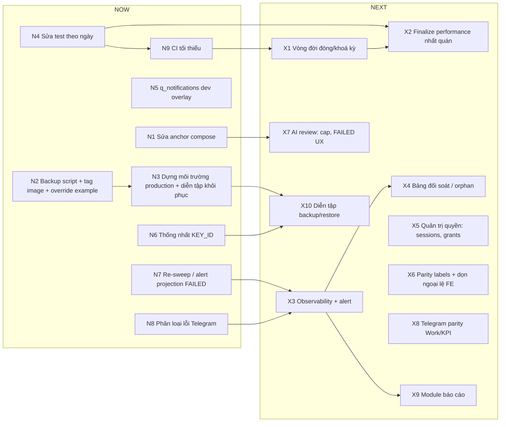

# 14. Lộ trình phát triển đề xuất

Lộ trình này được suy ra từ kiến trúc hiện có và các khoảng trống ghi trong [13_KNOWN_ISSUES_AND_TECH_DEBT.md](13_KNOWN_ISSUES_AND_TECH_DEBT.md). Toàn bộ là **khuyến nghị**; thứ tự và phạm vi do đội phát triển và product quyết định. Không đề xuất viết lại: modular monolith hiện tại (một image, bốn entry point, service `Pr*` là nơi duy nhất giữ nghiệp vụ) đủ cho quy mô ~20 người dùng và mọi khoảng trống đều có thể vá tăng dần.

Độ phức tạp: **S** ≤ 1 ngày, **M** ≤ 1 tuần, **L** ≤ 1 tháng, **XL** > 1 tháng hoặc cần quyết định sản phẩm/bên thứ ba.

## Thứ tự ưu tiên đề xuất

Ba tuần đầu nên dành cho việc làm cho **những gì đã có chạy đúng như tài liệu hứa** và làm cho deploy **tái lập được từ repo**: sửa anchor compose (P1-1) mở khoá connector YouTube và hai kill switch mà không cần viết tính năng mới; sửa test theo ngày (P1-6) trả lại một cổng chất lượng để mọi thay đổi sau đó có thể đo được; bổ sung script backup và tag image theo phiên bản (P2-25) để lần release đầu tiên có thể rollback và phục hồi được. Chỉ sau khi ba việc đó xong mới nên chạm vào vòng đời đóng kỳ và finalize performance (P1-2), vì đó là quyết định sản phẩm kéo theo migration và không thể kiểm chứng nếu bộ test còn đỏ. Quan sát hệ thống (observability) và bảng đối soát đứng ngay sau, vì chúng là thứ biến các lỗi "im lặng" hiện nay (projection FAILED, gửi Telegram thất bại không phân loại) thành việc thấy được. Mọi thứ còn lại (staging, CI/CD đầy đủ, KPI theo đội, đăng bài tự động) là **Later** vì cần hạ tầng hoặc quyết định ngoài phạm vi kỹ thuật.

---

## NOW — vài tuần tới

| #  | Hạng mục                                                                                                                                                                                                                                                                                                                                                                                                                                               | Giá trị nghiệp vụ                                                                                                                                                  | Lý do kỹ thuật                                                                                                                                                              | Phụ thuộc                                                                                     | Rủi ro                                                                                                                                                                                                                                      | Độ phức tạp                         |
| -- | -------------------------------------------------------------------------------------------------------------------------------------------------------------------------------------------------------------------------------------------------------------------------------------------------------------------------------------------------------------------------------------------------------------------------------------------------------- | ---------------------------------------------------------------------------------------------------------------------------------------------------------------------- | ------------------------------------------------------------------------------------------------------------------------------------------------------------------------------ | ----------------------------------------------------------------------------------------------- | -------------------------------------------------------------------------------------------------------------------------------------------------------------------------------------------------------------------------------------------- | --------------------------------------- |
| N1 | **Thêm 44 biến còn thiếu vào anchor `x-app-env`** trong `docker-compose.yml`; thêm test so khớp `.env.example` ↔ anchor ↔ `Settings`.                                                                                                                                                                                                                                                                                             | Connector YouTube bật được; kill switch`PR_RECURRING_WORK_ENABLED` / `PR_CHANNEL_SYNC_ENABLED` bấm được; tinh chỉnh notification/reminder có hiệu lực. | P1-1: container không đọc`.env` (`Dockerfile:49-52`, `.dockerignore:22-24`); chỉ anchor mới tới tiến trình (`docker-compose.yml:5-92`).                        | Không.                                                                                         | Thấp: mọi biến đều có default = giá trị đang chạy; chỉ`PR_SECRET_ENCRYPTION_KEY` cần cân nhắc vì env var thắng `_FILE` (`src/meobot/core/secrets.py:238-243`) — nếu host đang dùng `_FILE`, để trống env var. | S                                       |
| N2 | **Backup, tag image và override mẫu**: giữ `docker-compose.yml` + `docker-compose.dev.yml` làm topology chuẩn; thay `docker-compose.override.yml` bằng `docker-compose.override.yml.example` có ghi chú, giữ override thật ngoài git; thêm `scripts/backup.sh` (chưa tồn tại: `pg_dump` + sao chép file khoá + kiểm tra kích thước > 0); tag image theo `__version__` thay vì `meobot-app:0.3.0` cố định. | Dựng được trên host bất kỳ từ repo; rollback theo tag thay vì rebuild.                                                                                        | P2-25 trong[13](13_KNOWN_ISSUES_AND_TECH_DEBT.md): `Dockerfile:50` nướng `src/`; không có script backup.                                                                | Không có.                                                                                     | Thấp: chỉ thêm file; không đổi hành vi app.                                                                                                                                                                                           | S–M                                    |
| N3 | **Chuẩn bị môi trường production (host Docker Compose) và diễn tập khôi phục nếu kế thừa dữ liệu** theo [11_DEPLOYMENT_AND_OPERATIONS.md](11_DEPLOYMENT_AND_OPERATIONS.md): dựng stack trống → `alembic upgrade head` (0041) → smoke; hoặc khôi phục dump + file khoá → `alembic current` khớp revision lúc dump → `upgrade head` → smoke.                                                                        | Có môi trường production được kiểm soát; dữ liệu kế thừa (nếu có) được chứng tỏ phục hồi được.                                                | Quy trình phục hồi chưa được diễn tập; migration 0037/0039 có backfill, 0040/0041 downgrade có điều kiện ([08](08_DATABASE_AND_MIGRATIONS.md)).                   | N2 (backup script), Đ1–Đ3 trong[13](13_KNOWN_ISSUES_AND_TECH_DEBT.md).                        | Cao nếu kế thừa dữ liệu mà bỏ diễn tập; thấp nếu bắt đầu từ DB trống.                                                                                                                                                        | S (DB trống) / M (kế thừa dữ liệu) |
| N4 | **Sửa 34 test theo ngày**: helper tháng tương đối trong `tests/unit/test_pr_work_quota.py:102-108`, `test_pr_work_month_view.py:123-126`, `test_pr_performance.py:835-843`, `tests/integration/test_pr_manual_work_pg.py:178-197`; họ HR/notification ghim theo `date.today()`.                                                                                                                                                  | `make check` xanh trở lại; hồi quy thật phân biệt được với lịch.                                                                                          | P1-5;`complete()/approve()` đóng dấu `utcnow()` (`src/meobot/application/pr_work_service.py:1500`) nên tháng ghim cứng sẽ lệch mỗi tháng.                      | Không.                                                                                         | Thấp.                                                                                                                                                                                                                                       | S–M                                    |
| N5 | **Thêm `q_notifications` vào `docker-compose.dev.yml`** worker.                                                                                                                                                                                                                                                                                                                                                                              | Dev thấy được notification, reminder, guest replay như production.                                                                                                | P1-6:`docker-compose.dev.yml:53-54`.                                                                                                                                         | Không.                                                                                         | Không.                                                                                                                                                                                                                                      | S                                       |
| N6 | **Thống nhất `PR_SECRET_ENCRYPTION_KEY_ID`** giữa compose (`v1`), code (`primary`) và `.env.example`.                                                                                                                                                                                                                                                                                                                                  | CLI probe và mọi tiến trình ngoài compose giải mã được cùng DB.                                                                                             | P2-26:`docker-compose.yml:46` vs `config.py:269`.                                                                                                                          | Biết các ciphertext hiện có mang id nào (SQL ở[06 §10a](06_PERMISSIONS_AND_SECURITY.md)). | Chọn sai id làm mọi connection thành`ACTION_REQUIRED`; luôn thêm id cũ vào `KEYS_OLD` khi đổi.                                                                                                                                 | S                                       |
| N7 | **Re-sweep dòng projection `FAILED`** với trần `attempts`, và alert vào inbox OWNER; `reconcile` cập nhật `last_outcome`.                                                                                                                                                                                                                                                                                                           | Việc của nhân viên không "biến mất" vì một lỗi tạm thời.                                                                                                   | P1-7:`claim_batch` chỉ đọc `PENDING` (`src/meobot/application/pr_content_work_projector.py:376`); `_mark_failed` (`src/meobot/tasks/pr_content_work.py:168-201`). | Không.                                                                                         | Thấp: projector hội tụ, chạy lại là an toàn (test atomicity).                                                                                                                                                                         | S                                       |
| N8 | **Phân loại lỗi gửi Telegram thật**: `TelegramNotifier.send` ném/trả lỗi có cấu trúc thay vì `False`; honour `retry_after`; dừng sớm khi bot bị chặn.                                                                                                                                                                                                                                                                        | Alert thất bại nói đúng lý do; không đốt 5 lần thử vào người đã chặn bot.                                                                             | P1-4:`src/meobot/integrations/telegram/notifier.py:206-215`, `src/meobot/application/delivery_service.py:142-171`.                                                         | Không.                                                                                         | Trung bình: đụng vào đường gửi "ít nhất một lần"; cần test với`RecordingSession`.                                                                                                                                            | M                                       |
| N9 | **CI tối thiểu**: chạy `scripts/check.sh` + `cd frontend && npm run check` trên GitHub Actions (hoặc cron trên host nếu repo không lên GitHub).                                                                                                                                                                                                                                                                                       | Mỗi commit được kiểm tra;`next build` chạy trước `vitest` để test bí mật trong bundle có hiệu lực.                                                  | Không có`.github/workflows`; unit suite ~60 phút phải chia phần (xem [10](10_TESTING_AND_QUALITY_GATES.md)).                                                             | N4.                                                                                             | Thời gian chạy dài; cần cache uv/npm.                                                                                                                                                                                                    | M                                       |

## NEXT — 1–2 quý

| #   | Hạng mục                                                                                                                                                                                                                                                                                                                                               | Giá trị nghiệp vụ                                                                                              | Lý do kỹ thuật                                                                                                                                                                                                                                                          | Phụ thuộc                                              | Rủi ro                                                                                               | Độ phức tạp                  |
| --- | -------------------------------------------------------------------------------------------------------------------------------------------------------------------------------------------------------------------------------------------------------------------------------------------------------------------------------------------------------- | ------------------------------------------------------------------------------------------------------------------ | -------------------------------------------------------------------------------------------------------------------------------------------------------------------------------------------------------------------------------------------------------------------------- | -------------------------------------------------------- | ----------------------------------------------------------------------------------------------------- | -------------------------------- |
| X1  | **Vòng đời đóng/khoá kỳ báo cáo**: service + route ghi `CLOSED`/`LOCKED` (có capability, audit), đường mở lại, và finalize thực sự khoá review/override/rule approval/M2 recompute.                                                                                                                                         | Số liệu tháng cũ ổn định để trả lương/đánh giá; chấm dứt tình trạng "mọi guard là mã chết". | P1-2: không ai ghi`CLOSED`/`LOCKED` (`src/meobot/application/pr_work_period_service.py:206-208`); recurring generator và projector đã có nhánh xử lý kỳ đóng.                                                                                             | Q5 (product), N4, N9.                                    | Cao về nghiệp vụ: đóng nhầm không có đường lui nếu không làm đường mở lại trước. | L                                |
| X2  | **Finalize performance nhất quán**: `snapshot()` đọc dòng `PrPerformanceResult` đã finalize thay vì tính lại; `PUT /review`, `POST /target-override` từ chối tháng đã finalize ở server.                                                                                                                                   | Con số đã chốt là con số hiển thị.                                                                         | `src/meobot/application/pr_performance_service.py:342-381,919`; `pr_performance_review_service.py:178`; UI chỉ ẩn form (`performance.tsx:323`).                                                                                                                    | X1 (hoặc làm trước như bước nhỏ độc lập), N4. | Thấp.                                                                                                | M                                |
| X3  | **Observability và alert**: bộ đếm có cấu trúc (hoặc endpoint metrics) cho outbox, projection queue, AI review runs, channel sync, recurring occurrences; alert tới OWNER khi `FAILED`/`PERMANENT_FAILURE`/`consecutive_failures` vượt ngưỡng; tiêm `worker_ping` vào `HealthService` để `/health/ready` báo Celery. | Vận hành thấy lỗi trước người dùng.                                                                       | Các bảng trạng thái đã có (`pr_content_work_projections`, `pr_ai_review_runs`, `outbound_messages`, `pr_channel_connections`); `HealthService._check_workers` đã có sẵn nhưng `worker_ping` không được tiêm (`src/meobot/api/main.py:200`). | N7, N8.                                                  | Thấp.                                                                                                | M                                |
| X4  | **Bảng đối soát / phát hiện mồ côi** trong trang Maintenance: trạng thái queue projection, result không còn milestone sống, container không có result, work type `CONTENT_AUTO_*` tự sinh, result `PENDING` quá hạn.                                                                                                         | Admin tự chẩn đoán KPI thiếu/thừa mà không cần SQL.                                                       | Tất cả truy vấn đã có dạng tương đương trong`pr_work_maintenance_service.py` (preview sync/rebuild) và `GET /api/pr/work/content/projections`.                                                                                                            | X3.                                                      | Thấp.                                                                                                | M                                |
| X5  | **Lấp khoảng trống quản trị quyền**: màn hình phiên đang mở + route gọi `revoke_all_for_user`; grant chỉ cho user `may_use_meobot`; gọi revoke phiên trong `suspend`/`revoke`; xoá hoặc hiện thực `UserStatus.PENDING`.                                                                                               | Khoá tài khoản có hiệu lực tức thì và nhìn thấy được.                                                | P2-13, P2-14;`revoke_all_for_user` không có caller.                                                                                                                                                                                                                    | Q2.                                                      | Thấp.                                                                                                | S–M                             |
| X6  | **Test parity `labels.ts` ↔ enum backend** và dọn các ngoại lệ frontend (members OWNER-immunity, `can_manage_assignments` ở channels, trang Task cũ, scoring-rules/policy).                                                                                                                                                            | Đổi quy tắc server tự hiện lên UI; enum mới không hiện mã thô.                                          | P2-5, P2-6.                                                                                                                                                                                                                                                                | Không.                                                  | Thấp.                                                                                                | S–M                             |
| X7  | **AI review**: trần chi phí theo ngày/tháng, hiển thị run `FAILED`/requeue trên UI với lý do, quyết định có kiểm tra policy pack cho đường trực tiếp hay không.                                                                                                                                                              | Kiểm soát chi phí LLM; người viết biết vì sao kịch bản kẹt ở`AI_REVIEW`.                             | Không spend cap ngoài`PR_AI_REVIEW_MAX_ATTEMPTS=3`; `FAILED` run để content ở `AI_REVIEW` không lối ra ngoài cancel/`submit-ai-review`.                                                                                                                    | N1 (biến LLM tới container đã đúng), Q6.           | Trung bình.                                                                                          | M                                |
| X8  | **Telegram parity cho Work/KPI cơ bản** (xem việc của tôi, nhận việc, báo kết quả) hoặc tối thiểu ngừng để `member_router` nuốt câu PR; đăng ký `/web` vào `COMMANDS` và chuyển sang HTML.                                                                                                                           | Nhân viên dùng được module Work từ Telegram như README hứa.                                               | P2-7, P2-8;`member_interaction_service.py:350-363` trả `not_built_yet` cho 9 intent.                                                                                                                                                                                  | X3 (để thấy lỗi), không bắt buộc.                 | Trung bình: pattern tiếng Việt dễ va chạm.                                                       | S (vá) – L (parity đầy đủ) |
| X9  | **Module báo cáo**: trang `/pr/reports` hiện là placeholder; các bảng STEP_1B (`pr_issues`, reporting foundation) chưa có gì ghi vào; cần báo cáo tuần/tháng theo kênh, nội dung, việc, KPI.                                                                                                                                 | Trưởng phòng có số liệu tổng hợp mà không mở nhiều trang.                                              | `frontend/src/app/pr/reports/page.tsx:58-70`; metrics snapshot và work results đã có dữ liệu.                                                                                                                                                                      | X1 (kỳ ổn định), X3.                                 | Phạm vi dễ phình; cần đặc tả.                                                                  | L                                |
| X10 | **Diễn tập backup/restore** gồm file khoá mã hoá: restore vào container trống, chạy `alembic current`, mở panel, xác nhận connection giải mã được.                                                                                                                                                                              | Biết chắc backup dùng được trước khi cần.                                                                 | Chưa có diễn tập phục hồi; mất khoá = mọi kênh nối lại.                                                                                                                                                                                                        | N2, N3, N6, Đ3.                                         | Thấp.                                                                                                | S                                |

## LATER — khi đã ổn định

| #  | Hạng mục                                                                                                                                                                                                          | Giá trị nghiệp vụ                                                                 | Lý do kỹ thuật                                                                                                                                                      | Phụ thuộc                | Rủi ro                                         | Độ phức tạp |
| -- | ------------------------------------------------------------------------------------------------------------------------------------------------------------------------------------------------------------------- | ------------------------------------------------------------------------------------- | ---------------------------------------------------------------------------------------------------------------------------------------------------------------------- | -------------------------- | ----------------------------------------------- | --------------- |
| L1 | **Môi trường staging** (project compose thứ hai trên host với `-p meobot-staging`, DB riêng, bot token riêng).                                                                                      | Thử migration và tính năng với dữ liệu thật đã ẩn danh trước production. | Hiện chỉ có production và máy dev.                                                                                                                                | N2, X10.                   | Tài nguyên host (hiện ~2.2 GB cho một bộ). | M               |
| L2 | **CI/CD đầy đủ** với image tag, registry (hoặc save/load), rollback bằng tag.                                                                                                                          | Release có thể lặp lại và hoàn tác trong phút.                                | N9 chỉ chạy kiểm tra; deploy vẫn thủ công.                                                                                                                       | N2, N9, L1.                | Thay đổi thói quen vận hành.               | M–L            |
| L3 | **KPI theo đội / target suy ra từ lịch định kỳ**.                                                                                                                                                      | Trưởng nhóm lập kế hoạch cho cả nhóm; target không phải gõ tay.            | M2 mô hình chỉ per-person (`pr_work_plans.user_id` NOT NULL); target chỉ nhập tay; không có dimension team ở grants hoặc membership.                        | X1, quyết định product. | Đổi mô hình dữ liệu KPI.                  | XL              |
| L4 | **Đăng bài tự động lên Facebook/TikTok** sau khi duyệt.                                                                                                                                               | Bỏ bước đăng tay.                                                                | `FacebookPublisher` còn `NotConfigured` (`src/meobot/integrations/meta/publisher.py:96-108`); cần app review Meta/TikTok; cần Cloudflare tunnel cho callback. | Scope mới của app, X7.   | Bên thứ ba quyết định tiến độ.          | XL              |
| L5 | **Rate limiting** ở reverse proxy trước, ở app sau cho `/auth/login` và bot.                                                                                                                           | Chống lạm dụng.                                                                    | P2-12.                                                                                                                                                                 | Không.                    | Thấp.                                          | S–M            |
| L6 | **Quyết định số phận module Scripts/Sheets cũ** (`/pending_scripts`, `/review_script`, sheet profile, `/api/v1`): chuyển sang module PR hoặc gỡ cùng với routers nội bộ.                   | Bớt hai mô hình song song và bề mặt OWNER giả.                                 | P1-3; module cũ dùng`get_current_system_actor`.                                                                                                                    | Product.                   | Người dùng còn phụ thuộc Sheet.           | L               |
| L7 | **E2E trình duyệt** (Playwright) cho vòng cookie, proxy Next và ba bước smoke không giả lập được.                                                                                                 | Thay thế checklist 18 bước thủ công.                                             | Chỉ có fetch stub (`frontend/tests/helpers.tsx:134-171`).                                                                                                          | L1.                        | Thời gian chạy.                               | M               |
| L8 | **Hợp nhất tài liệu**: gắn banner "superseded" lên các STEP docs đã lỗi thời, thay các mục README cũ bằng liên kết tới bộ tài liệu này, giữ `docs/pr/` làm lịch sử quyết định. | Một nguồn đọc duy nhất.                                                          | P3-1, P3-2.                                                                                                                                                            | Không.                    | Không.                                         | M               |
