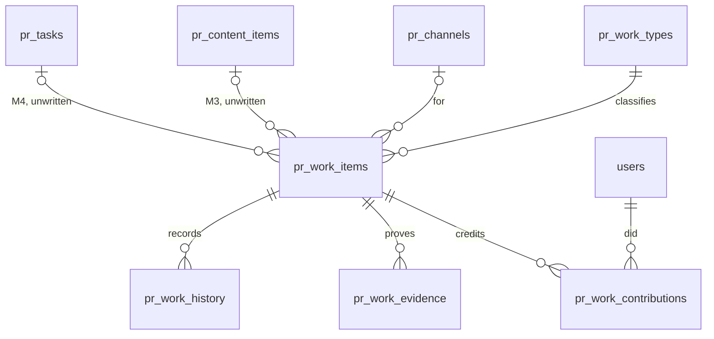
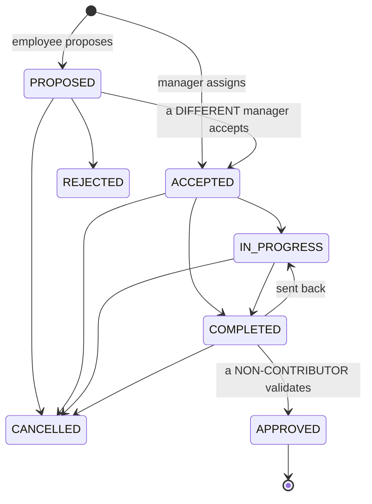

# M1 — Work Core

**Status:** implemented. Not deployed.
**Migration:** `0032_pr_work_core`, down-revision `0031`. Five new tables and
**no change to any existing one**.
**Superseded in one place:** §19's handover recommended `quota_status` on
`pr_work_contributions`. M2 did not do that and explains why — see
[`WORK_QUOTA_M2.md`](WORK_QUOTA_M2.md) §3. Everything else in §19 was
implemented as written. M2 added exactly one column to an M1 table
(`pr_work_types.default_quota_basis`) and changed **no M1 rule and no M1
figure**.
**Scope:** the Work Ledger foundation — types, items, contributions, evidence,
history, the acceptance boundary, the counting boundary, and the queries that
distinguish a period's achievement from what is still outstanding.
**Out of scope, and absent from the code:** every score, quota, cap, quality
grade, `score_status` and `OVER_QUOTA`; the content projector; the task bridge;
recurring generation; Telegram automation; any team or department model.

---

## 1. The one idea

```
CREATED  !=  ACCEPTED  !=  COMPLETED  !=  APPROVED  !=  COUNTED
```

Five facts about one piece of work. Collapsing any two of them is how a KPI
becomes something an employee can write for themselves, so they are five
different columns across two tables and the only path from the fourth to the
fifth runs through one method that refuses an actor who did the work.

Everything below is a consequence of that sentence.

---

## 2. Schema



### `pr_work_types` — the taxonomy

Hybrid: `category` is an enum that code groups and reports by; the row is the
sub-type the business owns and edits without a deploy.

| Column | Note |
|---|---|
| `code` | **The stable machine identifier.** Upper snake, unique, never renamed |
| `name` | What a person reads. Nothing authorises or groups on it |
| `category` | `CONTENT` `PRODUCTION` `DISTRIBUTION` `COMMUNITY` `PR_EVENT` `OPERATIONS` `RESEARCH` `OTHER` |
| `default_unit` | `ITEM` `VIDEO` `POST` `ARTICLE` `COMMENT` `MESSAGE` `SESSION` `HOUR` `DAY` |
| `requires_evidence` | Enforced at completion, not at insert |
| `is_active`, `display_order` | Deactivated types keep their history and stop being offered |

`code`, `category` and `default_unit` are **not editable** — they are what past
work was filed under, grouped by and measured in. The answer to a wrong one is a
new type and deactivating the old.

> **Superseded by M2.5.** See
> [`WORK_TYPE_MANAGEMENT_M25.md`](WORK_TYPE_MANAGEMENT_M25.md) §5. The rule is
> now on **use** rather than on the field: an unused type is fully editable (a
> typo in a type created five minutes ago should not be permanent), and a *used*
> one refuses `code`, `default_quota_basis` and `default_unit`. `category` moved
> to the editable side — it is how a report groups rows, not what a row measured
> — and `default_quota_basis`, which M2 had left editable at any time, moved onto
> the locked side, which is where it always belonged.

`OTHER` is a fallback, and its label says so: *"Khác (chưa phân loại)"*. A large
`OTHER` bar on a report is telling somebody a work type is missing.

### `pr_work_items` — one real job

`code` (`WRK-2026-000001`), `title`, `description`, `work_type_id`,
`source_type`, `source_key`, `status`, `priority`, `quantity`, `unit`,
`created_by_user_id`, `assigned_by_user_id`, and the timestamps
`assigned_at` / `accepted_at` / `started_at` / `completed_at` (+
`completed_by_user_id`) / `approved_at` (+ `approved_by_user_id`) / `due_at` /
`cancelled_at` (+ `cancelled_by_user_id`, `cancel_reason`); plus `channel_id`,
and `content_id` / `task_id` **reserved and unwritten by M1**.

No trigger derives any timestamp from `status` — the same reasoning
`PrTask.completed_at` is left underived for, applied to a ladder with an
anti-gaming rule on it.

Constraints that carry rules:

- `quantity IS NULL OR quantity > 0`
- `(quantity IS NULL) = (unit IS NULL)` — "100" of nothing and "comments" of no
  number are both unreadable
- `source_type = 'MANUAL' OR source_key IS NOT NULL`
- `uq_pr_work_items_source` — **partial unique** on `(source_type, source_key)`
  `WHERE source_key IS NOT NULL`

### `pr_work_contributions` — one person's share. **The KPI row**

`work_item_id`, `user_id`, `contribution_role` (`PRIMARY` / `CONTRIBUTOR` /
`SUPPORT`), `credit_weight`, `assigned_at`, `count_status`, `counted_at`,
`excluded_reason` / `excluded_by_user_id` / `excluded_at`.

- `uq_pr_work_contributions_item_user_role` — one person, one capacity, one job
- `credit_weight > 0 AND credit_weight <= 1` — a share may be reduced and never
  inflated
- `(count_status = 'COUNTED') = (counted_at IS NOT NULL)` — the database refuses
  a half-write

**No per-person `accepted_at` / `completed_at`**, unlike `pr_task_assignments`.
M1 has no semantics for one contributor finishing before another, and columns
nothing writes are columns that lie.

### `pr_work_evidence`

`label`, `location`, `note`, `added_by_user_id`. A URL or a path — **MeoBot
stores no files**; the department already keeps its output in Drive and on the
NAS. Shaped like `PrContentResource` and deliberately not reusing it, because
that table's `content_id` is `NOT NULL`.

### `pr_work_history` — the user-facing timeline

Append-only: `event_type`, `from_status`, `to_status`, `actor_user_id`, `note`,
`metadata` (JSONB), `contribution_id` for the per-person events.

Every foreign key in the revision is `RESTRICT`, **with no exception** —
including `actor_user_id`, which is deliberately not `audit_logs`' `SET NULL`.
A MeoBot user row is never hard-deleted (suspension and revocation are a status
and a timestamp, precisely so history stays attached), so nothing needs the
escape hatch, and forgetting who moved a piece of work would lose the answer
this table exists to give.

---

## 3. Lifecycle



`ACCEPTED → COMPLETED` skips `IN_PROGRESS` because small work does not need a
start. `COMPLETED → IN_PROGRESS` exists so a validator looking at unfinished
work has an option other than approving it or cancelling somebody's afternoon.

**Each write owns one edge into `IN_PROGRESS`.** `start` takes
`ACCEPTED → IN_PROGRESS` and refuses everything else; `reopen` takes
`COMPLETED → IN_PROGRESS` and refuses everything else (`_require_status`, the
same `illegal_transition` shape). Before the action-availability fix both
accepted either edge because the table admits both, which let a contributor
"start" finished work back to in-progress. The graph is unchanged; the writes
now say which edge is theirs, and `can_start` / `can_reopen` are advertised
from exactly that status.

**`APPROVED` has no outgoing edges**, and that is an M1 product decision rather
than a gap — see §7.

---

## 4. The two boundaries

### Acceptance — an employee cannot put work in their own workload

| | Proposal | Assignment |
|---|---|---|
| Who | employee (`PR_WORK_EXECUTE`) | manager (`PR_WORK_MANAGE`) |
| Lands at | `PROPOSED` | `ACCEPTED` |
| In a KPI? | **No.** Contributions `PENDING`, `counted_at` null | Not yet — accepted work still has to be done and validated |
| Needs acceptance | **Yes, by somebody else** | No: *the assignment is the authorization* |

`accept` and `reject` refuse `item.created_by_user_id == actor` with
`reason: self_acceptance`. Holding `PR_WORK_MANAGE` does not help — a manager
may accept anybody's proposal except their own. Without that, "propose" and
"assign" would be one button with two names.

### Validation — a contributor cannot count their own work

`approve` refuses any actor with a row in `pr_work_contributions` for that item,
with `reason: self_validation`, **whatever capability they hold — including an
OWNER**. The rule is about who did the work, never about rank, because the
approval is what puts a number on somebody's performance record.

This is a server check against a table, not a hidden button. `can_validate` on
the detail response is the same rule rendered as a flag so a client draws the
right controls; calling the route anyway gets the identical refusal, and
`test_08` asserts both halves.

---

## 5. COUNTED semantics

`COUNTED` means: **this person's share of this job is valid completed work.**
Nothing more. No points, no rate, no quota.

`approve` is one transaction, in this order:

1. lock the item (`SELECT … FOR UPDATE`) — a second validator waits rather than races
2. re-read the status under the lock; check the edge against `WORK_TRANSITIONS`
3. check `PR_WORK_VALIDATE`
4. check the actor contributed to nothing on this item
5. stamp `approved_at` / `approved_by_user_id`
6. stamp `count_status = COUNTED` and `counted_at` on every `PENDING` contribution
7. append `pr_work_history` (one `APPROVED` + one `COUNTED` per person) and the audit row

`counted_at` is **one clock reading for every contribution on the item**, so a
three-person shoot cannot land in two months because two writes straddled
midnight. An `EXCLUDED` contribution is left alone — exclusion is a deliberate
decision and approving around it must not undo it.

Two validators pressing at once: the second waits on the lock, re-reads
`APPROVED`, and is refused by the transition matrix. Verified concurrently on
real PostgreSQL — `test_two_validators_racing_count_exactly_once`.

---

## 6. Multiple contributors, and quantity

**One job is not one person's workload.** A shoot with three people:

| Figure | Value | Read from |
|---|---|---|
| Department work items | **1** | `pr_work_items` |
| Employee contributions counted | **3** | `pr_work_contributions` |
| Each person's credit | `1.0` | `credit_weight`, never divided |

`WorkSummary` carries `counted_work_items` **and** `counted_contributions` and
never derives one from the other.

**Quantity.** "100 comments seeding" is **one** work item with `quantity = 100`
and `unit = COMMENT`. The unit comes from the **work type**, not from the person
filing, which is what stops one real job being split into whichever shape counts
best. `quantity` is `Numeric(12,2)` so a half-day shoot is `0.5 DAY`, and it is
bounded at 100 000 because it is the one field that scales what an item claims.

---

## 7. Cancellation, and why `APPROVED` is final in M1

Cancelling open work marks it `CANCELLED`, keeps the row and its history, and
moves its `PENDING` contributions to `EXCLUDED` with a reason — so nothing waits
for ever on a validation that will not come.

**Approved work cannot be cancelled**, and the refusal is deliberate:
`counted_at` is written, and taking it back is a correction against a reporting
period that may since have been `CLOSED` or `LOCKED`. Correction semantics —
un-counting, re-counting, what a locked period permits — belong to the milestone
that has a quota engine to stay consistent with. Until then validation is final
and a mistake is recorded as **new work**, not by rewriting history.

The same reasoning forbids removing a **counted** contribution and removing
evidence from approved work.

Consequence for §12: because nothing in M1 can change a `counted_at` after the
fact, `LOCKED`-period immutability is preserved without M1 needing to implement
period locking at all.

---

## 8. Source keys and idempotency

Contract:

```
{source}:{entity-uuid}:{MILESTONE}

  content:8f3e…:SCRIPT_APPROVED
  content:8f3e…:PRODUCTION_APPROVED
  task:1a2b…:DONE
  recurring:9c8d…:2026-09-15
```

Two decisions:

**The milestone is in the key.** One content item legitimately produces several
pieces of work — somebody wrote it, somebody edited it, somebody posted it — so
a key of `content:{id}` alone would let the writer's credit exist and silently
swallow the other two.

**The transition event id is deliberately absent.** An approval that is undone
and re-made is *the same script being approved*, not a second one. Keying on the
event would produce a second item and double-count the writer; keying on the
milestone means a future projector finds the existing row and reconciles it.
Replayed jobs, repeated webhooks and a re-run backfill therefore converge on one
row.

Enforced by the partial unique index. **M1 writes no keyed rows** — every item
it creates is `MANUAL` with `source_key = NULL` — but the guarantee exists
*before* anything relies on it, which is the only time an idempotency guarantee
is worth adding.

---

## 9. Permissions

Four capabilities, each a **new pairing of an existing `Permission`** — never a
new permission, following `_BASELINE_PERMISSIONS`.

| Capability | Baseline | Reaches | For |
|---|---|---|---|
| `PR_WORK_EXECUTE` | `script.submit` | EMPLOYEE+ | Own work: propose, start, complete, attach evidence |
| `PR_WORK_MANAGE` | `video.approve` | TEAM_LEAD+ | Assign, accept/reject, and manage **the jobs you put somebody on** |
| `PR_WORK_VALIDATE` | `script.approve` | TEAM_LEAD+ | **Validate completed work** — the only act that counts anything |
| `PR_WORK_CONFIGURE` | `settings.write` | ADMIN+ | The taxonomy |
| `PR_WORK_VIEW_ALL` | `user.read` | **ADMIN+** | **Seeing the whole department's work** |

None is `GRANT_BACKED` in M1: requiring an explicit grant before anybody could
validate would make the module unusable out of the box, and the anti-gaming
boundary here is *independence*, not a grant. M2 may promote `PR_WORK_VALIDATE`
when validation starts deciding points.

**Visibility is relationship-based and invents no team.**

| Scope | Requires | Means |
|---|---|---|
| `MINE` | — | Work I contribute to |
| `ASSIGNED_BY_ME` | `PR_WORK_MANAGE` | Work I assigned or created |
| `NEEDS_MY_DECISION` | `PR_WORK_MANAGE` **or** `PR_WORK_VALIDATE` | Proposals I may accept and finished work I may validate, **minus anything I worked on or proposed** — a queue of refusals would be worse than no queue. Narrowed to what the holder can actually decide: `MANAGE` alone yields proposals, `VALIDATE` alone yields finished work |
| `ALL` | **`PR_WORK_VIEW_ALL`** | Everything. Head and Admin |

Effective matrix:

| Role | MINE | ASSIGNED_BY_ME | NEEDS_MY_DECISION | ALL |
|---|:--:|:--:|:--:|:--:|
| EMPLOYEE | ✓ | | | |
| TEAM_LEAD | ✓ | ✓ | ✓ | **✗** |
| ADMIN / OWNER | ✓ | ✓ | ✓ | ✓ |

**`PR_WORK_MANAGE` does not imply `ALL`.** Managing work means deciding about
what you put somebody on or what is waiting for your decision; reading every
colleague's record is a different act with different consequences for the
people in it, and it has its own capability.

A **work item** is readable through exactly four relationships — contributor,
creator, assigner, or an item currently in your decision queue — plus
`PR_WORK_VIEW_ALL`. `PR_WORK_MANAGE` on its own is not one of them, so the
detail route cannot be used to walk past the list scopes one id at a time.

The **write path is never wider than the read path**: changing a deadline,
cancelling, or adding a contributor requires `PR_WORK_MANAGE` *over that
item* — you created or assigned it, or you hold `PR_WORK_VIEW_ALL`. Accepting,
rejecting, validating and reopening deliberately stay open to any holder of the
relevant capability, because the whole point of the acceptance and validation
boundaries is that somebody *other* than the owner takes them.

Asking for a wider scope, or about another person, is **refused** with a stable
`reason` (`scope_not_permitted` / `user_filter_not_permitted`) rather than
narrowed: silently reducing a department-wide request to one person's own work
would put a figure on screen labelled as something it is not.

`PrChannelAssignment` is **not** used as a team proxy, and no organisational
table was added. MeoBot has no department, team or manager relationship, and
M0's channel-assignment suggestion was explicitly overridden.

---

## 10. Period semantics

**Two questions, two mechanisms, and they must never share one.**

| | Period performance | Open / overdue |
|---|---|---|
| Question | *"What did this person achieve in September?"* | *"What is still outstanding?"* |
| Driver | a date range over `counted_at` | **status only — no date range at all** |
| Changes with the filter | yes | **no** |

`WorkSummary` computes the operational figures from a **second** set of
conditions with the date predicate removed — not from the same set with a
different aggregate. That is what makes "a period filter cannot hide overdue
work" a property of the code.

Which timestamp drives what:

| Figure | Timestamp |
|---|---|
| `created` / `accepted` / `completed` / `approved` | the item's own `created_at` / `accepted_at` / `completed_at` / `approved_at` |
| **`counted_contributions` / `counted_work_items`** | **the contribution's `counted_at`** |
| `overdue` | `due_at < now AND status IN (ACCEPTED, IN_PROGRESS)` |
| `open` / `in_progress` / `awaiting_validation` / `proposed` | current status |

**Assigned 31 Aug, completed 1 Sep, validated 2 Sep → September.** `counted_at`
is stamped at validation and nothing else decides it.

**Overdue excludes `PROPOSED` and `COMPLETED`**, and both exclusions are the
definition of the word: a proposal is not late because nobody agreed to it, and
completed work is waiting on a *validator* — putting that in an employee's
"Nợ việc" would show them a manager's queue as their own debt. Both remain
visible, as *chờ duyệt* and *chờ xác nhận*.

Day boundaries come from the **existing** `day_bounds(from, to, tz)` — the one
place a Vietnamese calendar day becomes a pair of UTC instants. `WEEK` starts
Monday; `MONTH` runs from the 1st to today, because a figure for "this month"
that included the future would count days that have not happened.

---

## 11. API

```
GET    /api/pr/work/types                        · POST · PATCH /types/{id}
GET    /api/pr/work                              list, filtered server-side
GET    /api/pr/work/summary                      the ten figures
GET    /api/pr/work/{id}                         · GET /{id}/history
POST   /api/pr/work/proposals                    propose  → PROPOSED
POST   /api/pr/work                              assign   → ACCEPTED
POST   /api/pr/work/{id}/accept   /reject
POST   /api/pr/work/{id}/start    /complete
POST   /api/pr/work/{id}/approve  /reopen  /cancel
POST   /api/pr/work/{id}/contributors            · DELETE /{contribution_id}
POST   /api/pr/work/{id}/deadline /priority
GET    /api/pr/work/{id}/evidence · POST · DELETE /{evidence_id}
```

**Explicit actions, never one PATCH.** A general update route is a route through
which a client could write `status: "APPROVED"` without passing the checks that
make the word mean something. Request bodies use `extra="forbid"`, so a body
carrying `status`, `count_status` or `counted_at` is **refused** rather than
ignored — and no body anywhere carries `source_type`, so nobody can file work as
though the content workflow produced it.

Every action returns the whole refreshed item, because what the caller wants to
know is what state the work is in now.

---

## 12. Reporting periods

M1 implements no quota and no period locking, and **needs none** to stay
compatible: because `APPROVED` is terminal (§7), no M1 code path can alter a
`counted_at` after it is written. A `LOCKED` period therefore cannot be
retroactively changed by anything this milestone ships.

`PrReportingPeriod` is untouched and unread **by M1**. M2 is its first reader:
a KPI plan names a period row, and eligibility recomputes only while that row is
`OPEN`. M1 needed no change for that to be safe.

---

## 13. Audit and history — both, deliberately

Following the Step 1F.2.3b precedent for content transitions:

| | `audit_logs` | `pr_work_history` |
|---|---|---|
| Answers | *"who changed what"* | *"what happened to my work"* |
| Carries | request id, actor, structured `before`/`after` | event, status edge, note, small metadata |
| Read by | somebody investigating | somebody reading a timeline |
| Consumed in | SQL over a JSON payload | SQL over typed columns |

Both are written in the same transaction by the same method, and their content
is deliberately **different** — the approval's audit row carries
`counted_user_ids`, which the timeline does not; the timeline carries one
`COUNTED` line per person, which the audit row does not. Seventeen audit actions
(`pr.work.*`) and eighteen history event types.

---

## 14. Notifications

In-app only, through the existing `UserNotification` inbox, keyed for
idempotency. Four events: work assigned, proposal decided, awaiting validation,
approved. **No Telegram, no reminders, no scheduler, no beat job.**

The interesting one is *awaiting validation*: it goes to whoever **assigned**
the work, because the contributor cannot validate it themselves and somebody has
to know it is waiting.

---

## 15. Frontend

`/pr/work` — *Công việc*. `/pr/tasks` is untouched and still in the nav; the
Work Ledger is a new module beside it, not a rename, because renaming Task would
tell people the two are the same thing when the whole point is that they are
not.

- Presets: `Hôm nay` · `Tuần này` · `Tháng này` · `Nợ việc` · `Sắp tới`
- Summary strip: `Được giao` · `Đang làm` · `Chờ xác nhận` · `Đã ghi nhận` ·
  `Nợ việc`, with the three live figures marked *· hiện tại* so nobody reads
  "Nợ việc: 4" as "four this month"
- Cards: title, type, status, deadline, quantity+unit, contributors, source,
  priority, and `Quá hạn` from the server's `is_overdue`
- Detail: three timestamps said as three things, contributors with their own
  count status, evidence, timeline, and the actions the server's `can_*` flags
  permit

**The action contract (Work action availability fix).** The detail carries one
flag per lifecycle write — `can_accept`, `can_reject`, `can_start`,
`can_complete`, `can_approve`, `can_reopen`, `can_cancel` — resolved by
`resolve_work_actions` in `pr_work_service.py` from `WORK_TRANSITIONS` and the
same guards each write applies (container refusal, the capability, ownership
or contribution, the proposer and self-validation rules, manual-only cancel,
`APPROVED` is final). The page draws a button when, and only when, its flag is
true; it keeps no status list of its own. It used to infer each button from
`status`, `is_source_derived` and the coarse `can_manage` / `can_validate` /
`can_execute` flags, and that copy drifted: a `REJECTED` row was offered *Hủy*
and then refused with *Cannot move work from 'REJECTED' to 'CANCELLED'*.
`REJECTED` and `CANCELLED` are terminal in the table, so all seven flags are
false on them — nothing was added to the graph to make a button work. The
coarse flags stay for the panels that read them (results, evidence).
`tests/unit/test_pr_work_actions.py` pins every status against every role and
proves each false flag is a refused write and each true flag a successful one;
`frontend/tests/work-actions.test.tsx` proves the page obeys the flags and not
the status. The one English refusal in the module, `illegal_transition`, is
worded in Vietnamese by `errorMessage` from `details.current` / `details.target`
(*"Công việc đã bị từ chối nên không thể hủy."*) so nobody at the screen reads
the domain sentence.

Confirmations reuse the Step 1F.2.8 `ConfirmDialog` for **every** state change:
start, accept, reject, complete, approve, reopen, cancel and contributor
changes. `Bắt đầu` included — M1 shipped it without one on the reasoning that it
changes no responsibility, and that was the wrong test: the panel's rule is that
any change of business state asks first, and `ACCEPTED → IN_PROGRESS` is a
transition a manager reading the board can see. It is not destructive and is not
styled as such.

Forms are parameter modals whose submit button is the confirmation step; no
dialog is stacked on another.

The scope picker offers **only the scopes the server would accept**, read from
the actor's capabilities, and disappears entirely for somebody who has one
scope. Hiding an option is a courtesy — the server refuses it either way.

**No score appears anywhere**, asserted structurally by a frontend test.

---

## 16. Verification

| Check | Result |
|---|---|
| `tests/unit/test_pr_work_core.py` | **52 passed** |
| `tests/integration/test_pr_work_core_migrations.py` (real PostgreSQL) | **11 passed** |
| `tests/integration/test_pr_work_atomicity.py` (real PostgreSQL) | **5 passed** |
| `frontend/tests/work-core.test.tsx` | **21 passed** |
| Full frontend suite | **685 passed (23 files)** |
| `mypy` · `ruff check` · `ruff format --check` | clean |
| `tsc --noEmit` · `next build` | clean |
| `alembic heads` | one head, `0032` |
| Roundtrip `0031 → 0032 → 0031 → 0032` | clean; pre-0032 rows unchanged |
| `compare_metadata` restricted to `pr_work_*` | **zero drift** |

---

## 17. Known limitations

1. **No correction path.** Approved work is final in M1 (§7). A mistake is a new
   work item.
2. **No team model**, so a manager's read scope is module-wide rather than
   team-scoped. Explicit and documented rather than inferred from channel
   assignments.
3. **`content_id` / `task_id` are reserved and unwritten.** No projector exists.
4. **No `EXCLUDED` action.** The value exists and is written only by cancel and
   reject; a manual exclusion is M2's.
5. **`credit_weight` is settable but never used** by any M1 figure. **M2 uses
   it**, and only for `QUANTITY` quotas: a half share of 100 comments is 50
   comments of quota. `ITEM_COUNT` deliberately ignores it — one valid
   contribution is one item — see `WORK_QUOTA_M2.md` §5.
6. **The summary is computed live** on every request. Fine at the department's
   scale; see §18.
7. **No recurring work, no Telegram, no daily summary.**

---

## 18. Indexes and scale

Added, each with the query it serves in a comment:

```
pr_work_items          (status, due_at)                    the operational list + overdue
                       (work_type_id, status)
                       (created_by_user_id, status)        the manager's own book
                       (assigned_by_user_id)
                       (source_type, source_key) UNIQUE WHERE source_key IS NOT NULL
pr_work_contributions  (user_id, count_status, counted_at) THE KPI INDEX
                       (user_id, work_item_id)
                       (work_item_id, user_id, contribution_role) UNIQUE
pr_work_history        (work_item_id, created_at)
```

No benchmark was run, and the reason is a scale argument rather than an
omission. The department is ~20 people; a year of every kind of work in the
source spreadsheet is order 10⁴ rows, and every query above is an index lookup
narrowed by `user_id` first. The comparable live-counting page — `/pr/dashboard`
— has run this way since Step 1F.2.2 at similar volumes.

The figure worth watching is the **manager's cross-employee summary at ~10⁵
rows**: N employees × M work types of grouped counting. It is one grouped query
today; if it becomes slow the answer is the one Step 1F.2.2 already used — a
single grouped count instead of a query per cell — and only then a materialised
per-period summary written when a period closes, which `PrPeriodStatus.CLOSED`
already marks.

---

## 19. M2 handoff — **quota eligibility, not scoring**

> **Implemented.** M2 shipped as `0033_pr_work_quota_eligibility`; this section
> is kept as the handover it was, with the two places the implementation
> deviated marked inline. The authoritative description is
> [`WORK_QUOTA_M2.md`](WORK_QUOTA_M2.md).

M1 leaves the architecture ready for quotas **without changing what `COUNTED`
means**.

### 19.1 The word M2 must not use

**M2 does not score anything.** It decides *eligibility against an approved
quota*, and the vocabulary has to say so, because "scored" in a milestone that
awards no points is the kind of wrong word that turns into a wrong feature.

```
COUNTED work  →  quota evaluation  →  ELIGIBLE | OVER_QUOTA | NO_QUOTA
```

Awarded points remain **M6**. An M2 status is not a score, does not carry a
number, and does not imply one will follow.

**Recommended field name: `quota_status`** on `pr_work_contributions` — not
`score_status`. `score_status` invites the reading "how many points did this
get", which is exactly the confusion the split exists to prevent.
(`score_eligibility_status` says the same thing and is longer; `quota_status` is
preferred because *quota* is the thing being evaluated against.)

> **What M2 did instead.** The *name* was kept and the *placement* was not: the
> decision lives in `pr_work_quota_allocations`, one row per counted
> contribution, rather than as a column here. Two reasons no column could
> satisfy: partial `QUANTITY` eligibility is three numbers rather than an enum
> (40 comments eligible, 20 over), and a decision has to name the plan version
> that produced it or "why was this eligible yesterday" is unanswerable. The
> table also makes *no row at all* a legible state — which is the state every
> contribution counted before M2 shipped is in, and it reads as `NO_QUOTA`.
> See `WORK_QUOTA_M2.md` §3.

The `PENDING` value below was **not** implemented as a stored status, and the
reasoning that replaced it had to be corrected once: this section originally said
*"a counted contribution nothing has evaluated is `NO_QUOTA`, which is the honest
answer"*, and that was wrong.

`NO_QUOTA` is a **business claim** — *nobody set a target for this kind of work*
— and an absent allocation row is not evidence for it. M2's shipped vocabulary is
six values: `NO_QUOTA`, `UNMEASURABLE`, `ELIGIBLE`, `PARTIALLY_ELIGIBLE`,
`OVER_QUOTA`, and a **read-only** `PENDING_EVALUATION` that no row may hold. A
missing allocation is `NO_QUOTA` only when no approved quota covers the work
type; when one does, it is `PENDING_EVALUATION`. See
[`WORK_QUOTA_M2.md`](WORK_QUOTA_M2.md) §6b.

| Value | Meaning |
|---|---|
| `PENDING` | Counted, not yet evaluated against a quota |
| `ELIGIBLE` | Inside an approved quota for the period. **May** earn points in M6 |
| `OVER_QUOTA` | Real, counted, valid work, above the approved cap |
| `NO_QUOTA` | Real, counted, valid work, with **no approved quota** for this person, type and period — §19.4 |

> **What M2 shipped**, for the same four ideas: `ELIGIBLE`, `OVER_QUOTA` and
> `NO_QUOTA` as written; `PENDING` split into two, because it was hiding two
> different facts. `UNMEASURABLE` is *a quota exists and the contribution cannot
> be measured against it* — a stored row with a `reason_code`, because somebody
> can fix it; `PENDING_EVALUATION` is *a quota exists and nothing has looked
> yet* — read-only, because it describes the absence of a row. And
> `PARTIALLY_ELIGIBLE`, which the handover did not anticipate at all.

### 19.2 The tables M2 adds

```
pr_work_quotas
  user_id      -> users
  period_id    -> pr_reporting_periods        (reuse; do not restate dates)
  work_type_id -> pr_work_types  (nullable = an all-types cap)
  basis        -> ITEM_COUNT | QUANTITY       (§19.3)
  target_value      Numeric   -- what good looks like
  eligibility_cap   Numeric   -- how much may be eligible
  unit         -> PrWorkUnit? (required when basis = QUANTITY)
  version_no, status, approved_by_user_id, approved_at
  UNIQUE (user_id, period_id, work_type_id, version_no)
```

plus `quota_status` on `pr_work_contributions`. **No M1 column changes and no M1
rule changes.**

> **What M2 shipped.** Three tables — `pr_work_plans` (the versioned plan),
> `pr_work_quotas` (one work type's target and cap inside one plan version) and
> `pr_work_quota_allocations` (the decision) — plus **one** column on an M1
> table, `pr_work_types.default_quota_basis`. The sketch above collapses the
> plan and the quota into one row, which cannot express *"approve these five
> quotas together, or none of them"*; and it puts `version_no` on the quota,
> which would let one work type's cap be revised without the rest of the plan
> being reviewed. No M1 rule changed and no M1 figure moved.

### 19.3 Two bases: `ITEM_COUNT` and `QUANTITY`

A quota must be able to measure the thing the work actually is. M1's
`quantity` + `unit` on the work item is what makes that possible, and M2 must
use it rather than pretending.

| Basis | Counts | Example |
|---|---|---|
| `ITEM_COUNT` | one per counted contribution | Short-video scripts: `target = 20`, `eligibility_cap = 20` |
| `QUANTITY` | the item's `quantity`, in its `unit` | Seeding comments: `target = 2000 COMMENT`, `eligibility_cap = 2000 COMMENT` |

**The 100-comment case is the reason this is not optional.** "100 comments" is
**one** `pr_work_items` row with `quantity = 100` and `unit = COMMENT` — M1
enforces that shape, so one real job cannot be split into whichever form counts
best. A quota on `ITEM_COUNT` would therefore score it as **1**, and a
department that noticed would start filing a hundred rows. A `QUANTITY` quota
reads 100 and the incentive disappears.

**The work type determines valid unit semantics.** `PrWorkType.default_unit` is
copied onto each item at creation and is not the filer's choice, so a
`QUANTITY` quota is only meaningful for a work type whose unit is countable in
the way the quota means. M2 must validate that a `QUANTITY` quota's `unit`
matches the work type's `default_unit`, and refuse a `QUANTITY` quota on an
all-types (`work_type_id IS NULL`) row — "2000 of everything" has no unit.

A contribution's share of a quantity is `quantity × credit_weight`, which is why
`credit_weight` exists in M1 and is constrained to `(0, 1]`.

### 19.4 `NO_QUOTA` — absence is not permission

A contribution may be perfectly valid — approved, counted, in somebody's
workload — and have **no approved quota** for that person, work type and period.

That is `NO_QUOTA`, and it is **anti-gaming behaviour, not an edge case**:

> **Missing quota must never be read as unlimited eligibility.**

If it were, the cheapest way to an unbounded KPI would be to do work in a
category nobody has set a target for — and the absence of a target is usually
the absence of a decision, not permission. `NO_QUOTA` says: real work, counted
in the workload, **not automatically eligible** for KPI. Making it eligible is
somebody approving a quota, which is a versioned, audited act.

`NO_QUOTA` is distinct from `OVER_QUOTA`: the second means *there is a cap and
you are past it*, the first means *nobody set a cap*. They need different
sentences on a screen and different management responses.

> **And distinct from two more that M2 had to add.** `UNMEASURABLE` means *there
> is a cap and the work cannot be measured against it*; `PENDING_EVALUATION`
> means *there is a cap and nothing has evaluated this yet*. All four need
> different sentences, and the first implementation collapsed three of them into
> `NO_QUOTA` by treating any missing allocation row as one. See
> [`WORK_QUOTA_M2.md`](WORK_QUOTA_M2.md) §6b.

### 19.5 Recomputation is bounded by the reporting period

The engine is a **projection**, not a mutation loop. Per
`(user_id, period_id, work_type_id)`: take contributions with
`count_status = COUNTED` and `counted_at` inside the period, order by
`counted_at` then `work_item.created_at`, and fill the cap.

**Whether it may run at all depends on `PrReportingPeriod.status`:**

| Period | Recomputation |
|---|---|
| `OPEN` | **Allowed.** An `OVER_QUOTA` contribution may be promoted to `ELIGIBLE` when an earlier eligible item is excluded or the cap is raised |
| `CLOSED` | **No automatic historical reallocation.** The numbers were agreed |
| `LOCKED` | **No automatic rewrite of historical eligibility.** The period has been reported |

Worked example — 20 eligible, #21 `OVER_QUOTA`, then #5 is excluded:

- period `OPEN` → #21 **may** become `ELIGIBLE`;
- period `CLOSED` or `LOCKED` → **do not** promote #21. The gap stays.

Correcting a closed or locked period is a deliberate administrative act with its
own audit trail — reopening the period, or recording a compensating adjustment.
That workflow belongs to a later milestone and must not be reached by a
projection running on a timer.

M1 makes this safe to promise: because `APPROVED` is terminal (§7), no M1 code
path can alter a `counted_at` after it is written, so a locked period cannot be
disturbed by anything already shipped.

### 19.6 The worked example, end to end

| | |
|---|---|
| Created | 27 `pr_work_items` |
| Approved | 23 items at `APPROVED` |
| **Counted** | **23 contributions at `COUNTED`** ← what M1 delivers |
| Eligible | 20 — M2's decision, `basis = ITEM_COUNT`, `eligibility_cap = 20` |
| Over quota | 3 at `OVER_QUOTA` — still `COUNTED`, still real work |
| Points | **none yet.** M6 |

### 19.7 Decisions M2 must still take

- Does a cancelled #5 promote #21? **Recommended: yes, by recomputation, and
  only while the period is `OPEN`** (§19.5).
- May a manager override one item? **Recommended: no** — raise the cap, which is
  a versioned, audited `pr_work_quotas` row rather than an unauditable back door.
- Which timestamp does the quota period read? **Settled: `counted_at`.**
- Does an all-types quota interact with per-type quotas? Undecided; recommend
  refusing both for the same person and period until somebody asks.

> **Settled by M2, in order:** yes and only while `OPEN`; no override, raise the
> cap by a versioned revision; `counted_at`, unchanged; and **there is no
> all-types quota at all** — a quota targets exactly one work type, so the
> interaction cannot arise. M2 also settled three the handover did not ask:
> partial `QUANTITY` eligibility is required, `target_value` and
> `eligibility_cap` are two different numbers, and a plan may only target a
> **month** period, because a day inside both a week and a month would let two
> approved quotas claim one contribution.

---

## 20. What M3 built on this

[M3](CONTENT_WORK_PROJECTION_M3.md) (migration `0034`) is the first real consumer
of M1's derived-work machinery, and it used it unchanged:

* **`source_type` / `source_key` and `uq_pr_work_items_source`** carry the whole
  of M3's idempotency. The key is `content:{uuid}:{MILESTONE}` — semantic, keyed
  to the *job* rather than to the transition that revealed it, so an undo
  followed by a redo converges onto one row instead of creating a second;
* **the self-validation rule is untouched**, and it is where the milestone's
  integrity comes from. The content workflow has no rule against approving your
  own piece; M1's does, so a self-approved script is projected `PENDING` and
  waits for somebody else;
* **one addition:** `APPROVED → COMPLETED` as a **source-only** transition, for
  reversal. `allowed_work_transitions()` gained a `source_derived` flag rather
  than the table being widened for every caller, so the route stays unreachable
  from the ordinary API.

M1 needed no other change to support automatic projection, which is the strongest
statement available about whether the ledger's boundaries were drawn in the right
places.


---

## 21. What M2.5 changed

[M2.5](WORK_TYPE_MANAGEMENT_M25.md) gave the taxonomy an owner. **No migration**
— every field it needed was already here, which is the second strong statement
about M1's schema. Four changes reach this document:

* **the structural lock** replaces "these three fields are permanent" — see the
  note in §2 above;
* **`update_work_type` no longer takes `is_active`.** Retiring a kind of work is
  its own decision with its own routes and its own audit actions; the one
  M1 call site moved to `set_work_type_active`;
* **`include_inactive` now requires `PR_WORK_CONFIGURE`.** M1 let any
  `PR_WORK_EXECUTE` holder ask for the retired types, which put a deactivated
  type one query parameter away from a picker that asked for everything;
* **codes are ASCII.** `_require_code` used `str.isalnum()`, which is true for
  every Unicode letter, so `"Kịch bản"` was accepted as a machine identifier.

`pr_work_types` shipped **empty**, and nothing here created a first row. That is
what M2.5's bootstrap exists for, and it is why *Giao công việc* offered an empty
dropdown in production for as long as it did.
