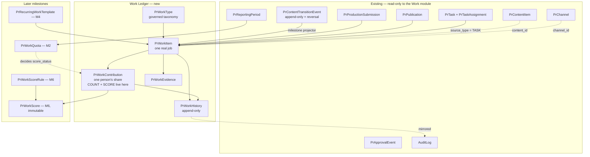
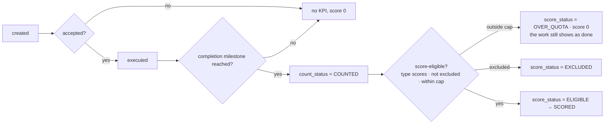

# Work & Performance — architecture specification (M0)

**Status:** design only. No code, no migration, no schema change was produced by
this milestone.
**Scope:** audit the existing MeoChat codebase, decide what the Work module
reuses, and specify the smallest clean architecture before M1 starts.
**Alembic head at time of audit:** `0031_pr_scoped_approval_grants` (single head,
31 revisions).

---

> **M1 is implemented.** This document is the approved M0 architecture and is
> kept as written; where the M1 product decisions overrode a recommendation
> here, the overriding decision is marked **[M1]** inline and the implemented
> design is `docs/pr/WORK_CORE_M1.md`.
>
> The overrides, in one place:
>
> | M0 recommended | M1 decided |
> |---|---|
> | Channel assignment as the interim team proxy (§12.3, Q13) | **No team proxy at all.** Visibility is explicit relationships: my work, work I assigned, `PR_WORK_MANAGE`, Head/Admin |
> | Ship `score_status` as a declared-but-unwritten column (§19) | **No `score_status` in M1.** `count_status` only; M2 adds the column |
> | Count self-approved content but flag it (Q16) | Not reached — M1 has no content projector, and for **manual** work self-validation is **refused** outright |
> | `NOT_QUALIFIED` in the count vocabulary (§5.6) | Three values only: `PENDING` / `COUNTED` / `EXCLUDED` |
> | `REVIEWER` contribution role (§5.3) | Deferred to M3, when reviewing might become countable |
> | `self_approved` boolean on the work item (Q16) | Dropped — M1 refuses self-validation, so the column would always be false |
> | Five capabilities incl. `PR_WORK_EXCLUDE` (§12.1) | Four: `EXECUTE` / `MANAGE` / `VALIDATE` / `CONFIGURE`. No M1 action performs a manual exclusion |
> | Per-contribution `accepted_at` / `completed_at` (§5.3) | Omitted. M1 has no per-person completion semantics |
> | `APPROVED` reversible, with a `LOCKED`-period guard (§10.3) | **`APPROVED` is terminal in M1.** No correction path, which preserves locked-period immutability without implementing period locking |
> | Channel-assignment team proxy, and `PR_WORK_MANAGE` as the manager gate (§12) | **`PR_WORK_VIEW_ALL`** (paired with `user.read`, ADMIN+) is its own capability. `PR_WORK_MANAGE` reaches TEAM_LEAD and **does not** imply the department-wide view |
>
> **And the M2 vocabulary below is superseded.** §5.6, §9 and §19 of this
> document call M2 a scoring step and name the field `score_status`. That is
> wrong and was corrected after M1: **M2 evaluates quota eligibility and awards
> nothing.**
>
> | This document says | The corrected semantics |
> |---|---|
> | `score_status` | **`quota_status`** - *quota* is what is being evaluated against, and `score_` invites "how many points" |
> | `SCORED` | **`ELIGIBLE`** - inside an approved quota. Points are M6 |
> | `score_cap` | **`eligibility_cap`**, beside `target_value` and a `basis` |
> | one implicit basis | **`ITEM_COUNT` or `QUANTITY`** - a 100-comment item is one row worth 100, and an `ITEM_COUNT` quota would read it as 1 |
> | (absent) | **`NO_QUOTA`** - counted work with no approved quota is *not* automatically eligible. Absence of a target is absence of a decision, not permission |
> | recompute freely | **Only while the reporting period is `OPEN`.** `CLOSED` and `LOCKED` get no automatic reallocation |
>
> `docs/pr/WORK_CORE_M1.md` §19 is authoritative for M2.

> **§5.7's `PrRecurringWorkTemplate` is M4B and is not yet built.** M4A shipped
> *manual* work only, and it needed no table: the audit found that
> `propose_work` and `assign_work` already produced `source_type = MANUAL`
> through M1's own lifecycle, so M4A added an assignment **mode** (one shared
> job, or one job each), a quantity rule for `QUANTITY`-measured types, bulk
> validation, a source filter and a read-only quota/scoring diagnostic — and no
> migration. The Alembic head is still `0035`.
>
> Two corrections this document's M4 sections need, both found by M4A's audit:
>
> | This document says | What is actually there |
> |---|---|
> | `source_key = "{entity}:{id}:{milestone}:{role}"` (§7) | **Three segments, not four.** `SOURCE_KEY_PATTERN` is `{source}:{uuid}:{MILESTONE}`, and M4B's occurrence key has to fit it or widen it deliberately |
> | "a recurrence engine with occurrence tracking" (§1) | A recurrence engine **without** occurrence tracking. `ReminderSchedule` answers *next*, not *which ones were missed*, so M4B's downtime catch-up needs enumeration added |
>
> [`MANUAL_RECURRING_WORK_M4.md`](MANUAL_RECURRING_WORK_M4.md) is authoritative
> for M4.

> **Status of this document.** M0 — the design that preceded implementation. M1
> shipped as `0032_pr_work_core` and M2 as `0033_pr_work_quota_eligibility`;
> where the two disagree with this document, the milestone docs are
> authoritative: [`WORK_CORE_M1.md`](WORK_CORE_M1.md) and
> [`WORK_QUOTA_M2.md`](WORK_QUOTA_M2.md). Sections 5.6, 5.8 and 9 carry inline
> notes where the implementation deviated, and why.

## 1. Executive summary

MeoChat already contains most of the *mechanics* a Work & Performance module
needs — an append-only audit trail, an append-only transition log with reversal
links, a per-person assignment table with `assigned_at` / `accepted_at` /
`completed_at`, a reporting-period table, a recurrence engine with occurrence
idempotency, a notification outbox, a capability system with scoped grants, and
a business-timezone day-boundary helper. What it does **not** contain is a
*ledger*: nowhere in the system is there a row that means *"this is one unit of
valid, measurable work, credited to this person, in this period."*

The central finding is that **`PrTask` must not become that row.** Three reasons,
each independently sufficient:

1. `PrTask.task_type` is documented in the model as deliberately free text —
   *"the list is still being discovered, and a wrong enum costs a migration
   while a wrong string costs an `UPDATE`."* A KPI taxonomy is the opposite: it
   must be governed, versioned and referentially enforced.
2. `PrTask` has **no acceptance gate**. A task is created at `TODO` by whoever
   creates it. The entire anti-gaming requirement is that creating work must not
   be the same act as being credited for it, and retrofitting acceptance onto
   `PrTask` would change semantics that `PrContentViewScope.MY_ACTIONS`,
   `MY_CONTENT`, the dashboard's overdue list and the Telegram tools all already
   depend on. The brief forbids changing existing workflow semantics.
3. `PrApprovalEvent.task_id` already couples `pr_tasks` into the content
   approval trail. Widening what a task *means* widens that coupling.

**Recommended architecture: a separate Work Ledger (option C), evolving to D.**
`pr_work_items` + `pr_work_contributions` are new, additive tables. `PrTask`
becomes one bounded *source* feeding the ledger and is otherwise untouched. The
UI grows a `Công việc` section; `/pr/tasks` is frozen and later folded in.

The second central decision: **counting and scoring live on the contribution,
not on the work item.** Principle 9 says one real job may have several
contributors; the worked example ("23 counted, 20 scored, 3 over quota") is
per-employee-per-work-type-per-period. A quota is a property of a *person*, so
the thing a quota decides about must be a person's share of a job.

---

## 2. Current-state audit

### 2.1 Task module

| Aspect | What exists |
|---|---|
| Model | `PrTask` (`pr_tasks`): `code`, `content_id?`, `task_type` (free `String(50)`), `title`, `description?`, `priority`, `status`, `deadline?`, `created_by_user_id`, `completed_at?` |
| Assignment | `PrTaskAssignment` (`pr_task_assignments`): `task_id`, `user_id`, `assignment_role` (`OWNER`/`CONTRIBUTOR`/`REVIEWER`), **`assigned_at`**, **`accepted_at?`**, **`completed_at?`**. Unique on `(task_id, user_id, assignment_role)`; indexed on `(user_id, completed_at)` |
| Statuses | `PrTaskStatus`: `TODO`, `IN_PROGRESS`, `BLOCKED`, `IN_REVIEW`, `REVISION_REQUIRED`, `DONE`, `CANCELLED`. Legality in `TASK_TRANSITIONS`; `TERMINAL_TASK_STATUSES = {DONE, CANCELLED}` |
| Service | `PrTaskService` (380 lines): `create_task`, `assign_user`, `unassign_user`, `change_status`, `require_task`, `list_assignments`. Row-locks the task; refuses terminal edits |
| API | `GET/POST /api/pr/tasks`, `GET /tasks/{id}`, `POST/DELETE /tasks/{id}/assignments`, `POST /tasks/{id}/status` |
| Queries | `PrQueryService.list_tasks` (filters: `content_id`, `status`, `open_only`), `list_overdue_tasks` (deadline passed and not terminal) |
| Frontend | `/pr/tasks` — 276 lines; status filter, overdue checkbox, create form, per-row expand, assign, move |
| Audit | `pr.task.created`, `pr.task.assigned`, `pr.task.unassigned`, `pr.task.status_changed` |
| Permission | `PrCapability.PR_TASK_MANAGE` |

**Gaps found.** No assignee filter anywhere — `list_tasks` has none, and the
route's docstring says so explicitly: *"There is deliberately no `assignee`
filter."* So **there is no "my tasks" query in the system today.** No comments
on tasks (comments exist only on content). No task history table. No
recurrence. No quantity/unit. No evidence. No acceptance at task level. No
notion of a task being *countable*.

### 2.2 Content workflow

| Aspect | What exists |
|---|---|
| Item | `PrContentItem`: `code`, `title`, `brand_id`, `format_id?`, `pillar_id?`, `content_type?` (`PrContentType` enum — `SHORT_VIDEO_SCRIPT`, `FACEBOOK_POST`, `PRESS_ARTICLE`, …), `workflow_stage`, **`owner_user_id`**, **`producer_user_id?`**, `production_started_at?`, `planned_publish_at?`, `created_by_user_id`, `archived_at?` |
| Stages | `IDEA → BRIEFING → SCRIPTING → AI_REVIEW → TEAM_LEAD_REVIEW → HEAD_REVIEW → APPROVED → PRODUCTION → INTERNAL_REVIEW → READY_TO_PUBLISH → PUBLISHED → MEASURED → ARCHIVED`, plus `CANCELLED` |
| Gates | `STAGE_APPROVAL_GATES`: `TEAM_LEAD_REVIEW`, `HEAD_REVIEW`, `INTERNAL_REVIEW` |
| Approvals | `PrApprovalEvent` — **append-only, never updated**: `content_id`, `task_id?`, `production_submission_id?`, `approval_stage`, `reviewer_user_id`, `decision`, `version_reviewed`, `decided_at` |
| Transitions | `PrContentTransitionEvent` — append-only: `from_stage`, `to_stage`, `trigger` (`MANUAL`/`AI_REVIEW`/`HUMAN_APPROVAL`/`PUBLICATION`/`UNDO`), `actor_user_id?`, `approval_event_id?`, `production_submission_id?`, **`reverses_event_id?`**, **`reversed_by_event_id?`** (the one write-once mutable column) |
| Production | `PrProductionSubmission` — append-only: `content_id`, `content_version_id`, `submission_no`, **`producer_user_id`**, `submitted_by_user_id`, `artifact_type`, `location` |
| Publication | `PrPublication`: `content_id`, `channel_id`, `production_submission_id?`, `derivative_id?`, `published_at`, **`publisher_user_id?`**, `status` |
| Targets | `PrContentTarget`: `content_id`, `channel_id`, `distribution_mode`, `status` |
| Versions | `PrContentVersion` |
| Undo | `PrWorkflowUndoService` — appends a backward transition with `trigger = UNDO` and links the pair. Never edits the approval row |
| Assets | `PrContentResource` (references/inputs), `PrContentDerivative` (remixes/cutdowns), `PrContentDestination` (open links) — each with `added_by_user_id`/`created_by_user_id` |

**Contributor roles already represented in data**, and this is the single most
important input to the Content→Work mapping:

| Role | Authoritative column | Milestone available |
|---|---|---|
| Writer / script author | `PrContentItem.owner_user_id` | `HEAD_REVIEW → APPROVED` transition |
| Producer / editor | `PrProductionSubmission.producer_user_id` (and `PrContentItem.producer_user_id`) | `INTERNAL_REVIEW → READY_TO_PUBLISH` transition |
| Publisher / distributor | `PrPublication.publisher_user_id` | `PrPublication` row + `READY_TO_PUBLISH → PUBLISHED` transition |
| Reviewer | `PrApprovalEvent.reviewer_user_id` | the approval event itself |

**Not represented anywhere:** shooter/camera operator, seeding/comment work,
customer chat, meetings, research, CTV operations, livestream, onset. Every one
of those from the source spreadsheet has **no home in the current schema** and
is precisely why a manual work source is required.

**Finding: the content workflow does not forbid self-approval.** Nothing in
`PrApprovalService` compares `reviewer_user_id` against `owner_user_id`, and no
test asserts such a rule. A content owner who holds `PR_HEAD_REVIEW` can approve
their own script today. That is defensible for a small department where a lead
writes and approves — but it is load-bearing for a module whose whole purpose is
that creating work must not be the same act as being credited for it. The only
self-approval refusal in the codebase is `HrRequestService`'s
(`CANNOT_APPROVE_OWN`). See §17 and §18 Q16.

### 2.3 Users / roles / teams

`User`: `telegram_user_id?`, `full_name`, `role` (`OWNER`/`ADMIN`/`TEAM_LEAD`/
`EMPLOYEE`, with a `rank` for "at least" comparisons), `active`, `status`
(`ACTIVE`/suspended/revoked), plus Telegram reachability columns.

**There is no department, team or manager relationship in the database.**
`MEOBOT_DEPARTMENT_NAME` is a configuration string used in the assistant's
self-introduction. `TelegramChat.department` / `.team` are free-text labels on a
*chat*, not an org structure. The nearest thing to a team is
`PrChannelAssignment` (`channel_id`, `user_id`, `assignment_role`,
`effective_from`, `effective_to?`) — which `PrContentViewScope.TEAM` already
uses as *"the broadest existing assignment grouping"*, with the code explicitly
noting it is **not** a hierarchy.

This is a real gap and M0's most consequential org-model finding: **"manager"
is not a modellable relationship today.** See §12.

### 2.4 Channel / campaign

`PrChannel` (`code`, `name`, `platform_id`, `brand_id?`, `category`, `tier?`,
`status`) and `PrChannelAssignment` (six roles, dated intervals, `is_primary`,
`allocation_percent`) both exist and are mature.

**There is no campaign entity.** `campaign` appears only as a free-text field on
a Drive folder naming request (`domain/drive/models.py`). A work item can point
cleanly at a channel; it cannot point at a campaign without a new table.

### 2.5 Audit / event infrastructure

`AuditLog` (`audit_logs`): `request_id` (correlation id, indexed),
`actor_user_id?`, `actor_telegram_id?`, `action` (`String(100)`),
`entity_type?`, `entity_id?`, `before_data`/`after_data` (**JSONB on Postgres**),
`result`, `error_message?`, `created_at`. Indexed on `(action, created_at)` and
`(entity_type, entity_id)`. Never updated, never deleted.

The PR module writes through one helper, `record_pr_event`. `AuditAction` is a
`StrEnum` of dotted strings in a `VARCHAR` column, so a new action is a new enum
member and **no migration** — Step 1F.2.8 relied on exactly this.

The precedent that matters most: **Step 1F.2.3b faced this exact question for
undo and answered "both".** The audit trail already recorded stage changes, but
undo needed to ask *"what was the last reversible thing, and is it still in
force"* as a business question in SQL under a lock — so it got a structured
table, and the audit trail kept recording everything. The module docstring says
so in as many words. That precedent decides §5.

### 2.6 Notifications / Telegram / scheduling

- `UserNotification`: in-app notification with `event_type`, `target_kind`,
  `target_id`, `read_at`, and **`idempotency_key`** — a working pattern for
  "generate this once".
- `PrNotificationService`: content workflow → Telegram, with private-chat
  resolution and outbox delivery.
- Outbox drained by beat (`notifications.drain_outbox`, 20s) with stale
  recovery (`notifications.recover_stale`, 300s).
- **`Reminder` + `ReminderOccurrence` is a complete recurrence engine**:
  `schedule_kind` (`ONE_TIME`/`DAILY`/`WEEKLY` — *monthly is deliberately
  absent*), `recurrence_rule`, `local_time`, `timezone`, `next_run_at`,
  `last_run_at`, `missed_occurrence_policy`, and occurrence idempotency via
  `uq_reminder_occurrences_reminder_moment (reminder_id, scheduled_for)`. Swept
  by `reminders.sweep_due`.
- Beat already runs eight schedules; the claim-then-dispatch pattern
  (`PrChannelSyncService.claim` — a conditional `UPDATE`, with
  `release_stale` for workers that die) is the house pattern for sweeps.

**There is no task reminder and no overdue reminder today.** The dashboard shows
overdue tasks; nothing pushes them.

### 2.6b Working calendar — an easy subsystem to miss

`db/models/hr.py` carries an organisation-wide working calendar that has nothing
to do with leave requests and is directly relevant here:

```
work_schedules        name, timezone, working_days (JSONB, Mon=0..Sun=6),
                      morning_start/end, afternoon_start/end,
                      active_from?, active_until?, is_active
organization_holidays holiday_date (unique), name, is_paid
```

`WorkSchedule`'s docstring states the rule the Work module should inherit
verbatim: *"Its absence is meaningful: MeoBot refuses to compute lateness rather
than assuming an office opens at 08:00, and tells the owner to configure it."*

This is the only place in the codebase that knows what a **working day** is. Any
future "X working days late", "expected output per working day", or a monthly
target pro-rated across working days must read it rather than counting calendar
days — and must inherit its refusal-over-assumption behaviour.

### 2.7 Reporting

`GET /api/pr/dashboard` returns live stage counts, `awaiting_my_review` (scoped
by grant), `overdue_tasks`, `my_capabilities`, `recent_content`. Everything is
counted live; nothing is cached or aggregated.

`/pr/reports` (73 lines) renders the dashboard's stage counts and says in its own
docstring: *"There is no PR reporting service yet… `pr_report_runs`,
`pr_report_artifacts`, `pr_reporting_periods`, `pr_weekly_manual_inputs` — and
**nothing writes them**."*

So there is a **dormant reporting scaffold**, and `PrReportingPeriod` in
particular is directly reusable:

```
pr_reporting_periods: code ("2026-W32", "2026-08"), period_type (WEEK|MONTH),
                      date_start, date_end, previous_period_id?,
                      status (OPEN|CLOSED|LOCKED), closed_at?, locked_at?
```

Note its documented rule: *"Periods are not generated… a caller supplies the code
and the dates."* And `status` is **not enforced by the database** — locking is a
service rule.

**There is no per-employee metric anywhere in the system.**

### 2.8 Database conventions

- `Base` with `NAMING_CONVENTION` for deterministic Alembic diffs.
- `UUIDPrimaryKeyMixin` — client-side UUIDv4, no DB extension.
- `TimestampMixin` — server-default `created_at`/`updated_at`.
- **Enums are `VARCHAR` + CHECK (`native_enum=False`) via `value_enum(...)`** —
  *"adding a workflow state must not require an `ALTER TYPE` migration, and the
  values stay greppable."* This is why a new status value is cheap and a new
  *table* is the expensive part.
- `JSONColumn = JSON().with_variant(JSONB, "postgresql")`.
- FKs use `ondelete=RESTRICT` throughout the PR module.
- **No soft delete via a flag.** The house patterns are: append-only + reversal
  link (transitions), `revoked_at` + `revoked_by_user_id` (capability grants),
  dated intervals `effective_from`/`effective_to` (assignments),
  status + timestamp (`archived_at`, `cancelled_at`).
- Composite indexes are added deliberately and commented with the query they
  serve (`ix_pr_tasks_status_deadline`, `ix_pr_task_assignments_user_completed`).
- Association tables carry their own UUID PK plus a unique constraint on the
  natural key — never a composite PK.

### 2.9 Frontend conventions

Next.js App Router, all client components, TanStack Query, Tailwind with CSS
variables (`--surface`, `--border`, `--text`, `--text-muted`).

- Nav (`shell.tsx`): `Tổng quan`, `Nội dung`, `Task`, `Kênh`, `Phân quyền`,
  `Báo cáo`.
- **Every user-facing word is a `*_label` from the server.** The browser never
  maps a code to Vietnamese and never decides who may press a button
  (`can_*` flags come from the server).
- **No arithmetic in the browser** — deltas, percentages and "days since" are
  computed server-side.
- Filters live in the URL (`useSearchParams` + `router.replace`), inside a
  `<Suspense>` boundary.
- `DATE_PRESETS`: `Mọi lúc`, `Hôm nay`, `Hôm qua`, `7 ngày`, `30 ngày`,
  `Tùy chọn`, resolved to `YYYY-MM-DD` and interpreted server-side in the
  business timezone by `day_bounds(...)`.
- `ConfirmButton` / `ConfirmDialog` for every business state change; explicitly
  **not** for non-destructive reads (Step 1F.2.9's "Đồng bộ lại" precedent).
- List/detail is a two-column grid on `lg`, stacked below; `min-h-11` on every
  touch target.

---

## 3. Reuse matrix

| Concept | Verdict | Why |
|---|---|---|
| `PrTask` entity | **DO NOT REUSE as WorkItem** — keep as a *source* | `task_type` is intentionally ungoverned free text; there is no acceptance gate; `MY_ACTIONS`, `MY_CONTENT`, the overdue dashboard and Telegram tools depend on today's semantics. Changing it breaks the "do not change existing workflow semantics" constraint |
| `PrTaskAssignment` | **EXTEND (as pattern), NEW (as table)** | Its shape — per-person `assigned_at` / `accepted_at` / `completed_at`, unique on `(task, user, role)`, indexed on `(user_id, completed_at)` — is exactly `WorkContribution`. Copy the design, not the table: contributions need `count_status`, `score_status` and a credit weight that have no business on a task |
| `PrTaskStatus` | **EXTEND** | The seven values are a good execution vocabulary. Work needs `PROPOSED` and `ACCEPTED` in front of them, which existing consumers must not see |
| Task comments | **NEW** | Do not exist. `PrContentComment` is the pattern to copy if M4 needs them |
| Task history | **NEW** | Does not exist |
| Task notifications | **REUSE AS-IS** | `UserNotification` + outbox + `idempotency_key` covers reminders and daily summaries without a new delivery path |
| `PrContentItem` | **REUSE AS-IS (read-only)** | The Work module reads it and writes nothing to it. Zero risk to the content workflow |
| Content workflow events | **REUSE AS-IS** | `PrContentTransitionEvent` is append-only with reversal links — it is already a perfect completion-milestone feed, including *un*-completion |
| `PrApprovalEvent` | **REUSE AS-IS** | Append-only, carries `reviewer_user_id`, `decided_at`, `version_reviewed`. The reviewer-work source if reviewing is ever counted |
| `PrProductionSubmission` | **REUSE AS-IS** | `producer_user_id` is the authoritative producer credit |
| `PrPublication` | **REUSE AS-IS** | `publisher_user_id` is the authoritative distribution credit |
| `PrContentTarget` / `PrChannel` | **REUSE AS-IS** | A work item points at `channel_id` directly |
| `AuditLog` | **REUSE AS-IS, and add `WorkHistory` beside it** | Follows the Step 1F.2.3b precedent verbatim: audit records *everything*; the structured table answers the business question in SQL |
| `PrContentResource` | **DO NOT REUSE** for work evidence | It is `content_id`-bound and `RESTRICT`-keyed to content. Work evidence must attach to work that has no content. Copy its shape (`label`, `location`, `note`, `added_by_user_id`, `required_for_review`) |
| Notification system | **REUSE AS-IS** | |
| Scheduled jobs / beat | **REUSE AS-IS** | The claim → dispatch → `release_stale` pattern is what recurring generation and the overdue sweep need |
| `Reminder`/`ReminderOccurrence` | **WRAP (pattern), NEW (table)** | The best recurrence design in the codebase, but a reminder *sends a message* and a template *creates a work item*. Copy `recurrence_rule` + `next_run_at` + the `(template, scheduled_for)` unique constraint; do not overload the reminder |
| `PrReportingPeriod` | **REUSE AS-IS** | Already `WEEK`/`MONTH`, dated, codeable, closeable and lockable. `WorkQuota` should FK to it rather than carry loose dates |
| `PrWeeklyManualInput` | **DO NOT REUSE** | Channel metrics per period, not employee work. Different subject entirely |
| Reporting queries | **DO NOT REUSE** | Live per-stage counts over content. Nothing per-employee exists to build on |
| `PrCapability` + scoped grants | **EXTEND** | Add work capabilities; reuse the scoped-grant machinery (`content_type_scope`, `channel_scope`, `requires_role_baseline`, `revoked_at`) unchanged |
| `ConfirmDialog` | **REUSE AS-IS** | Accepting, rejecting, excluding from KPI and changing a deadline are exactly the state changes it exists for. Marking one's own work in progress is not |
| `day_bounds` / business timezone | **REUSE AS-IS** | The single place a calendar day becomes an instant. Period boundaries must not get a second implementation |
| `WorkSchedule` / `OrganizationHoliday` | **REUSE AS-IS** when working days are needed | The only definition of a working day in the system. Inherit its rule too: with no schedule configured, refuse to compute lateness rather than assume one. Not needed by M1 — `due_at` is an instant — and required the moment a target is expressed per working day |
| `PrChannelAssignment` | **REUSE AS-IS** as the interim team proxy | It is what `PrContentViewScope.TEAM` already means. Do not invent a hierarchy to match it |

### Architecture options considered

**A. `PrTask` becomes `WorkItem`.** Rejected. It needs ~12 new columns, converts
`task_type` from free text to an FK (a data migration on live rows), and
retrofits acceptance onto a table four existing read models depend on.

**B. `WorkItem` wraps/references `Task` 1:1.** Rejected. Every manual work item
would need a shadow `PrTask` purely to hold operational fields, or the two would
diverge. A wrapper that is mandatory for one source and absent for three is not
a wrapper.

**C. `Task` stays; a separate Work Ledger is canonical.** ✅ **Recommended.**
Purely additive: no existing table changes, no existing semantics move, and the
"created ≠ counted" boundary is structural rather than a flag on a table that
predates it. `PrTask` becomes `source_type = TASK`.

**D. Merge Task into Work over time.** ✅ **Recommended as the destination.**
Once `/pr/work` covers the operational need, `/pr/tasks` becomes read-only and
new task creation is disabled. `pr_tasks` is never dropped — `PrApprovalEvent`
and the content read models reference it.

**So: C now, D as the rollout end-state.**

---

## 4. Recommended architecture



Three rules hold the design together:

1. **The Work module writes nothing to the content workflow.** It observes
   transitions and writes its own rows. A bug in Work can never corrupt content.
2. **The item holds facts; the contribution holds credit.** `PrWorkItem` says
   what happened; `PrWorkContribution` says whose it was and whether it counts.
3. **Counting is reversible; scoring is immutable.** `count_status` and
   `score_status` are current state and change when reality changes (an undo, an
   exclusion). An *awarded score* is written once into an append-only table with
   the rule version that produced it.

---

## 5. Domain model

### 5.1 `PrWorkItem` — one real job

Recommended fields, each justified:

| Field | Type | Justification |
|---|---|---|
| `id` | UUID PK | House convention |
| `code` | `String(64)` unique | Every PR entity has a human code; `PrCodeService` already allocates them |
| `title` | `String(300)` | Matches `PrTask.title` |
| `description` | `Text?` | |
| `work_type_id` | FK → `pr_work_types` RESTRICT | §5.2 |
| `source_type` | enum `CONTENT`/`MANUAL`/`RECURRING`/`SYSTEM`/`TASK` | §6 |
| `source_key` | `String(200)?` | The idempotency key. Unique with `source_type` where not null — §7.4 |
| `status` | enum `PrWorkStatus` | §8 |
| `priority` | reuse `PrPriority` | Same vocabulary as content and tasks |
| `assigned_by_user_id` | FK users? | Null for `CONTENT`/`SYSTEM` — nobody assigned it |
| `assigned_at` | timestamptz? | |
| `accepted_at` | timestamptz? | The anti-gaming gate. Null ⇒ nothing counts |
| `due_at` | timestamptz? | Overdue is `due_at < now AND status not terminal` — the same rule `list_overdue_tasks` already uses |
| `completed_at` | timestamptz? | The doer's claim |
| `approved_at` | timestamptz? | The approver's decision |
| `approved_by_user_id` | FK users? | |
| `quantity` | `Numeric(12,2)?` | "100 comments", "0.5 shoot-days" — see §18 Q7 |
| `unit` | `String(20)?` | Comes from the work type's default; stored on the row so a taxonomy edit never rewrites history |
| `content_id` | FK content? | Set for `CONTENT` |
| `task_id` | FK tasks? | Set for `TASK` |
| `channel_id` | FK channels? | Optional attribution |
| `recurrence_id` | FK templates? | M4 |
| `cancelled_at`, `cancel_reason` | | House pattern: status + timestamp, no soft-delete flag |
| `self_approved` | bool, default `false` | Set when `approved_by_user_id` is also a contributor. Recorded rather than refused — see §18 Q16. One boolean in M1 is cheaper than a backfill in M3 |
| `created_by_user_id` | FK users | |
| `created_at`/`updated_at` | `TimestampMixin` | |

**Deliberately rejected from the suggested list:**

- `assignee_user_id` — a denormalised copy of the primary contribution. It would
  be wrong the first time a shoot has three people, which principle 9 says is
  routine. Query through `pr_work_contributions`.
- `evidence` as a column — §5.4.
- `campaign_id` — no campaign entity exists (§2.4). Adding an FK to a table that
  does not exist is not a design, it is a placeholder.
- `started_at` — derivable from the first `IN_PROGRESS` row in `PrWorkHistory`,
  and nothing in the business model asks for it. Add it when something does.
- `count_status` / `score_status` — these belong on the contribution (§5.6).

### 5.2 `PrWorkType` — **hybrid: configuration table with an enum category**

Recommendation: a **table** for the sub-type, an **enum** for the category.

```
pr_work_types
  id, code (unique, e.g. "SHORT_SCRIPT"), name ("Kịch bản ngắn"),
  category  -> PrWorkCategory enum
  default_unit ("item" | "video" | "post" | "session" | "day" | "hour" | "comment")
  requires_evidence (bool)
  requires_approval (bool)
  content_type?  -> PrContentType, when this type is what a content item produces
  status (ACTIVE|INACTIVE), display_order, created_at, updated_at
```

`PrWorkCategory` as a `value_enum`: `CONTENT`, `PRODUCTION`, `DISTRIBUTION`,
`COMMUNITY`, `PR_EVENT`, `OPERATIONS`, `RESEARCH`.

**Why hybrid.** The category is a small closed set that code branches on
(reporting groups, permission scoping) — an enum is `VARCHAR`+CHECK here, so
adding one is a code change with no migration. The sub-type is a long, open,
business-owned list (the source spreadsheet already has ~19 and will grow), each
needing configuration — unit, whether evidence is required, and eventually a
base score. That is a table. A pure enum would put "Trend edit" in a Python file
and make adding one a deploy; a pure table would let arbitrary strings decide
control flow, which is `PrTask.task_type`'s problem.

**Seed set derived from the source spreadsheet** (M1 fixture, not code):

| Category | Types |
|---|---|
| `CONTENT` | Script, Short script, Ultra-short script, PR article, Facebook/group post |
| `PRODUCTION` | Edit video, Trend edit, Half-day shoot, Full-day shoot, Onset, Livestream |
| `DISTRIBUTION` | Posting, Via nurturing |
| `COMMUNITY` | Comments, Customer chat, CTV operations |
| `PR_EVENT` | Event |
| `OPERATIONS` | Meeting, Preparation, Coordination, Report, Other |
| `RESEARCH` | Research |

### 5.3 `PrWorkContributor` → recommended name **`PrWorkContribution`**

**Required from M1.** Not optional, and the reasons are structural rather than
aspirational:

1. Principle 9 — a shoot has three people, and the source spreadsheet's
   half-day/full-day shoot rows are exactly that case.
2. The worked example's arithmetic is per-person. A quota belongs to a person,
   so the row a quota decides about must be a person's.
3. Retrofitting it in M2 means migrating every M1 row and rewriting every query.
   Building it in M1 costs one extra table.
4. The precedent is already in the codebase: `PrTaskAssignment` is this table
   for tasks, and `PrChannelAssignment` is it for channels. A per-person row with
   a role is the house answer.

```
pr_work_contributions
  id
  work_item_id -> pr_work_items RESTRICT
  user_id      -> users RESTRICT
  contribution_role -> PrWorkContributionRole
        (PRIMARY | CONTRIBUTOR | REVIEWER | SUPPORT)
  credit_weight  Numeric(5,4) default 1.0000   -- see §18 Q5
  assigned_at, accepted_at?, completed_at?     -- copied from PrTaskAssignment
  count_status  -> PrWorkCountStatus
  counted_at?
  score_status  -> PrWorkScoreStatus
  scored_period_id? -> pr_reporting_periods
  excluded_reason?, excluded_by_user_id?, excluded_at?
  created_at, updated_at
  UNIQUE (work_item_id, user_id, contribution_role)
  INDEX (user_id, count_status, counted_at)
```

The unique constraint is the same shape as
`uq_pr_task_assignments_task_user_role`, and it is what makes double-crediting
one person for one job in one capacity structurally impossible.

### 5.4 `PrWorkEvidence` — **child table**

Rejected alternatives: URL columns on `PrWorkItem` (a shoot has many files, and
the second one would need `evidence_url_2`); reusing `PrContentResource` (it is
`content_id NOT NULL` with `ondelete=RESTRICT` — most work has no content);
generic polymorphic attachments (no such system exists, and building one for one
consumer is inventing infrastructure).

```
pr_work_evidence
  id, work_item_id -> pr_work_items RESTRICT
  label String(200), location Text, note Text?
  added_by_user_id -> users, created_at, updated_at
```

Shape copied from `PrContentResource` so the two read alike. **Whether evidence
is required is `PrWorkType.requires_evidence`**, enforced at the
completion transition, not at insert — the same place `required_for_review`
works today.

### 5.5 `PrWorkHistory` — **both**, exactly as Step 1F.2.3b decided

`AuditLog` keeps recording everything through `record_pr_event` — that is the
compliance trail and it is free.

`pr_work_history` is the structured half, because the Work module has to answer
*"when did this contribution become countable, and is it still countable"* as a
business question in SQL, under a lock, for a quota engine. Deriving that from
`before_data`/`after_data` JSON would mean parsing a payload nothing constrains
— and the module docstring for `pr_content_transition_events` says exactly what
happens then: *"the first time somebody changed a key the undo button would
start reversing the wrong action."*

```
pr_work_history
  id, work_item_id, contribution_id?
  event_type -> PrWorkEventType
        (CREATED | ASSIGNED | ACCEPTED | REJECTED | STARTED | COMPLETED
         | APPROVED | REVISION_REQUESTED | DEADLINE_CHANGED | REASSIGNED
         | COUNTED | UNCOUNTED | EXCLUDED | CANCELLED | SCORED | SCORE_REVOKED)
  from_status?, to_status?
  actor_user_id?
  reverses_event_id?           -- the reversal-pair pattern, verbatim
  note Text?
  metadata JSONColumn?         -- JSONB on Postgres
  created_at
  INDEX (work_item_id, created_at)
```

Written in the **same transaction** as the audit row by the same method — the
rule `PrContentWorkflowService.apply` already follows.

### 5.6 Where `count_status` and `score_status` live — **on the contribution**

> **Half superseded.** `count_status` is on the contribution, as recommended,
> and M1 shipped it there. The **eligibility** half did not: M2 put the decision
> in `pr_work_quota_allocations`, which this table's third row calls a ❌ for
> status and a ✅ only for an awarded score.
>
> The row was right about the *grain* — *this person, this work type, this
> period* — and wrong that it fits in a status. Partial `QUANTITY` eligibility
> is three numbers (40 comments eligible, 20 over), and a decision has to name
> the approved plan version that produced it or *"why was this eligible
> yesterday and over quota today"* has no answer. The separate table also makes
> **no row at all** a legible state, which is what every contribution counted
> before M2 is in.
>
> `PrWorkScoreStatus` below was not implemented under any name. M2's stored
> values are `NO_QUOTA` · `UNMEASURABLE` · `ELIGIBLE` · `PARTIALLY_ELIGIBLE` ·
> `OVER_QUOTA` on the allocation, plus a **read-only** `PENDING_EVALUATION` that
> no row may hold. There is no `SCORED`.
>
> `PENDING` above was right that a fourth kind of thing exists, and wrong that it
> is one thing: *"a quota exists and the work cannot be measured"* and *"a quota
> exists and nothing has looked yet"* are different facts with different people
> to send the reader to. See [`WORK_QUOTA_M2.md`](WORK_QUOTA_M2.md) §3 and §6b.

Evaluated three placements:

| Placement | Verdict |
|---|---|
| On `PrWorkItem` | ❌ A shoot with three contributors has one item and three quotas. One status cannot answer three questions |
| On `PrWorkContribution` | ✅ **Recommended.** Matches the grain of the question: *this person, this work type, this period* |
| Separate evaluation table | ❌ for status; ✅ for **awarded score** (M6). Current status is mutable and belongs beside the thing it describes; a score award is a historical fact and belongs in an append-only table with its rule version |

```
PrWorkCountStatus:  PENDING | COUNTED | EXCLUDED | NOT_QUALIFIED
PrWorkScoreStatus:  PENDING | ELIGIBLE | SCORED | OVER_QUOTA | NOT_APPROVED | EXCLUDED
```

`NOT_QUALIFIED` is added to the brief's list on purpose: *"the milestone was
never reached"* (cancelled, abandoned) and *"a manager removed this from KPI"*
(`EXCLUDED`) need different sentences on screen and different treatment if the
item is later revived.

### 5.7 `PrRecurringWorkTemplate` — M4, designed for now

```
pr_recurring_work_templates
  id, work_type_id, title_template, default_quantity?, default_unit?
  assignee_user_id? | channel_id?         -- who, or which channel's assignee
  schedule_kind (DAILY|WEEKLY|MONTHLY), recurrence_rule, local_time, timezone
  due_offset_minutes                       -- due_at = generated_for + offset
  auto_accept bool                         -- true when a manager approved the template
  status (ACTIVE|PAUSED|CANCELLED), next_run_at?, last_run_at?
  created_by_user_id, created_at, updated_at

pr_recurring_work_runs
  id, template_id, scheduled_for, work_item_id?, status, created_at
  UNIQUE (template_id, scheduled_for)      -- the idempotency guarantee
```

Deliberately mirrors `Reminder`/`ReminderOccurrence`, including the unique
constraint that makes a double sweep harmless. Note `MONTHLY` is added — the
reminder engine omits it on purpose, and monthly work is real here.

**`auto_accept` is the anti-gaming hook**: a template a manager approved
produces work already `ACCEPTED`; a template anyone else created produces
`PROPOSED`.

### 5.8 `PrWorkQuota` — M2, designed for now

> **Superseded by the implementation.** M2 shipped as
> `0033_pr_work_quota_eligibility` with **three** tables rather than one, and
> the sketch below is kept as the design it was. Read
> [`WORK_QUOTA_M2.md`](WORK_QUOTA_M2.md) §2 for the schema that exists.
>
> What changed and why:
>
> * **the plan and the quota are separate tables.** One row per
>   `(user, period, work_type, version)` cannot express *"approve these five
>   quotas together, or none of them"*, and putting `version_no` on the quota
>   would let one work type's cap be revised without the rest of the plan being
>   reviewed. `pr_work_plans` is the versioned, approvable thing;
>   `pr_work_quotas` are its lines;
> * **`score_cap` is `eligibility_cap`, and `target_count` /
>   `target_quantity` are one `target_value`.** The basis says which it is, so
>   two nullable columns that must never both be set are one column that always
>   is. The word *score* is gone everywhere: M2 awards nothing;
> * **`work_type_id` is `NOT NULL`.** There is no all-types quota — "2000 of
>   everything" has no unit — which also removes the open question in §18;
> * **a third table**, `pr_work_quota_allocations`, holds the decision. See
>   §5.6's verdict below, which this contradicts and explains.

```
pr_work_quotas
  id
  user_id       -> users
  period_id     -> pr_reporting_periods        -- reuse, do not restate dates
  work_type_id? -> pr_work_types               -- null = an all-types cap
  target_count  Integer?
  score_cap     Integer?
  target_quantity Numeric(12,2)?
  version_no    Integer                        -- a change is a new version
  status (DRAFT|ACTIVE|SUPERSEDED)
  approved_by_user_id?, approved_at?
  created_at, updated_at
  UNIQUE (user_id, period_id, work_type_id, version_no)
```

Versioned rather than edited, following `PrWeeklyManualInput`'s documented rule:
*"A correction is a new version, never an edit."* A quota decides money-adjacent
outcomes; whoever raised a cap mid-month must be visible afterwards.

---

## 6. Work source model

| | `CONTENT` | `MANUAL` | `RECURRING` | `SYSTEM` | `TASK` |
|---|---|---|---|---|---|
| **Created by** | the milestone projector | a manager, or an employee proposing | the template sweep | a MeoChat job | the Task→Work bridge |
| **Acceptance** | **not required** — the workflow already accepted it | **required** when the employee proposed it; auto-accepted when a manager assigned it | auto-accepted iff `template.auto_accept` | not required | required, mirroring MANUAL |
| **Completion** | the configured content milestone (§7) | employee marks complete, then approval if `work_type.requires_approval` | same as MANUAL | the job stamps it | the task reaches `DONE` |
| **User may edit** | ❌ title/type/quantity are the content's. Evidence and contributor split ✅ | ✅ while `PROPOSED`; after acceptance only the manager may change type/quantity/deadline | ✅ like MANUAL, on the generated item | ❌ | ❌ edit the task |
| **User may delete** | ❌ | ✅ own `PROPOSED` item only. After acceptance it is cancelled, never deleted | ❌ cancel | ❌ | ❌ |
| **Duplicate prevention** | unique `(source_type, source_key)` — §7.4 | in-flight duplicate detector — §8.4 | `UNIQUE (template_id, scheduled_for)` | deterministic key | `source_key = "task:{task_id}"` |
| **Link back** | `content_id` + `source_key` | none | `recurrence_id` | none | `task_id` |

Recommendation: **include `TASK` as a source type from M1**, but do **not** build
the bridge in M1. Declaring the enum member costs nothing (`VARCHAR`+CHECK) and
reserves the design; building the projector is M4 work once it is known whether
`/pr/tasks` will be folded in or frozen.

---

## 7. Content → Work integration

### 7.1 The mapping table

Derived from what the current schema actually records — no invented roles.

| Content event | Trigger observed | WorkType category | Contributor source | Role | Milestone |
|---|---|---|---|---|---|
| Script approved | transition `HEAD_REVIEW → APPROVED`, `trigger = HUMAN_APPROVAL` | `CONTENT` (sub-type from `content_type`) | `PrContentItem.owner_user_id` | `PRIMARY` | that transition |
| Production approved | transition `INTERNAL_REVIEW → READY_TO_PUBLISH`, `trigger = HUMAN_APPROVAL` | `PRODUCTION` | `PrProductionSubmission.producer_user_id` of the latest un-superseded submission | `PRIMARY` | that transition |
| Published | `PrPublication` inserted + transition `READY_TO_PUBLISH → PUBLISHED`, `trigger = PUBLICATION` | `DISTRIBUTION` | `PrPublication.publisher_user_id` | `PRIMARY` | the publication row |
| Reviewed | `PrApprovalEvent` | `OPERATIONS` | `reviewer_user_id` | `REVIEWER` | the approval event |

**`SHORT_VIDEO_SCRIPT` → `WorkType(code="SHORT_SCRIPT")`** via
`PrWorkType.content_type`, so the taxonomy link is data, not a `match` statement.

**Recommendation on the reviewer row:** generate it, but ship M3 with the
review work type `requires_approval = false` and **no quota**, so it is recorded
and visible and scores nothing until the business decides. See §18 Q11.

### 7.2 Why the transition log and not the approval event

`PrApprovalEvent` is append-only and never marked cancelled — the transition
table exists precisely because *"is this approval still effective"* has to be
answered as *"is the transition that recorded it un-reversed."* So the projector
reads `PrContentTransitionEvent` and honours `reversed_by_event_id`. An undo
therefore un-counts automatically, by construction rather than by a second rule.

### 7.3 Behaviour on the awkward paths

| Path | Behaviour |
|---|---|
| **Undo** | The `UNDO` transition arrives; the contribution moves `COUNTED → PENDING` and `PrWorkHistory` records `UNCOUNTED` with `reverses_event_id` pointing at the `COUNTED` row. The work item is **not** deleted — it happened |
| **Redo** | The same milestone recurs. The `(source_type, source_key)` row already exists, so it is **reactivated**, never duplicated |
| **Cancellation** | `→ CANCELLED` transition ⇒ item `CANCELLED`, contributions `NOT_QUALIFIED`. History preserved |
| **Revision** | `REVISION_REQUIRED` moves the content back. If the item was counted it is un-counted; when it is approved again the **same** contribution is re-counted with a new `counted_at`. **One approved script is one countable script however many drafts it took** — see §18 Q10 |
| **Re-assignment** | `owner_user_id` or `producer_user_id` changes *before* the milestone: the projector reads the current value, so the new person is credited. *After*: the existing contribution stands, and a manager reassigns credit explicitly. Automatically moving a credited contribution because a column changed later would silently rewrite last month's KPI |
| **Derivative / republish** | A second `PrPublication` against the same content and channel is a second distribution event only if `derivative_id` differs; otherwise it is a correction and reuses the same key |

### 7.4 Idempotency

```
source_key = "{entity}:{id}:{milestone}:{role}"

  content:{content_id}:SCRIPT_APPROVED:PRIMARY
  content:{content_id}:PRODUCTION_APPROVED:PRIMARY
  publication:{publication_id}:PUBLISHED:PRIMARY
  approval:{approval_event_id}:REVIEWED:REVIEWER
  task:{task_id}:DONE:PRIMARY
  template:{template_id}:{scheduled_for_iso}
```

Enforced by a **partial unique index** `(source_type, source_key)
WHERE source_key IS NOT NULL` — leaving `MANUAL` work, which has no natural key,
outside it.

**The transition event id is deliberately absent from the key.** Including it
would make an undo-then-redo produce a *second* contribution and double-count.
Excluding it means the redo finds the existing row and reactivates it, which is
the correct business answer: the script was approved once, whatever route it took
to get there.

The projector must therefore be an **upsert-then-reconcile**, never an insert:
`ON CONFLICT (source_type, source_key) DO UPDATE`, followed by setting
`count_status` from the *current* effective state of the transition. Then a
replayed Celery task, a double webhook and a manual backfill all converge on the
same row — which is what "repeated events must not double-count" requires.

---

## 8. Created vs Accepted vs Completed vs Counted vs Scored

### 8.1 The status ladder

```
PrWorkStatus:
  PROPOSED       employee suggested it. Not work yet
  ACCEPTED       a manager (or an auto-accepting template) took it on
  IN_PROGRESS    being done
  BLOCKED        waiting on something
  SUBMITTED      the doer says it is finished; awaiting approval
  APPROVED       an approver agreed
  DONE           finished, and no approval was required for this type
  REJECTED       not accepted as work
  CANCELLED      abandoned
```

`SUBMITTED`/`APPROVED` replace `PrTaskStatus`'s `IN_REVIEW`/`REVISION_REQUIRED`
naming because for work the question is *"is this creditable"*, not *"is the
draft good"*. `PROPOSED`, `ACCEPTED`, `SUBMITTED`, `APPROVED` and `REJECTED` are
the five that do not exist in `PrTaskStatus` — and they are the five the
anti-gaming rule needs.

### 8.2 The two independent gates



Applied to the worked example — Hảo, September, short-video scripts,
`target_count = 20`, `score_cap = 20`:

| Figure | Where it comes from |
|---|---|
| Created 27 | `count(work_items)` for the type/period |
| Approved 23 | `status IN (APPROVED, DONE)` |
| Counted 23 | `count_status = COUNTED` |
| Scored 20 | `score_status = SCORED`, ordered by `counted_at` ascending, first 20 |
| Over quota 3 | `score_status = OVER_QUOTA` |

The 21st keeps `count_status = COUNTED`. It is real work; it is above the cap.

### 8.3 Content never needs acceptance

Content that reached `HEAD_REVIEW → APPROVED` has been accepted by two humans
already. Asking for a third acceptance would be ceremony, and it is why
principle 4 ("no duplicate task entry") holds: the projector creates the item
`ACCEPTED` and immediately `APPROVED`.

### 8.4 How each gaming route is closed

| Attack | Defence |
|---|---|
| Fake tasks | `MANUAL` work an employee creates starts `PROPOSED`. `count_status` requires `accepted_at IS NOT NULL`. Manager acceptance is a `PrCapability` check, audited |
| Duplicate tasks | Structural for every keyed source. For `MANUAL`, a **soft duplicate warning** at acceptance: same `(user, work_type, day)` with a similar title surfaces the existing item to the accepting manager. A warning, not a block — two shoots in one day are real |
| Splitting one job into many | `PrWorkType.default_unit` + `quantity`. "100 comments" is one item with `quantity = 100`, not 100 items — enforced by the type, so an employee cannot choose the shape that pays better. See §18 Q7 |
| Excess content for score | This is exactly what `score_cap` is for. Excess is `COUNTED` and `OVER_QUOTA`. **Do not block the work** |
| Self-approving a proposal | `accepted_by_user_id != any contribution.user_id` for `MANUAL`, enforced in the service and asserted by test. The precedent is `HrRequestService` — `CANNOT_APPROVE_OWN = "Bạn không thể tự duyệt yêu cầu của mình."` — **not** the PR workflow, which does not have this rule (§2.2) |
| Self-approving completion | Same rule at the `SUBMITTED → APPROVED` edge |
| Inflating `credit_weight` | The employee cannot set it. Only a manager may write `credit_weight`, and the sum per item is validated |

---

## 9. Quota / anti-gaming (M2 design)

> **Implemented, with corrected terminology.** This section calls the outcome
> "scored" and the cap `score_cap`. After M1 the vocabulary was corrected:
> **M2 decides quota *eligibility* and awards no points.** Read `ELIGIBLE` for
> `SCORED` and `eligibility_cap` for `score_cap`; add `NO_QUOTA` for counted
> work with no approved quota, `PARTIALLY_ELIGIBLE` for a contribution that
> straddles the cap, and the `ITEM_COUNT` / `QUANTITY` basis.
>
> The projection described below is what shipped, with three additions the sketch
> did not have: the ordering has a **third** key (the contribution id) because
> `counted_at` and `created_at` tie for every contribution on one work item;
> step 3 **splits** a `QUANTITY` contribution across the cap rather than putting
> the whole of it on one side; and a contribution the quota cannot measure gets
> its own state, `UNMEASURABLE`, rather than being dropped out of the ordering.
>
> That last one matters more than it looks. Step 4 below says *"`EXCLUDED` never
> enters the ordering and never consumes cap"*, which is right — but the first
> implementation applied the same treatment to a contribution with no measurable
> quantity, and a row that leaves the ordering leaves **no allocation**, which
> the read path then reported as `NO_QUOTA`. Dropping a row and recording a
> decision about it are different things.
>
> [`WORK_QUOTA_M2.md`](WORK_QUOTA_M2.md) is authoritative.

The quota engine is a **projection over contributions**, not a mutation loop.
Per `(user_id, period_id, work_type_id)`:

1. Take contributions with `count_status = COUNTED` and `counted_at` inside the
   period.
2. Order by `counted_at` ascending, then `work_item.created_at` — deterministic,
   and "first counted, first scored" is the rule an employee can predict.
3. First `score_cap` rows → `ELIGIBLE`; the rest → `OVER_QUOTA`.
4. `EXCLUDED` never enters the ordering and never consumes cap.

Recomputed rather than incremented, so an undo, an exclusion or a raised cap all
converge on the right answer without a repair script. It is idempotent by
construction, which is the same property the sync claim and the reminder
occurrence rely on.

**Bounded by the period, which this section originally left open.**
Recomputation runs only while `PrReportingPeriod.status` is `OPEN`; a `CLOSED`
or `LOCKED` period gets no automatic reallocation, so a promotion that would
rewrite a reported figure does not happen on a timer. Correcting one is a
deliberate administrative act with its own trail. This settles §18 Q3 as *yes
while OPEN, never once CLOSED or LOCKED*.

---

## 10. Period / time semantics

### 10.1 Two views that must not be conflated

| | **Period performance** | **Open / carried work** |
|---|---|---|
| Question | *"What did this person achieve in September?"* | *"What is outstanding right now?"* |
| Driver | `counted_at` within the period | `status` not terminal, regardless of origin |
| Changes with the filter | yes | **no** |
| Screen | `Hiệu suất`, manager tables | `Nợ việc`, `Hôm nay`, the manager's operational board |

This directly answers the brief's requirement: filtering "August" must not hide
unfinished June work. It does not, because the overdue view is **not filtered by
period at all** — it is filtered by status. Two queries, two questions.

### 10.2 Which timestamp drives what

| Figure | Timestamp | Why |
|---|---|---|
| Assigned in period | `assigned_at` | When it was handed over |
| Completed in period | `completed_at` | The doer's claim |
| **Counted KPI** | **`counted_at`** | ✅ recommended |
| **Scored KPI** | `counted_at` (via the quota's period) | One period per contribution, decided once |
| Overdue | `due_at` vs now, status not terminal | Same rule `list_overdue_tasks` uses |
| Quota period | `pr_reporting_periods.date_start/date_end` over `counted_at` | Reuses the existing table |

### 10.3 The Aug 31 / Sep 2 question — explicit policies

A work item assigned 31 Aug, approved 2 Sep.

| Policy | Rule | Consequence |
|---|---|---|
| **A. Period of `counted_at`** ✅ | September | Stable — a period, once closed, cannot move. Simple to explain: *"it counts when it is approved"* |
| B. Period of `completed_at` | Depends when the employee marked it done | Gameable: mark it done on the 31st and it lands in August whatever the approver does |
| C. Period of `assigned_at` | August | An August total that keeps growing into September; a closed period is never final |
| D. Configurable per work type | either | Real complexity for a case nobody has yet asked for |

**Recommended: A.** It is stable, ungameable and matches `PrReportingPeriod`'s
`CLOSED`/`LOCKED` design — once a period is locked, nothing may be counted into
it, and a late approval falls into the open period instead.

**Consequence to state plainly:** an item counted into a closed period and then
undone is un-counted from a period that is already reported. That is a
correction, and `PrPeriodStatus.LOCKED` is what stops it happening silently.
The service must refuse to write `counted_at` into a `LOCKED` period and record
the refusal.

### 10.4 Day boundaries and working days

`Hôm nay`, `Tuần này`, `Tháng này` resolve through the **existing**
`day_bounds(date_from, date_to, tz=business_timezone)`. The Work module must not
add a second implementation of *"when does a Vietnamese day start"*.

**Calendar days, not working days, in M1.** `due_at` is an instant and overdue is
an instant comparison, so nothing in M1 needs a working calendar. The moment a
figure is expressed *per working day* — a pro-rated monthly target, "3 working
days late" — it must read `work_schedules` and `organization_holidays` (§2.6b)
and inherit their rule: with no schedule configured, refuse to compute rather
than assume an eight-hour Monday-to-Friday week.

---

## 11. Future scoring compatibility (M6)

Two tables, one mutable and one not.

```
pr_work_score_rules                  -- the rule book, versioned
  id, work_type_id, base_score Numeric(8,2)
  quality_grade? -> PrWorkQualityGrade, multiplier Numeric(5,3)
  quantity_divisor Numeric(8,2)?     -- e.g. 50 comments = 1 unit
  role?  -> Role                     -- if a rule ever differs by role
  effective_from Date, effective_to Date?
  rule_version Integer
  created_by_user_id, created_at

pr_work_scores                       -- APPEND-ONLY. Never updated
  id, contribution_id, period_id
  rule_id, rule_version              -- which rule book produced this
  base_score, quality_multiplier, quantity_factor, awarded_score
  computed_at, computed_by_user_id?
  superseded_by_id?                  -- a recomputation appends and links
```

**Immutability strategy:** a score is never recalculated in place. Changing the
rules writes a new `pr_work_score_rules` row with a later `effective_from`; a
recomputation appends a new `pr_work_scores` row and sets `superseded_by_id` on
the old one. September's report keeps quoting September's numbers under
September's rules. This is the write-once-link-forward pattern
`PrContentTransitionEvent.reversed_by_event_id` already establishes.

**Quality grades.** The business uses `Tốt` / `Đạt` / `Cần cố gắng` /
`Làm lại`. There is **no canonical multiplier anywhere in the codebase**, so
none is proposed:

```
PrWorkQualityGrade:  GOOD | MET | NEEDS_IMPROVEMENT | REDO
```

The enum is safe to declare (it is the business's own vocabulary). The
multipliers are configuration a manager enters, and §18 Q12 flags that they need
product approval before M6.

---

## 12. Permissions

### 12.1 New capabilities

| Capability | Meaning | Baseline permission |
|---|---|---|
| `PR_WORK_EXECUTE` | Update *my own* work's execution status, attach evidence, propose work | `SCRIPT_SUBMIT` — the "a contributor's own work" permission |
| `PR_WORK_ASSIGN` | Assign work, accept/reject proposals, change deadlines | `VIDEO_APPROVE` — already the pairing behind `PR_PRODUCTION_ASSIGN` |
| `PR_WORK_APPROVE` | Approve completion; the gate that makes work countable | `SCRIPT_APPROVE` |
| `PR_WORK_EXCLUDE` | Remove a counted item from KPI | `SCRIPT_APPROVE` |
| `PR_WORK_CONFIGURE` | Manage work types, quotas and (later) score rules | `SETTINGS_WRITE` — the channel-master-data pairing |

Every one is a **new pairing of existing permissions**, never a new
`Permission` — the rule `_BASELINE_PERMISSIONS` states and every capability
since Step 1C.1 has followed.

### 12.2 Role mapping

| Actor | Holds | Can |
|---|---|---|
| Employee | `PR_WORK_EXECUTE` | See own work, update own status, propose, attach evidence |
| Team lead | + `PR_WORK_ASSIGN` | Assign, accept/reject, change deadlines, see their channels' people |
| Admin / head | + `PR_WORK_APPROVE`, `PR_WORK_EXCLUDE` | Approve completion, exclude from KPI |
| Owner | + `PR_WORK_CONFIGURE` | Work types, quotas, score rules |

### 12.3 The missing capability M1 will need

**Scoped visibility of *people*.** The scoped-grant machinery
(`content_type_scope`, `channel_scope`) narrows by *content type* and *channel*.
There is no `user_scope`, and no manager→report relationship (§2.3). So *"which
employees may this team lead see the performance of"* has no answer today.

Three options, in increasing cost:

1. **Reuse `PrChannelAssignment` as the team proxy** — a lead sees people
   assigned to the channels they are assigned to. Zero new schema, matches what
   `PrContentViewScope.TEAM` already means. ✅ **Recommended for M1–M5.**
2. Add `user_scope`/`pr_user_capability_users` to the existing scoped-grant
   tables. Consistent, but a schema change to the authorization module for a
   need M1 does not yet have.
3. A real org chart (`teams`, `team_members`, `manager_user_id`). Correct
   long-term, out of scope, and a separate product decision.

**Flagged as an open decision (§18 Q13).** Option 1 is chosen as the default so
M1 is not blocked, and it is honest: it is what "team" already means here.

---

## 13. Migration / coexistence

### 13.1 Existing `PrTask` records

**Recommendation: no migration. New records only, `pr_tasks` untouched.**

Existing tasks have no accepted work type, no acceptance, no contributor credit
and no evidence. Migrating them would mean inventing every one of those, and the
result would be a KPI ledger whose oldest rows are guesses. The bridge
(`source_type = TASK`, M4) can pick up tasks *going forward* if the business
wants it; the back catalogue stays where it is and stays readable.

### 13.2 Existing content history

**Recommendation: limited backfill — one closed period, in shadow mode.**

| Option | Risk |
|---|---|
| No backfill | The first month has no comparison; the projector's correctness is never tested against reality before it matters |
| **Limited (one period)** ✅ | Bounded, reversible (delete the ledger rows), and it is the only way to compare MeoChat against the spreadsheet before switching |
| Full backfill | `owner_user_id` and `producer_user_id` reflect **today's** assignments, not who did the work eighteen months ago. It would produce confident, wrong history — and somebody would quote it |

The backfill must run the **same projector** as live, over historical
transitions, with the same idempotency key. A separate backfill script is a
second implementation of the counting rule and would drift.

### 13.3 Spreadsheet data

**Do not import.** Mapping needed if management later asks:

| Spreadsheet column | Target |
|---|---|
| Ngày giao | `work_item.assigned_at` |
| Người giao | `work_item.assigned_by_user_id` (needs a name→user resolution pass) |
| Bộ phận | ⚠️ **no target** — no department model (§2.3) |
| Loại công việc | `work_type_id` (needs a name→type mapping table) |
| Mô tả | `title` / `description` |
| Deadline | `due_at` |
| Ngày hoàn thành | `completed_at` |
| Người thực hiện | `contribution.user_id`, role `PRIMARY` |
| Link sản phẩm | `pr_work_evidence` |
| Trạng thái duyệt | `status` + `approved_at` |
| Đánh giá chất lượng | `PrWorkQualityGrade` (M6) |
| Điểm | `pr_work_scores.awarded_score` with `rule_version = "IMPORTED"` |

Two blockers to record now: there is no department model, and free-text
Vietnamese names must be resolved to `users.id` — the codebase's existing rule
(`domain/member/normalization.py`, and the Telegram tools' "ask when ambiguous"
behaviour) is that a name is never silently resolved.

### 13.4 Rollout

1. **Shadow (M1–M3).** Ledger writes; nothing is reported from it. Compare
   against the spreadsheet weekly.
2. **Pilot (M4–M5).** One team. Both systems run; discrepancies are the
   acceptance test.
3. **Parallel (M6).** Scoring computes but does not decide anything.
4. **Switch (M7).** MeoChat becomes the reporting source. The spreadsheet stays
   read-only for one quarter.

No step deletes anything, and every step is reversible by not looking at the
ledger.

---

## 14. Query patterns and indexing

### 14.1 Expected queries

| Who | Query | Support |
|---|---|---|
| Employee | my work today / this week | `pr_work_contributions (user_id, ...)` → items by `due_at` |
| Employee | my overdue | `due_at < now AND status NOT IN terminal` |
| Employee | my counted this month | `(user_id, count_status, counted_at)` |
| Manager | everyone today | items by `due_at` joined to contributions |
| Manager | employee drilldown | `(user_id, count_status, counted_at)` |
| Manager | counted per period per type | the same index, grouped |
| Manager | open workload | `status NOT IN terminal` grouped by user |
| M6 | scored by employee/type/period | `pr_work_scores (period_id, contribution_id)` |

### 14.2 Recommended indexes — **do not create yet**

```
pr_work_items         (status, due_at)              -- mirrors ix_pr_tasks_status_deadline
                      (source_type, source_key) UNIQUE WHERE source_key IS NOT NULL
                      (content_id)  (work_type_id)  (created_at)
pr_work_contributions (user_id, count_status, counted_at)   -- the KPI index
                      (work_item_id, user_id, contribution_role) UNIQUE
                      (user_id, completed_at)       -- mirrors ix_pr_task_assignments_user_completed
pr_work_history       (work_item_id, created_at)
```

Nothing beyond this in M1. The codebase's own habit is to add an index with a
comment naming the query it serves; an index without a query is a write cost
with no reader.

### 14.3 Scale

| Volume | Assessment |
|---|---|
| **10k items** (≈ 1 year, 20 people) | Everything is trivial. Live counts are fine — exactly what `/pr/dashboard` does today |
| **100k items** (≈ 5–10 years) | The KPI index carries per-employee queries. The manager's *"everyone this month"* grid becomes N employees × M types of grouped counting — **this is the first query worth measuring.** Answer it with one grouped query over the KPI index, the way Step 1F.2.2 replaced fourteen `SELECT`s with one grouped count |
| **1M items** | Only reachable with high-volume `quantity`-style work (comments, chat). At that point *closed* periods should be materialised into a per-employee-per-period-per-type summary table written **once when the period closes** — `PrPeriodStatus.CLOSED` already marks the moment. Open periods stay live |

**Explicitly not premature:** no summary table, no cache, no denormalised
counters in M1. The first is only justified when a closed period is being
recomputed on every page load, and `PrPeriodStatus` already tells us when that
stops being necessary.

---

## 15. Frontend information architecture

### 15.1 Task vs Work — **Option B now, Option C as the destination**

| Option | Assessment |
|---|---|
| A. Rename `Task` → `Công việc` | ❌ Dishonest. The nav word would change but a task still would not count, propose, carry evidence or hold a quota. It would teach people that the two are the same thing when the whole point is that they are not |
| **B. Keep Task, add Work** ✅ | Additive, zero risk, ships M1 without touching a working screen |
| **C. Merge Task into Work over time** ✅ **destination** | Once `/pr/work` covers the operational need, `/pr/tasks` becomes read-only, task creation is disabled, and the nav item is dropped. `pr_tasks` is never dropped — `PrApprovalEvent` references it |

**So: B now, C after M4.** Two nav items is acceptable for two milestones; two
nav items forever is not.

### 15.2 Navigation

```
Tổng quan · Nội dung · Công việc · Task* · Kênh · Phân quyền · Báo cáo
                       ^^^^^^^^^   ^^^^^
                       new         legacy, removed after M4
```

`Hiệu suất` (M7) sits under `Báo cáo`, not as a seventh top-level item.

### 15.3 Wireframe level only

**`/pr/work` — employee**

```
┌ Công việc của tôi ─────────────────────────────────────────────┐
│ [Hôm nay] [Tuần này] [Tháng này] [Nợ việc] [Sắp tới]  + Đề xuất│
├────────────────────────────────────────────────────────────────┤
│ Nợ việc (3)                          ← never hidden by a period│
│  ⚠ CH-0014 · Kịch bản ngắn · quá hạn 4 ngày      [Bắt đầu]     │
├────────────────────────────────────────────────────────────────┤
│ Hôm nay (5)                                                    │
│  ○ Edit video · hạn 17:00      [Bắt đầu] [Hoàn thành]         │
│  ◐ Quay nửa buổi · đang làm    [Hoàn thành]                    │
│  ✓ Đăng bài · chờ duyệt        Đã nộp · chờ duyệt              │
├────────────────────────────────────────────────────────────────┤
│ Tháng này:  Đã ghi nhận 23 · Trong hạn mức 20 · Vượt 3         │
└────────────────────────────────────────────────────────────────┘
```

The footer line is the whole anti-gaming design made visible: three numbers, and
the third is not a failure.

**`/pr/work/manage` — manager**

```
┌ Quản lý công việc ──────────────────────────────────────────────┐
│ [Tháng 9 ▾] [Loại việc ▾] [Kênh ▾]        Chờ duyệt: 4 · Đề xuất: 2│
├──────────┬────────┬────────┬─────────┬──────────┬──────────────┤
│ Nhân sự  │ Giao   │ Xong   │ Ghi nhận│ Nợ việc  │ Quá hạn      │
│ Hảo      │  27    │  23    │  23     │   4      │   1          │
│ Linh     │  14    │  14    │  14     │   0      │   0          │
└──────────┴────────┴────────┴─────────┴──────────┴──────────────┘
   click → drilldown: that person's items, grouped by work type
```

`Nợ việc` and `Quá hạn` are **not** filtered by the period selector, and the
column header says so on hover. That is §10.1 rendered.

Everything follows the existing conventions: server-sent `*_label`s, server-sent
`can_*` flags, no browser arithmetic, URL-held filters, `ConfirmButton` for
accept/reject/exclude/deadline changes and **not** for "start work".

---

## 16. Phased roadmap

| Milestone | Delivers | Depends on |
|---|---|---|
| **M1 Work Core** ✅ | `pr_work_types`, `pr_work_items`, `pr_work_contributions`, `pr_work_evidence`, `pr_work_history`; assignment, deadlines, execution status, acceptance; daily/weekly/monthly and overdue queries; `/pr/work` | — |
| **M2 Quota / eligibility** ✅ | `pr_work_quotas` (FK to `pr_reporting_periods`); the count/score-status engine; over-quota semantics | M1 |
| **M3 Content integration** ✅ | The transition projector; the mapping table; idempotent upsert; undo handling; ~~limited backfill in shadow~~ **a bounded operator-run reconcile instead** — see below | M1, M2 |
| **M4 Manual + recurring** | `pr_recurring_work_templates` + runs; the beat sweep; the duplicate detector; the Task→Work bridge decision | M1 |
| **M5 UI / dashboard** | Manager table, drilldown, employee summary line, work-type breakdown | M1–M4 |
| **M6 Scoring** | `pr_work_score_rules`, `pr_work_scores`, quality grades; immutable awards | M2, M5 |
| **M7 Performance** | `Hiệu suất` reporting; period close writes the summary; spreadsheet cutover | M6 |
| **M8 Automation** | Overdue reminders, daily summaries via the existing outbox, Telegram work tools | M5 |

---

## 17. Risks

| Risk | Severity | Mitigation |
|---|---|---|
| **No department/team model** | **High** | §12.3 — channel assignment as the interim proxy; flagged for product |
| **Projector double-counts** | ~~**High**~~ **Closed** | M3: upsert on `(source_type, source_key)`, key `content:{uuid}:{MILESTONE}` excluding the event id, enforced by a partial unique index; asserted by a replay test offline **and by two concurrent projections on PostgreSQL** |
| Undo leaves a stale count | ~~High~~ **Closed** | M3: the projector is state-convergent and a "live" milestone is the newest qualifying transition with `reversed_by_event_id IS NULL`, so undo, redo and retry converge by construction. A redo re-stamps `counted_at` at the **new** instant |
| KPI diverges from the spreadsheet at cutover | High | Shadow mode + one-period backfill + weekly comparison before any switch. **M3 did not backfill:** `0034` writes no rows, and historical content is brought in by an operator running a bounded, `dry_run`-able reconcile and reading the outcomes |
| Employees perceive `OVER_QUOTA` as punishment | Medium | It is UI copy, and it matters. *"Đã ghi nhận, ngoài hạn mức tính điểm"* — never "rejected" |
| Work-type taxonomy churns | Medium | It is a table; a new type is an `INSERT`. `unit` is copied onto the item so history never moves |
| Contribution splitting becomes contentious | Medium | `credit_weight` defaults to 1.0 and only a manager may change it; the default is "everyone gets full credit" until the business says otherwise |
| Quota engine recomputation cost | ~~Low~~ **Measured** | Bounded per user/period/type; recompute on write, not on read. **M3's benchmark quantified it:** the same 200 content items and the same ~7,800 queries cost 249 ms/item dealt to one author and 45 ms/item dealt to four. The term is quadratic in *one person's counted work in one month* and small in practice; if it stops being, the fix is an incremental evaluator in M2 |
| **Content self-approval is not blocked today** | ~~**High**~~ **Decided** | §2.2, §18 Q16. **M3 chose the third option and made it safe:** the content rule is unchanged — a head may still approve their own piece — and the *Work* boundary is where integrity comes from. A self-approved milestone is projected and left `PENDING`, and the author cannot count it, because M1's self-validation rule refuses them. A publication **never** validates itself |
| Scope creep into an HR system | Medium | The module measures *work*, not attendance. `hr_requests` already exists and is separate — though its **working calendar** (§2.6b) is a legitimate shared dependency |
| Two nav items confuse people | Low | Time-boxed: `/pr/tasks` goes after M4 |

---

## 18. Open business decisions

Each has a recommended default so M1 is not blocked. **Every one marked ⚠ needs
product approval before the milestone named.**

| # | Question | Recommended default | Needed by |
|---|---|---|---|
| Q1 | Which content stage makes a script countable? | `HEAD_REVIEW → APPROVED` — the last human gate before production | ⚠ M3 |
| Q2 | Does the period use `completed_at` or `approved_at`? | Neither — **`counted_at`**, stamped at counting (§10.3) | ⚠ M2 |
| Q3 | If #5 is cancelled, does #21 become scoreable? | **Yes, automatically.** The engine recomputes the whole period from `COUNTED` rows, so a freed cap slot fills by the same ordering rule | ⚠ M2 |
| Q4 | May a manager mark an over-quota item scoreable? | **No** — raise the cap instead (a versioned, audited `pr_work_quotas` row). A per-item override is an unauditable back door | ⚠ M2 |
| Q5 | How is shared work split? | `credit_weight` per contribution, default 1.0 for everyone (each contributor gets a full countable unit). A shoot with three people counts as three units | ⚠ M1 (the column), M2 (the rule) |
| Q6 | Do meetings count by occurrence or duration? | **Occurrence**, `unit = "session"`. Duration is a second dimension nobody has asked to score | ⚠ M6 |
| Q7 | Is "100 comments" one item or 100? | **One item, `quantity = 100`, `unit = "comment"`.** Enforced by `PrWorkType.default_unit`, so the shape is not the employee's choice | ⚠ M1 |
| Q8 | Which work requires evidence? | `PrWorkType.requires_evidence` — default `true` for `PRODUCTION` and `DISTRIBUTION`, `false` for `OPERATIONS` | ⚠ M1 (per-type seed) |
| Q9 | May a proposer approve their own proposal? | **No.** `accepted_by != contributor`, enforced in the service and asserted by test | M1 |
| Q10 | How do content revisions affect counted work? | **One approved script is one countable unit**, however many revisions. Revision un-counts; re-approval re-counts the same contribution | ⚠ M3 |
| Q11 | Is reviewing counted work? | Record it, `requires_approval = false`, **no quota** — visible and unscored until the business decides | ⚠ M3 |
| Q12 | What are the quality multipliers for Tốt / Đạt / Cần cố gắng / Làm lại? | **None proposed.** No canonical value exists in the codebase; configuration a manager enters | ⚠ M6 |
| Q13 | How is "my team" defined for a manager? | Channel assignment as the proxy (§12.3). A real org chart is a separate product decision | ⚠ M5 |
| Q14 | Should existing `PrTask` records feed the ledger? | **No** for history; the going-forward bridge is an M4 decision | ⚠ M4 |
| Q15 | What happens to counted work when a period locks? | Counting into a `LOCKED` period is **refused** and recorded; the item counts into the open period instead | ⚠ M2 |
| Q16 | Content self-approval is currently permitted (§2.2). Should a self-approved item count? | **Count it, but flag it.** Record `self_approved = true` on the contribution and surface it in the manager view. Blocking self-approval is a change to existing workflow semantics, which M0 is forbidden to make — so the Work module observes rather than enforces, and the business decides | ⚠ M3 |

---

## 19. Recommended M1 scope

The smallest thing that is honest, useful on its own, and does not prejudge M2–M6.

### In scope

- The five tables (§20.1), with `count_status`/`score_status` **columns present
  and left at `PENDING`** — declared so M2 does not migrate every row, computed
  by nobody in M1.
- The `PROPOSED → ACCEPTED → … → APPROVED/DONE` ladder, including the
  self-approval refusal. **The acceptance gate is M1, not M2** — retrofitting the
  anti-gaming boundary later means every M1 row is untrusted.
- Assignment, deadline, execution status, evidence, contributions.
- Today / this week / this month / overdue / upcoming queries.
- `/pr/work` employee view.
- `PrWorkHistory` + audit from the first commit.

### Out of scope

Quota, scoring, the content projector, recurring generation, the manager
dashboard, the Task bridge, Telegram tools, reminders.

### The one judgement call

**`source_type` and `source_key` ship in M1**, unused except for `MANUAL`. They
are two columns and one partial unique index. Adding them in M3 means migrating
live data and rewriting the insert path — and the index is the thing that makes
double-counting impossible, so it should exist before anything can be counted.

---

## 20. M1 handoff specification

### 20.1 Tables to add

```
pr_work_types            id, code(uq), name, category, default_unit,
                         requires_evidence, requires_approval, content_type?,
                         status, display_order, created_at, updated_at

pr_work_items            id, code(uq), title, description?, work_type_id(FK),
                         source_type, source_key?, status, priority,
                         assigned_by_user_id?, assigned_at?, accepted_at?,
                         due_at?, completed_at?, approved_at?, approved_by_user_id?,
                         self_approved, quantity?, unit?, content_id?(FK), task_id?(FK),
                         channel_id?(FK), recurrence_id?(no FK yet — M4),
                         cancelled_at?, cancel_reason?,
                         created_by_user_id(FK), created_at, updated_at

pr_work_contributions    id, work_item_id(FK), user_id(FK), contribution_role,
                         credit_weight, assigned_at, accepted_at?, completed_at?,
                         count_status, counted_at?, score_status, scored_period_id?,
                         excluded_reason?, excluded_by_user_id?, excluded_at?,
                         created_at, updated_at

pr_work_evidence         id, work_item_id(FK), label, location, note?,
                         added_by_user_id(FK), created_at, updated_at

pr_work_history          id, work_item_id(FK), contribution_id?(FK), event_type,
                         from_status?, to_status?, actor_user_id?,
                         reverses_event_id?, note?, metadata(JSONB), created_at
```

New enums, all `value_enum` (`VARCHAR` + CHECK, no `ALTER TYPE`):
`PrWorkCategory`, `PrWorkSourceType`, `PrWorkStatus`, `PrWorkContributionRole`,
`PrWorkCountStatus`, `PrWorkScoreStatus`, `PrWorkEventType`.

### 20.2 Tables to extend

**None.** M1 changes no existing table. `PrCapability` gains five members —
a Python enum in a `VARCHAR` column, so no migration.

### 20.3 APIs to add

```
GET    /api/pr/work                    ?scope=TODAY|WEEK|MONTH|OVERDUE|UPCOMING
                                       &user_id&work_type&status&from&to&limit&offset
POST   /api/pr/work                    create (manager) or propose (employee)
GET    /api/pr/work/{id}
PATCH  /api/pr/work/{id}               title/description/quantity/due_at
POST   /api/pr/work/{id}/accept        PR_WORK_ASSIGN — refuses self-acceptance
POST   /api/pr/work/{id}/reject        PR_WORK_ASSIGN
POST   /api/pr/work/{id}/status        execution transitions
POST   /api/pr/work/{id}/complete      requires evidence when the type demands it
POST   /api/pr/work/{id}/approve       PR_WORK_APPROVE — refuses self-approval
POST   /api/pr/work/{id}/cancel        PR_WORK_ASSIGN
POST   /api/pr/work/{id}/contributors  · DELETE /{contribution_id}
POST   /api/pr/work/{id}/evidence      · DELETE /{evidence_id}
GET    /api/pr/work/{id}/history
GET    /api/pr/work-types              · POST/PATCH  (PR_WORK_CONFIGURE)
GET    /api/pr/work/summary            ?user_id&from&to → counts by status/type
```

### 20.4 APIs to reuse unchanged

`GET /api/pr/people`, `/api/pr/channels`, `/api/pr/dashboard`,
`/api/pr/capabilities`, `/api/notifications*`. None is modified.

### 20.5 Frontend

**New:** `frontend/src/app/pr/work/page.tsx`; `src/lib/api.ts` types and
methods; `src/lib/labels.ts` label tables for the seven new enums;
`src/lib/confirmations.ts` specs for accept / reject / cancel / deadline-change.

**Changed:** `src/components/shell.tsx` — one nav entry.

**Unchanged:** `/pr/tasks`, `/pr/content`, `/pr/channels`.

### 20.6 Permissions

The five capabilities of §12.1, each mapped to an existing `Permission`. No new
`Permission` member. Scoped grants are **not** used in M1 — visibility is "own
work" for employees and "everything" for `PR_WORK_ASSIGN` holders, with the
channel-assignment narrowing deferred to M5 (§18 Q13).

### 20.7 Migration shape

One Alembic revision, `0032_pr_work_core`, down-revision `0031`. Five
`create_table`s, the enum CHECK constraints the house `value_enum` produces, and
the indexes of §14.2. **Purely additive: no `ALTER` on any existing table, and a
clean `downgrade` that drops the five tables.** Work types are seeded by an
idempotent service call, not by the migration — the codebase does not seed
business data in migrations.

### 20.8 Tests required

**Backend** (`tests/unit/test_pr_work_core.py`, on the existing `World` fixture):

1. Creating work as an employee produces `PROPOSED`, never `ACCEPTED`.
2. A manager creating work for somebody else produces `ACCEPTED` directly.
3. A proposer cannot accept their own proposal.
4. A doer cannot approve their own completion.
5. `count_status` stays `PENDING` for everything in M1 (the M2 boundary, asserted).
6. Unaccepted work never appears in any countable query.
7. Completion is refused when the work type requires evidence and none exists.
8. Overdue means `due_at < now` and not terminal — never a terminal item that finished late.
9. A period query uses business-timezone day boundaries via the existing `day_bounds`.
10. Overdue results are **unchanged** by the period filter (the §10.1 guarantee).
11. Multiple contributors on one item; the unique constraint refuses a duplicate `(item, user, role)`.
12. Every state change writes both a `pr_work_history` row and an audit row, in one transaction.
13. Cancelling preserves history; nothing is deleted.
14. `(source_type, source_key)` refuses a duplicate; `MANUAL` with a null key does not.
15. Capability refusals for each of the five capabilities.
16. Architecture: the work service imports no HTTP client (the existing `test_no_pr_service_imports_an_llm_or_telegram_client` sweep must cover `pr_work_*`).

**Frontend** (`frontend/tests/work-core.test.tsx`): employee list renders the five
scopes; overdue survives a period change; proposing shows "chờ duyệt"; a
non-manager sees no accept control; every label comes from the server; the
confirmation dialog appears for accept/reject/cancel and **not** for "Bắt đầu".

---

## Appendix — files inspected

**Models:** `db/base.py`, `db/models/pr.py`, `pr_reporting.py`,
`pr_transition.py`, `pr_production.py`, `pr_content_asset.py`,
`pr_content_resource.py`, `pr_content_version.py`, `pr_content_comment.py`,
`pr_authorization.py`, `pr_channel_connection.py`, `audit_log.py`, `user.py`,
`notifications.py`, `user_notification.py`, `reminder.py`, `hr.py`

**Domain:** `pr/models.py`, `pr/workflow.py`, `pr/policy.py`, `pr/labels.py`,
`pr/content_views.py`, `pr/reporting.py`, `pr/channel_connections.py`,
`identity/models.py`, `reminders/models.py`, `permissions/matrix.py`,
`audit/models.py`

**Application:** `pr_task_service.py`, `pr_query_service.py`, `pr_services.py`,
`pr_content_query.py`, `pr_notifications.py`, `user_notification_service.py`,
`pr_channel_metrics_service.py`, `pr_channel_sync_service.py`,
`pr_approval_service.py`, `pr_undo_service.py`, `pr_code_service.py`,
`hr_request_service.py`

**API:** `routers/pr.py`, `schemas/pr.py`, `deps.py`

**Tasks:** `celery_app.py`, `reminders.py`, `reports.py`

**Frontend:** `app/pr/tasks/page.tsx`, `app/pr/channels/page.tsx`,
`app/pr/content/page.tsx`, `app/pr/reports/page.tsx`, `components/shell.tsx`,
`components/states.tsx`, `lib/api.ts`, `lib/labels.ts`, `middleware.ts`

**Migrations:** `alembic/versions/` (31 revisions; single head `0031`)
