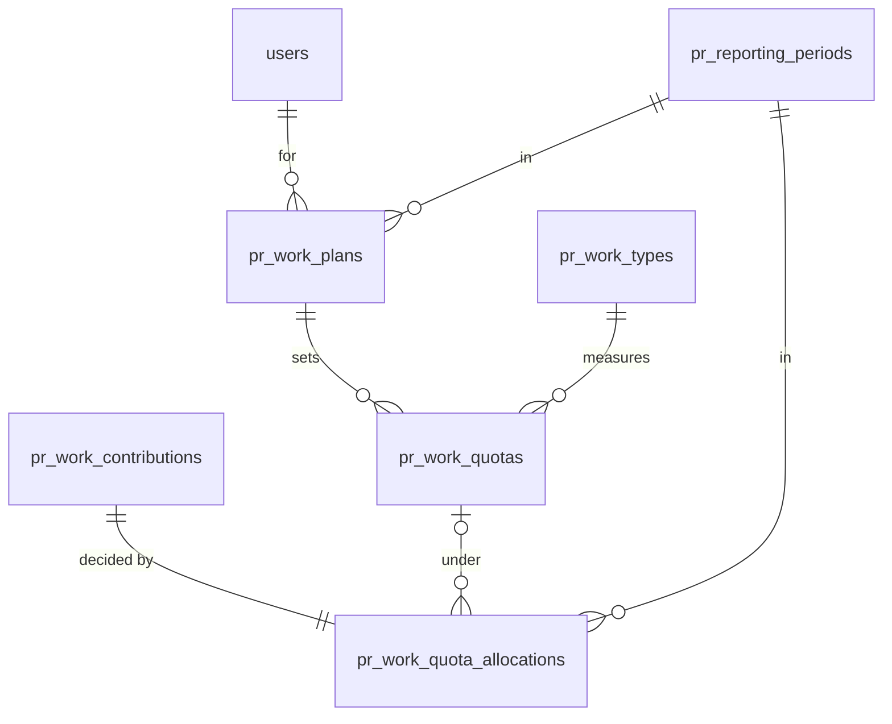
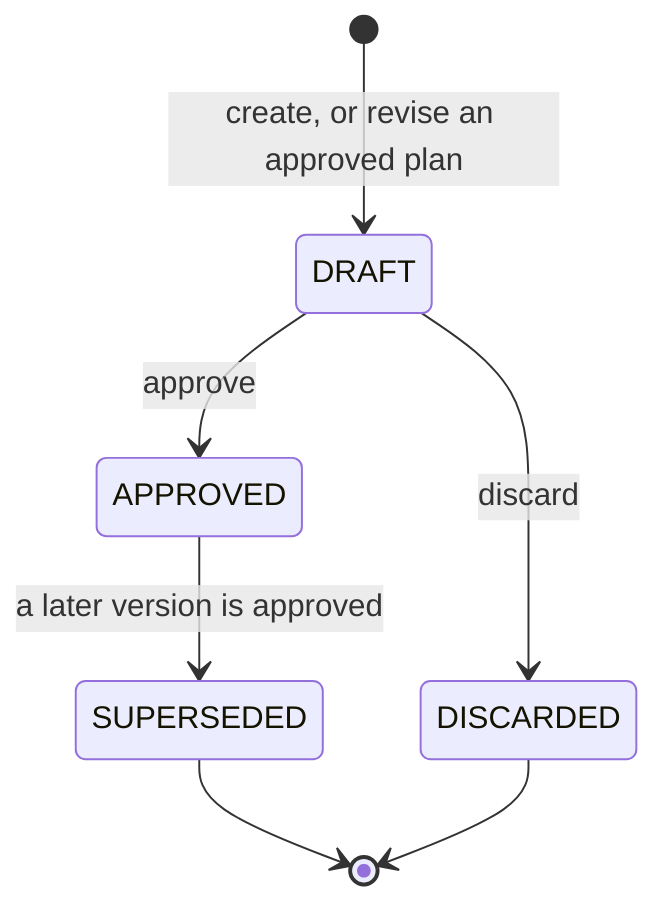

# M2 — Work Plan, Quota & Eligibility

> **Read with [`WORK_RESULTS_BY_PERIOD.md`](WORK_RESULTS_BY_PERIOD.md)
> (migration `0039`).** The allocation - `ELIGIBLE / PARTIALLY_ELIGIBLE /
> OVER_QUOTA / NO_QUOTA` - is still computed exactly as below and still shown
> on the KPI screen, but it is now an **informational decomposition** of the
> actual against the target: M6 prices the whole counted amount, so
> `OVER_QUOTA` and `NO_QUOTA` no longer mean *"worth nothing"*. Two smaller
> changes: the evaluator no longer produces `UNIT_MISMATCH` (a work type's unit
> is an editable label and both sides copy it), and "counted in this period"
> attributes a period container to its own month rather than to its
> `counted_at` (`counted_in_period`). `QuotaTypeProgress` gained
> `completion_percent` and `over_target_amount`, uncapped.

**Status:** implemented. Not deployed.
**Migration:** `0033_pr_work_quota_eligibility`, down-revision `0032`. Three new
tables and **one column** on one existing one.
**Scope:** the KPI plan, its quotas, and the projection that decides which
`COUNTED` work sits inside an approved cap.
**Out of scope, and absent from the code:** every point — `base_score`,
`awarded_score`, `points`, `quality_multiplier`, `score_total`, `bonus`;
ranking; payroll; the content projector; the task bridge; recurring work;
Telegram KPI automation; any team or department model; channel- or
campaign-scoped quota; spreadsheet import; correcting a closed period.

---

## 1. The one idea

```
COUNTED  !=  ELIGIBLE  !=  SCORED
```

M1 answers *"is this real, valid, completed work?"* M2 answers *"among valid
`COUNTED` work, which portion belongs to the employee's approved KPI plan for
this reporting period?"* **`SCORED` does not exist**, in this milestone or in
the schema, and M6 owns it.

```
WorkContribution
      │  M1: validated by somebody who did not do it
      ▼
   COUNTED
      │  M2: evaluated against the approved plan in force
      ▼
  ┌──────────┬──────────────┬──────────┬────────────────────┬────────────┐
  │ NO_QUOTA │ UNMEASURABLE │ ELIGIBLE │ PARTIALLY_ELIGIBLE │ OVER_QUOTA │
  └──────────┴──────────────┴──────────┴────────────────────┴────────────┘
                                                              + a read-only
                                                          PENDING_EVALUATION
```

Everything below is a consequence of that, and of the two sentences that follow
it:

> **Missing quota is never unlimited eligibility.**
>
> **A missing allocation row is never, by itself, `NO_QUOTA`.**

---

## 2. Schema



### `pr_work_plans` — one employee's KPI plan for one month, at one version

| Column | Note |
|---|---|
| `user_id` | One employee. M2 models no team and no shared plan |
| `period_id` | **The existing `pr_reporting_periods` row.** Reused, never restated as a pair of dates |
| `version_no` | 1, 2, 3 … within one `(user, period)`. Never reused, never renumbered |
| `status` | `DRAFT` · `APPROVED` · `SUPERSEDED` · `DISCARDED` |
| `supersedes_plan_id` | Links the chain backwards |
| `note` | Why this version exists. Prose |
| `created_by_user_id`, `approved_by_user_id`, `approved_at`, `superseded_at`, `discarded_at`, `discarded_by_user_id` | |

Constraints that carry rules:

- `uq_pr_work_plans_user_period_version` — what makes "v2" mean one thing
- **`uq_pr_work_plans_approved`** — *partial*, `WHERE status = 'APPROVED'`. **At
  most one plan in force** per employee per period
- **`uq_pr_work_plans_draft`** — the same shape for the one revision in flight
- `(status IN ('APPROVED','SUPERSEDED')) = (approved_at IS NOT NULL)` — a
  superseded plan *was* approved and keeps saying when

### `pr_work_quotas` — one work type's target and cap inside one plan version

`plan_id`, `work_type_id`, `basis`, `target_value`, `eligibility_cap`, `unit`,
`note`.

- `target_value > 0`, `eligibility_cap > 0`, **`eligibility_cap >= target_value`**
- `(basis = 'QUANTITY') = (unit IS NOT NULL)`
- **`uq_pr_work_quotas_plan_type`** — one answer per kind of work. An ambiguous
  quota match is unrepresentable rather than merely refused by a validator

### `pr_work_quota_allocations` — what an approved quota decided

`work_contribution_id`, `reporting_period_id`, `user_id`, `work_type_id`,
`work_plan_id?`, `work_quota_id?`, `quota_status`, `basis`, `unit?`,
`basis_amount`, `eligible_amount`, `over_quota_amount`, `evaluated_at`.

- **`uq_pr_work_quota_allocations_contribution`** — one current decision per
  contribution. What makes a repeated reconcile idempotent rather than additive
- `basis_amount = eligible_amount + over_quota_amount` **unless
  `quota_status = 'NO_QUOTA'`** — see §7
- `(quota_status = 'NO_QUOTA') = (work_quota_id IS NULL)` — provenance is not
  optional for anything a quota decided
- **`quota_status <> 'NO_QUOTA' OR eligible_amount = 0`** — the anti-gaming
  constraint, said by the database independently of the evaluator

`user_id` and `work_type_id` are **denormalised** from the contribution and the
item. The summary index `(user_id, reporting_period_id, work_type_id)` is the
question every KPI screen asks, and answering it through a join to
`pr_work_contributions` would put the module's cheapest read on its widest lock
footprint.

### The one column on an M1 table

`pr_work_types.default_quota_basis`, `NOT NULL`, server default `'ITEM_COUNT'`.

**Why on the type.** How a kind of work is measured is a fact about the work,
not a per-employee negotiation. Two plans measuring "seeding comments"
differently — one by rows, one by comments — would make a department-wide figure
meaningless and hand whoever chose `ITEM_COUNT` a hundredfold advantage. It is
also what lets a `NO_QUOTA` allocation be reported in the right units (§7).

**Editable, unlike `default_unit`,** and the difference is not an
inconsistency: a unit is what past quantities *meant*, while a basis is only
read when new configuration is written. Every quota and every allocation stores
the basis it was decided under, so changing it rewrites no history.

Existing types get `ITEM_COUNT` from the default, which is what M1's figures
already implied — nothing was measured by quantity, because nothing was measured
against a quota at all. A type that should be `QUANTITY` is reconfigured through
the existing work-type endpoint: a decision somebody takes, never a guess the
migration makes from `default_unit`.

---

## 3. Why the allocation is its own table

M1's handover recommended `quota_status` on `pr_work_contributions`. M2 does
**not** do that.

| | Column on the contribution | Separate allocation row |
|---|---|---|
| Partial `QUANTITY` eligibility | ❌ 40 eligible and 20 over is three numbers, not an enum | ✅ |
| "Which plan version decided this?" | ❌ Nowhere to keep it; rewritten in place | ✅ `work_plan_id` / `work_quota_id` |
| Pre-M2 counted work | A null that means two things | ✅ **No row** is a legible state, and it reads as `NO_QUOTA` |
| What M1 means | Four quota columns on the table that means *"is this valid completed work"* | ✅ M1 unchanged |

The cost is a join. It buys back the third row: **every contribution counted
before M2 was deployed is in the "no allocation" state**, and that state is the
truth rather than a placeholder.

---

## 4. Plan lifecycle



```
APPROVED v1  ──revise──►  DRAFT v2  ──edit──►  approve v2
                                                   │
                                        ┌──────────┴──────────┐
                                   v1 → SUPERSEDED       v2 → APPROVED
                                   (one transaction, or neither)
                                                   │
                                        recompute, if the period is OPEN
```

**A `DRAFT` decides nothing.** The evaluator reads `APPROVED` plans only, so a
half-written plan cannot set somebody's KPI while it is still being argued
about.

**An `APPROVED` plan is never edited.** Every quota write passes one gate that
refuses anything but a draft, with `reason: "plan_not_draft"` and
`next: "revise"`. The panel offers *"Tạo bản điều chỉnh"* and no edit form at
all; the route refuses either way.

**The old version stays in force while the new one is written**, which is what
somebody revising a plan wants: nothing changes for the employee until the
revision is approved, and if it never is, nothing changed at all. Quotas are
copied by value into the draft, so editing it cannot reach the version still
deciding.

**Approval and superseding are one transaction.** The previous plan is locked
and marked `SUPERSEDED`, flushed, and only then is the new one marked
`APPROVED` — the partial unique index allows exactly one, so writing them in the
other order would violate it inside the transaction itself.

---

## 5. Quota basis

| Basis | Consumes | Example |
|---|---|---|
| `ITEM_COUNT` | **one per counted contribution** | 20 short-video scripts |
| `QUANTITY` | `WorkItem.quantity × WorkContribution.credit_weight` | 3 000 `COMMENT` |

**`ITEM_COUNT` does not apply `credit_weight`.** A shared shoot is one work item
and three people's contributions, and each of those three did one job.
`credit_weight` exists to record a *minor* share; using it to divide an item
would make "how much of this counts towards my plan" depend on a field that
means something else.

**`QUANTITY` does.** A half share of 100 comments is 50 comments of quota.

**"100 comments" is one work item with `quantity = 100`, never a hundred rows** —
M1 enforces that shape. A quota on `ITEM_COUNT` would read it as 1, and a
department that noticed would start filing a hundred rows.

Every amount is a `Decimal`, quantised once to two places where it is computed.
**No float arithmetic anywhere**, because eligibility capacity is money-adjacent.

**The work type is the semantic authority.** A quota's `basis` must equal the
type's `default_quota_basis`, and a `QUANTITY` quota's `unit` must equal the
type's `default_unit`. Both are refused at configuration rather than discovered
at the end of the month:

| Configuration | Outcome |
|---|---|
| `SEEDING_COMMENT` (`QUANTITY`, `COMMENT`) + `QUANTITY`/`COMMENT` | ✅ |
| `SEEDING_COMMENT` + `QUANTITY`/`VIDEO` | ❌ `unit_does_not_match_work_type` |
| `SEEDING_COMMENT` + `ITEM_COUNT` | ❌ `basis_does_not_match_work_type` |

**A missing quantity is refused, never read as 1.** A quantity-measured item
with no quantity is a row nobody can measure, and treating it as a single unit
would turn a data-entry mistake into a hundred comments' worth of KPI. The
domain function raises; the evaluator skips that one contribution rather than
aborting the whole period, and reports the count as `unmeasurable` in the
reconcile response. It stays visible as `NO_QUOTA`.

---

## 6. Target vs eligibility cap

Two numbers, not one.

```
target_value    = 20    what the plan asks for
eligibility_cap = 25    how much may be eligible at all
```

| Counted | Eligible | Over quota | Target progress | Extra eligible above target |
|---|---|---|---|---|
| 27 | 25 | 2 | 20 / 20 | 5 |

`target_progress` is **capped at the target**, because "20 / 20" is what a met
target looks like and "25 / 20" is a different fact. The excess inside the cap
is `extra_eligible_above_target`, said separately.

Collapsing the two would force a choice between *"extra work is worth nothing"*
and *"there is no target"*, and the department wants neither. **Neither is a
point total.**

Neither may be `NULL`, and `NULL` is never read as unlimited.

---

## 6b. The five states, and the one a read can add

`NO_QUOTA` is a **business claim**: *nobody set a target for this kind of work,
for this person, in this period.* An absent allocation row is not evidence for
it, and treating it as evidence was the semantic bug this section exists to
record.

| State | Means | Stored? | Who fixes it |
|---|---|---|---|
| `NO_QUOTA` | No approved quota covers the work type | ✅ | somebody approves a plan |
| `UNMEASURABLE` | A quota covers it and the contribution **cannot be measured** | ✅ | somebody types a quantity onto the work item |
| `ELIGIBLE` | Wholly inside the cap | ✅ | — |
| `PARTIALLY_ELIGIBLE` | Part inside, part over | ✅ | — |
| `OVER_QUOTA` | A quota exists and its capacity is used up | ✅ | raise the cap by revision, or nothing |
| `PENDING_EVALUATION` | A quota covers it and **nothing has evaluated it yet** | ❌ **read-only** | an administrator reconciles the period |

`ck_pr_work_quota_allocations_status_is_materialisable` is the database refusing
to store the last one: it describes the *absence* of a row, so a row holding it
would contradict itself and would be indistinguishable from a decision.

### `UNMEASURABLE` — a target exists and a number does not

Not rejected work, not invalid work, not excluded work, not unapproved work. The
contribution is `COUNTED` and stays `COUNTED`; the whole of what is wrong is that
nobody wrote down a quantity, and somebody can.

```
WorkType SEEDING_COMMENT   basis QUANTITY   unit COMMENT
Approved quota             target 3000      cap 3000 COMMENT
Contribution               COUNTED          WorkItem.quantity = NULL
                                            ─────────────────────────
                                            quota_status = UNMEASURABLE
                                            reason_code  = MISSING_QUANTITY
                                            basis_amount = NULL
```

On screen: *"Chưa thể tính hạn mức — thiếu số lượng công việc."*

Three reason codes, and **only failure modes the evaluator actually produces** —
a code with no branch would be a sentence nobody can ever see:

| `reason_code` | When | Vietnamese |
|---|---|---|
| `MISSING_QUANTITY` | A `QUANTITY` type and the item has no quantity | *Thiếu số lượng công việc.* |
| `INVALID_QUANTITY` | `quantity × credit_weight` rounds away to nothing | *Số lượng công việc chưa hợp lệ.* |
| `UNIT_MISMATCH` | The item's unit is not the unit the quota caps | *Đơn vị công việc không khớp hạn mức KPI.* |

There is deliberately **no `EVALUATION_ERROR`** — see §12b.

`basis_amount` is **null**, not zero. Zero is a measurement; this is the absence
of one, and a report that summed it would say the employee produced nothing.

### Which wins when both apply

**`NO_QUOTA`.** A contribution with no quantity *and* no approved quota is
`NO_QUOTA`: the absence of a decision is the more useful sentence, and asking
somebody to supply a quantity for a quota nobody wrote would send them to do
pointless work. Its `basis_amount` is null too, for the same reason.

---

## 7. `NO_QUOTA` — absence is not permission

A contribution may be perfectly valid — approved, counted, in somebody's
workload — and have **no approved quota** for that person, work type and period.

That is `NO_QUOTA`, and it is **anti-gaming behaviour, not an edge case**. If
missing quota meant unlimited eligibility, the cheapest route to an unbounded
KPI would be to do work in a category nobody has set a target for — and the
absence of a target is nearly always the absence of a decision.

| | `NO_QUOTA` | `OVER_QUOTA` |
|---|---|---|
| Means | **Nobody set a cap** | There is a cap and it is used up |
| The work | Real, counted, in the workload | Real, counted, in the workload |
| `eligible_amount` | 0 | 0 |
| On screen | *"Đã ghi nhận công việc, chưa có hạn mức KPI."* | *"Vượt hạn mức"* |
| What to do about it | Ask for a quota | Nothing; or raise the cap by revision |

**The amounts.** `basis_amount` is the real contribution amount,
`eligible_amount` and `over_quota_amount` are both zero — so a `NO_QUOTA` row is
the one place the reconcile invariant does not hold, and the CHECK constraint
exempts it explicitly. Forcing the sum would mean calling the work eligible
(*"missing quota means unlimited"*) or calling it over quota (*"your work was
rejected"*). Both are false, so a summary counts it as a third figure,
`no_quota_amount`.

The basis for a `NO_QUOTA` row comes from the **work type**, which is why
`default_quota_basis` exists: 30 seeding contributions read as *"3 150 bình
luận, chưa có hạn mức"* rather than *"30 rows"*.

A `DRAFT` plan is **not** a quota. When an `APPROVED` plan is later created while
the period is still `OPEN`, the `NO_QUOTA` allocations recompute into `ELIGIBLE`,
`PARTIALLY_ELIGIBLE`, `OVER_QUOTA` — or `UNMEASURABLE`, if the contribution turns
out to have no measurable amount once there is a quota to measure it against.

---

## 8. Partial `QUANTITY` allocation

`eligibility_cap = 100 COMMENT`, contributions of 60, 60 and 30:

| | `basis_amount` | `eligible_amount` | `over_quota_amount` | Status |
|---|---|---|---|---|
| A | 60 | 60 | 0 | `ELIGIBLE` |
| B | 60 | **40** | **20** | `PARTIALLY_ELIGIBLE` |
| C | 30 | 0 | 30 | `OVER_QUOTA` |

All-or-nothing on B would make two employees who did the same 120 comments get
different KPI results purely from how they chose to split the job — which would
make the shape of the paperwork worth more than the work.

`ITEM_COUNT` never produces `PARTIALLY_ELIGIBLE`: one item cannot be half an
item.

---

## 9. Deterministic allocation

```
ORDER BY counted_at ASC, contribution.created_at ASC, contribution.id ASC
```

The first key is the rule an employee can predict and the department can
explain: **first validated, first inside the quota.**

The second and third exist only to make the order *total*. `counted_at` is one
instant for every contribution on one work item — M1 stamps it once — so a
three-person shoot ties three ways, and a tie is where a repeated evaluation
stops being reproducible.

The ordering is stated twice on purpose: in SQL, so the rows arrive already
ordered, and in `candidate_sort_key`, so the pure allocation function does not
depend on a caller getting it right. A test asserts the two agree. Sorting on
the id's *string* keeps `ORDER BY id` and Python's `sorted` agreeing, because
PostgreSQL compares `uuid` values in that same textual order.

**Python-side ordering normalises both instants to UTC first**, through
`meobot.core.time.ensure_utc`, and `candidate_sort_key` is the only place in M2
that needs to. The convention is that a stored timestamp is aware UTC, but the
*driver* decides what comes back: SQLite has no timezone type and returns the
same column naive, so one evaluation can hold a freshly flushed `counted_at`
that is still aware beside one re-read from the database that is not — and
Python refuses to compare those, taking the whole evaluation down with a
`TypeError`. Normalising is not the same as stripping the offsets: `08:00+07:00`
is *earlier* than `01:30+00:00`, and an order that compared wall clocks would
raise nothing and be wrong. Nothing persisted changes; this is a comparison
boundary, not a storage decision.

**Running the evaluator repeatedly against unchanged data produces identical
allocations.** It is a projection, not an increment: it recomputes a whole
`(user, period)` and writes the result, so an undo, a raised cap, a plan revision
and a re-run backfill all converge without a repair script.

---

## 10. Reporting periods

M2 reuses `pr_reporting_periods` and **adds no second calendar**. Step 1B built
the table and left it with no reader; M2 is that reader, which is what the table
was for.

**Month periods only.** A contribution counted on 15 September falls inside both
`2026-W38` and `2026-09`, so if plans could target either type, one contribution
could be claimed by two approved quotas at once — and there is exactly one
allocation per contribution, deliberately. Rather than invent a precedence rule
nobody asked for, M2 refuses a `WEEK` plan with `reason:
"period_type_not_supported"` and records it as a limitation (§17).

**The period is decided by `counted_at`**, unchanged from M1: assigned 31 Aug,
completed 1 Sep, validated 2 Sep → **September**.

A period's calendar days become UTC instants through the **existing**
`day_bounds(from, to, tz=business_timezone)` — the one place a Vietnamese day
becomes a pair of instants. 2026-09-01 begins at 2026-08-31T17:00Z, and
comparing `counted_at >= 2026-09-01T00:00Z` would push the first seven hours of
every working day into the previous month.

**Periods are not generated on a timer**, keeping Step 1B's rule. An
administrator asks for `2026-09` through `POST /api/pr/work/periods` and gets
it, **idempotently** — asking for a month that exists returns it unchanged,
including its status, so a retry does not reopen a closed period.

**A month nobody has opened is an operational fact, not an invented row.** A
contribution counted into one stays `COUNTED`, gets no allocation, reads as
`NO_QUOTA`, and is logged as `pr_work_quota_period_missing`. Inventing the period
would silently attach a KPI decision to a month nobody agreed to.

---

## 11. `OPEN` / `CLOSED` / `LOCKED`

| Period | Recomputation |
|---|---|
| `OPEN` | **Allowed.** An `OVER_QUOTA` contribution may become `ELIGIBLE` when capacity appears — a cap was raised, or an earlier contribution stopped qualifying |
| `CLOSED` | **Refused.** The numbers were agreed |
| `LOCKED` | **Refused.** The period has been reported |

Worked example — 20 eligible, #21 `OVER_QUOTA`, then #5 stops qualifying:

- period `OPEN` → #21 **may** be promoted by the next recompute;
- period `CLOSED` or `LOCKED` → **not promoted**. The gap stays.

**Refused, not silently skipped.** A no-op would hide somebody reconciling the
wrong month and believing it worked. The error is
`pr_work_period_not_open` with the period's code and status in `details`, and
there is deliberately **no `force` flag**: correcting a closed period is an
administrative act with its own trail, and it belongs to a later milestone.

Reads work on a closed period. `GET /eligibility` and `/eligibility/summary`
materialise nothing, so reporting a reported month is safe — and a read that
wrote would put a write on a path that has to work while a period is `LOCKED`.

---

## 12b. Three failures, and only two are business states

The distinction that keeps a bug out of somebody's KPI figure:

| | Outcome | Why |
|---|---|---|
| **No approved quota** | `NO_QUOTA` | A business state. Somebody approves a plan |
| **A quota, and no measurable data** | `UNMEASURABLE` + `reason_code` | A business state. Somebody types a quantity |
| **The evaluator broke** | **Neither** | Not a business state at all |

The third row is the rule. An unexpected exception — a bug, a lock timeout, a
column that is not there — is **raised**, never dressed as an eligibility
decision:

- inside `approve`, the savepoint rolls the projection back and the approval
  commits. The contribution gets **no allocation**, and a read then reports it as
  `PENDING_EVALUATION` when a quota covers it — *nothing has looked at this yet*,
  which is true — rather than `NO_QUOTA`, which would be a claim about the plan
  that nobody made;
- inside `reconcile_period`, it propagates, so an operator sees a failure rather
  than a period full of confident wrong answers.

That is why `measure_contribution` **returns** its two business outcomes rather
than raising one of them. If it raised, the only way to stop one bad row aborting
an employee's whole period would be a `try/except` around it — and an `except`
wide enough to catch a missing quantity is wide enough to catch a bug, which is
exactly how *"the evaluator broke"* came to look like *"no quota"* in the first
place.

**No raw exception text is ever stored.** `reason_code` is a closed enum; an
error string is an implementation detail that changes when somebody rewords a
docstring, and putting one on an employee's KPI screen would be a stack trace in
a performance review.

---

## 12. Integration with M1 approval

**Chosen consistency: the same transaction, behind a `SAVEPOINT`.**

`PrWorkService.approve` gained one line. After the contributions are counted, it
calls `PrWorkQuotaEligibilityService.on_contributions_counted` inside
`session.begin_nested()`, and catches everything.

Why that shape, and not the two alternatives:

| Option | Why not |
|---|---|
| A plain call in the transaction | A projection failure poisons the transaction and takes a correct approval with it |
| An outbox/worker event | MeoChat has no worker for this kind of derived read model, and the window in which work is counted and the KPI screen says nothing about it is exactly the confusion the module exists to prevent |
| **A savepoint** | ✅ Both: approval and eligibility commit together, and a failure rolls back only the projection |

The requirements it satisfies, one by one:

- **no duplicate allocation** — `uq_pr_work_quota_allocations_contribution`, and
  the evaluator upserts rather than appends;
- **a temporary projection failure does not corrupt `COUNTED` work** — the
  savepoint is rolled back and the approval, the `counted_at` values, the history
  rows and the audit row all commit. Verified on real PostgreSQL;
- **M1 approval remains correct even if quota evaluation fails** — the exception
  is logged as `pr_work_quota_projection_failed` and never raised;
- **eventual state converges** — the evaluator is a projection, so the next
  reconcile of that open period produces exactly the allocations the failed
  attempt would have.

**Work validation never depends on a quota existing.** A contribution whose
quota status will be `NO_QUOTA` still becomes `COUNTED`; so does one counted into
a month with no reporting period, and one counted into a `CLOSED` period. The
first two are logged; the third is skipped because rewriting a reported month is
what §11 forbids.

A `PrWorkService` built without an evaluator — M1's wiring, and any test that
only cares about the ledger — does nothing at all here.

---

## 13. Pre-existing M1 data, and reconciliation

**No migration-time backfill.** Not from the spreadsheet, not from
`pr_content_items`, not from `pr_tasks`, and not over `pr_work_contributions`.
Migration `0033` writes no row in any existing table.

A `COUNTED` contribution with no allocation is a supported state: the read path
is a **left outer join** with `is_materialised: false`. What it reports depends
on the one thing a read can establish without evaluating anything —

- **no approved quota covers the work type** → `NO_QUOTA`. The claim is true, and
  it is a lookup in the quota map, not a second evaluator: nothing is ordered, no
  cap is filled, no amount is allocated;
- **an approved quota does cover it** → `PENDING_EVALUATION`, with **no amounts
  at all**. `eligible_amount` is not zero, it is unknown, and a zero would be a
  decision nobody took.

Reporting `NO_QUOTA` for the second case was the semantic bug: it told an
employee their manager set no target when their manager had, and sent them to ask
for a quota that already existed.

### The incremental hook writes nothing without an approved plan

**Two absences, and only one of them is a decision.**

- **No approved plan exists for this person and month.** There is nothing to
  evaluate *against*. `on_contributions_counted` returns early and materialises
  no row — a `NO_QUOTA` allocation written here would record that eligibility was
  assessed and came out empty, when it was never assessed at all. The read path
  still says `NO_QUOTA`, because *nobody set a target* is true and establishable
  by a lookup, and it says it with `is_materialised: false`, which is the
  module's word for *nothing has formally assessed this*.
- **A plan is in force and no quota in it covers this work type.** Somebody did
  decide, and this work fell outside every decision. That is actionable — *"your
  plan does not cover the work you are doing"* — and it stays **materialised**,
  by `evaluate`, exactly as before.

The guard is on the **incremental hook only**. `reconcile_period` is a
deliberate administrative act with `PR_WORK_CONFIGURE` and a request id behind
it, and it still materialises `NO_QUOTA` for somebody with no plan. Automatic
projection and explicit reconciliation are different acts, and only the first is
guessing at a decision nobody has taken.

**Nothing is stranded.** An approved plan is *monotone* per person and period —
the only exit from `APPROVED` is `SUPERSEDED`, written inside the approval of
its own replacement — and `PrWorkPlanService.approve` finishes by calling
`evaluate` for the whole period. Work counted before anybody planned the month is
evaluated the moment a plan is approved, without waiting for a reconcile.

**M2 never vetoes M1.** With no plan the contribution is still `COUNTED`; the
guard is a return, not a raise, and the hook still cannot refuse an approval.

The explicit convergence path is `POST /api/pr/work/eligibility/reconcile`
(`PR_WORK_CONFIGURE`). An **application endpoint** rather than a CLI or a worker,
because that is the repository-consistent option: every other administrative act
in this module is an audited HTTP call, and a management command would be the
one operation with no request id behind it.

It is **idempotent** — running it twice produces identical allocations — and it
is what recovers a period after a projection failed inside an approval. Omitting
`user_ids` sweeps everybody with counted work in the period, so nobody is missed
because their name was not on the list. `CLOSED` and `LOCKED` are refused.

Its response carries `created` / `updated` / `removed` and — the figure worth
watching — `unmeasurable`: contributions an approved quota could not measure.
They are **materialised, not skipped**: each gets a row with
`quota_status = UNMEASURABLE` and a reason code, so a screen can name the field
somebody has to fix and a read never has to guess what a missing row meant.

**`UNMEASURABLE` is a state somebody can get out of.** Supply the quantity, and
the next reconcile of the still-`OPEN` period converges on the real answer —
`ELIGIBLE`, `PARTIALLY_ELIGIBLE` or `OVER_QUOTA` depending on the capacity left,
in the same deterministic `counted_at → created_at → id` order. The reason code is
**cleared** on the way, which `ck_..._reason_matches_status` enforces: a resolved
row must not keep saying what used to be missing.

In a `CLOSED` or `LOCKED` period the reconcile is refused as always (§11) and the
allocation stays as the period recorded it. Fixing a quantity after the numbers
were agreed does not quietly move an employee's figures.

---

## 14. Concurrency

| Race | What settles it |
|---|---|
| Two approvals for the last `ITEM_COUNT` slot | Row lock on the **reporting period**. The second waits, re-reads the committed allocations, and fills nothing |
| Two approvals splitting the last `QUANTITY` units | The same lock. The eligible amounts sum to exactly the cap |
| Two administrators approving one draft | Row lock on the **plan**, then `uq_pr_work_plans_approved` |
| Two administrators approving two drafts | `uq_pr_work_plans_approved` — a partial unique index wins the race an application check loses |
| Two reconciliations at once | The period lock, plus `uq_pr_work_quota_allocations_contribution` |
| A duplicate HTTP retry of `approve` | Re-reads `APPROVED` under the lock and is refused with `plan_not_draft` |

**The lock order is always work item → period.** `approve` holds the item when it
calls the evaluator, and nothing else takes the two in the other order.

Locking the period is **coarser than locking `(user, period)`** — two approvals
for two different employees in the same month serialise — and that is the right
trade here: contention is a handful of writes a day at ~20 people, and the
alternative is an advisory-lock scheme with no row to hang it on when the
employee has no plan at all. It is documented rather than hidden, and it is the
first thing to change if the department triples.

All six are asserted on real PostgreSQL in
`tests/integration/test_pr_work_quota_concurrency.py`; the offline suite cannot
prove any of them, because `lock_row` degrades to a plain `get` on SQLite.

---

## 15. Permissions

**The M1 patch scope model kept, not regressed.** No new `PrCapability`, and no
parallel RBAC.

| Act | Capability | Reaches |
|---|---|---|
| Read own approved plan, own quota progress, own contribution eligibility | — (any Work-module reader) | EMPLOYEE+ |
| List reporting periods | `PR_WORK_EXECUTE` | EMPLOYEE+ |
| Read **anybody's** plan or eligibility | `PR_WORK_VIEW_ALL` | ADMIN+ |
| Create/edit a draft, add/edit/remove a quota, approve, revise, discard, open a period, reconcile | `PR_WORK_CONFIGURE` | ADMIN+ |

**`PR_WORK_MANAGE` opens nothing here.** A `TEAM_LEAD` may assign work, accept
proposals and validate what somebody finished; none of that implies deciding an
arbitrary colleague's KPI targets. MeoBot models **no team, department or manager
relationship**, and deriving one from `PrChannelAssignment` was explicitly ruled
out in M1 and is not reintroduced. Until a real organisational model exists,
quota configuration stays at ADMIN and above.

**An employee configures nothing, including their own plan.** That is the point.

Asking about somebody else without `PR_WORK_VIEW_ALL` is **refused** — reason
`user_filter_not_permitted` — rather than narrowed to the caller's own figures: a
screen headed with a colleague's name showing your numbers is worse than an
error. A plan detail the caller may not see returns **not-found**, matching M1's
work detail, because whether a colleague has a KPI plan is itself information.

Every check is server-side, in the services, and the `can_*` flags on the detail
response are the same checks rendered as booleans. `can_edit` is **false for
every approved plan, whoever is asking** — the immutability rule as a flag, not a
permission that happened to fail.

---

## 16. API

```
GET    /api/pr/work/periods                     the months a plan may target
POST   /api/pr/work/periods                     open one · idempotent

GET    /api/pr/work/plans                       · GET /plans/mine?period_id=
GET    /api/pr/work/plans/{id}
POST   /api/pr/work/plans                       → DRAFT
POST   /api/pr/work/plans/{id}/quotas           · PATCH · DELETE /{quota_id}
POST   /api/pr/work/plans/{id}/approve
POST   /api/pr/work/plans/{id}/revise           → the next DRAFT
POST   /api/pr/work/plans/{id}/discard

GET    /api/pr/work/eligibility?period_id=      · GET /eligibility/summary
POST   /api/pr/work/eligibility/reconcile
```

Mounted **before** M1's work router, because they share the `/api/pr/work`
prefix and M1 owns `GET /api/pr/work/{work_item_id}`: FastAPI matches in
registration order, so the literal paths have to be declared first or each would
be parsed as a work-item UUID.

**Explicit lifecycle endpoints, never one PATCH.** Approve, revise and discard
are three routes calling three service methods. The one `PATCH` edits a **draft**
quota's two numbers and can reach nothing else — not the work type, not the
basis, not the unit, and no plan that is not a draft. `work_type_id`, `basis` and
`unit` are absent from `UpdateQuotaRequest` on purpose: changing what a quota is
*about* is a different quota, and the answer is to remove it and add the right
one, so both acts are audited.

Every request body uses `extra="forbid"`, so a body carrying `status`,
`approved_at` or `quota_status` is **refused** rather than ignored.

`ContributionEligibilityResponse` carries `quota_status` (six values),
`reason_code` (three, or null), `reason_label` (the server's sentence) and three
**nullable** amounts. No raw exception text is ever on the wire, and no scoring
field exists anywhere in the schema.

---

## 17. Frontend

`/pr/work` gained a **view**, not a page: `?view=kpi` — *Kế hoạch KPI*. One
screen, because the KPI view answers the next question about the same rows, and
two pages would make somebody navigate between two halves of one sentence.

**Employee view.** Per work type, four figures said as four:

```
Kịch bản video ngắn                       Theo số đầu việc
Mục tiêu    20    Đã ghi nhận  23    Đủ điều kiện  20    Vượt hạn mức  3
Trần hạn mức 20 · Đạt mục tiêu 20 / 20
```

```
Comment seeding                              Theo số lượng
Mục tiêu 3.000 bình luận   Đã ghi nhận 3.150 bình luận
Đủ điều kiện 3.000 bình luận   Vượt hạn mức 150 bình luận
```

With no quota, the row shows the counted amount and one sentence:
*"Đã ghi nhận công việc, chưa có hạn mức KPI."* Not zero, not a failure, not
unlimited.

A per-contribution breakdown sits behind a disclosure, each row carrying the
server's `quota_status_label`:

| Badge | Means |
|---|---|
| *Đủ điều kiện* | inside the cap |
| *Đủ điều kiện một phần* | split, with the numbers on the badge |
| *Vượt hạn mức* | the cap is used up |
| *Chưa có hạn mức KPI* | nobody set a target |
| *Chưa thể tính hạn mức* | a target exists, a number is missing — with the reason beside it |
| *Chưa tính điều kiện KPI* | a target exists, the period has not been recomputed |

`OVER_QUOTA` and `UNMEASURABLE` are **amber, not red**: in both, the work was
done correctly and counted in full, and painting either as a failure would tell
somebody off for doing their job.

Every word is the server's — `quota_status_label` and `reason_label` are composed
server-side, so the browser never invents an eligibility sentence and the six
states cannot quietly become five in the client. A progress card whose totals
leave rows out says so in words rather than folding a missing quantity in as
zero.

**Administrator view.** Employee, period, draft/approved version, add a work-type
quota with target and cap, approve, revise, discard, reconcile. No basis or unit
fields — they come from the work type, and offering them would let somebody write
a quota in units the work is never recorded in.

**Confirmations** reuse the Step 1F.2.8 `ConfirmDialog`, and the inventory in
`lib/confirmations.ts` names all ten new actions. Dialogs for: approve a plan,
approve a replacement revision, create a revision, remove a draft quota, discard
a draft, and reconcile. Parameter modals — whose submit button *is* the
confirmation — for: create a draft, add a quota, edit a draft quota's numbers,
open a period. Filters and period selection are not confirmed.

**No point total appears anywhere**, asserted structurally by a frontend test
over both the rendered screen and the API client.

---

## 18. Summary semantics

Never merged:

| Figure | Grain |
|---|---|
| `counted_contributions` | one per person per counted job |
| `counted_work_items` | distinct jobs behind them |
| `counted_amount` | the same as the count for `ITEM_COUNT`; a quantity for `QUANTITY` |
| `eligible_amount` | inside the approved cap |
| `over_quota_amount` | past it |
| `no_quota_amount` | no approved quota looked at it |
| `target_value` / `eligibility_cap` | what was asked for / how much may be eligible |
| `measured_contributions` | how many had an amount the engine could state |
| `unmeasurable_contributions` | a quota exists and they cannot be measured. **A count** |
| `pending_contributions` | a quota exists and nothing has evaluated them. **A count** |

`counted_amount = eligible_amount + over_quota_amount + no_quota_amount`, **over
the contributions that could be measured**.

Which is why `measured_contributions` sits beside `counted_contributions`: when
the two differ, the amounts understate the period by exactly those rows.
`UNMEASURABLE` and `PENDING_EVALUATION` work is **counted, never summed as zero**
— a missing quantity is not a quantity of nothing, and adding it in as zero would
say the employee did no work when they did work nobody wrote a number for.

An employee's strip therefore reads:

```
Counted        25
Eligible       20
Partial         1
Over quota      2
No quota        1
Unmeasurable    1
```

**There is no cross-type total quantity, and nowhere to put one.** The
cross-type figures are counts of contributions by status. Summing `COMMENT` +
`VIDEO` + `DAY` would produce a number that is not a quantity of anything, and
the response object refuses to have a field for it.

---

## 19. Audit and history

Ten new `AuditAction` values, all `pr.work_p*` or `pr.work.eligibility_*`:
`pr.work_period.created`, `pr.work_plan.created`, `.quota_added`,
`.quota_updated`, `.quota_removed`, `.approved`, `.revised`, `.superseded`,
`.discarded`, and `pr.work.eligibility_reconciled`.

**No new domain history table.** M1 has `pr_work_history` because a work item has
a timeline a person reads; a plan does not — it has *versions*. The question
*"why was contribution X `ELIGIBLE` yesterday and `OVER_QUOTA` today?"* is
answered from three things that already exist:

1. the allocation names the plan version and quota row that decided it
   (`work_plan_id`, `work_quota_id`, `evaluated_at`);
2. the plan chain shows what replaced it (`supersedes_plan_id`, `superseded_at`);
3. the audit row for `pr.work_plan.approved` carries who approved the replacement,
   when, and **the full quota set** as it was approved.

A second table repeating those payloads would be two records to keep in step, and
this milestone is not building an event-sourcing framework.

Allocation changes are not individually audited. They are a **projection** — a
row's value is a function of the contributions and the approved plan, both of
which are audited — so an audit row per allocation would record a consequence
rather than a decision, at roughly one row per counted contribution per
recompute.

---

## 20. Indexes and performance

Added, each with the query it serves:

```
pr_work_plans              (user_id, period_id, version_no) UNIQUE
                           (user_id, period_id) UNIQUE WHERE status = 'APPROVED'
                           (user_id, period_id) UNIQUE WHERE status = 'DRAFT'
                           (user_id, period_id, status)       the employee view
                           (period_id, status)                the admin list
pr_work_quotas             (plan_id, work_type_id) UNIQUE     the quota match
pr_work_quota_allocations  (work_contribution_id) UNIQUE      idempotency
                           (user_id, reporting_period_id, work_type_id)  THE KPI INDEX
                           (reporting_period_id, quota_status)  the reconcile report
                           (work_plan_id)                     provenance
```

The candidate query — the evaluator's hot path — is served by **M1's existing**
`ix_pr_work_contributions_user_count` on `(user_id, count_status, counted_at)`,
which is exactly `WHERE user_id = ? AND count_status = 'COUNTED' AND counted_at
BETWEEN ? AND ?`. M2 adds no index for it, because M1 already added the right
one.

### Measured

One employee, one month, PostgreSQL 17, everything on one machine:

| Counted contributions | `evaluate` first run | `evaluate` re-run (no change) | `summary` |
|---|---|---|---|
| 1 000 | 412 ms | 253 ms | 162 ms |
| 10 000 | 3 162 ms | 3 146 ms | 1 168 ms |

`EXPLAIN (ANALYZE)` at 10 000 rows:

| Query | Plan | Time |
|---|---|---|
| candidates by user / period | Hash join, seq scan on `pr_work_contributions` | 12.1 ms |
| allocations by user / period | Seq scan | 2.2 ms |
| **allocation by contribution** | **Index scan**, `uq_pr_work_quota_allocations_contribution` | 0.04 ms |
| summary by `quota_status` | HashAggregate over seq scan | 3.9 ms |
| plan by user / period | Seq scan (one row) | 0.02 ms |

**The SQL is not the cost.** Every statement above is single-digit
milliseconds, and the seq scans are the planner being right rather than an
index being missed: in a benchmark where one employee owns *all* 10 000 rows,
the filter selects 100 % of the table and an index would be slower. With the
department's real shape — ~20 people × 12 months — the same predicates are
selective and the indexes are used; the one query that is selective even here,
*allocation by contribution*, does take its index.

**The cost is the ORM upsert loop.** `evaluate` loads every existing allocation
for the pair, compares nine fields per row and writes back, so ~3 s at 10 000
rows is ~0.3 ms per row of Python and unit-of-work overhead. The re-run being
the same speed as the first confirms it: nothing is inserted the second time and
the time does not move. The obvious fix — a bulk `INSERT … ON CONFLICT DO
UPDATE` — is **not built**, because it would trade a readable projection for a
dialect-specific statement to save time at a volume the department cannot reach.

### The scale that matters

The department is ~20 people. One employee's month at the volumes the source
spreadsheet implies is order **10²** counted contributions — roughly **40 ms**
per evaluate by the table above. The brief's 1 000 and 10 000 are two and three
orders above what one person can physically do in a month.

At **10⁵ module rows** — roughly a decade of the whole department — the reads
stay narrow, because every one is keyed on `user_id` or `reporting_period_id`
first and neither is the whole table any more.

What would degrade is a **whole-period reconcile**: N employees × their
contributions in one transaction, so ~20 × 10² ≈ 2 000 rows, or under a second
by the measurements above. Two mitigations exist and neither is built,
deliberately: `user_ids` already narrows the sweep to one person, and the period
lock could be split to `(user, period)` if contention ever appeared. The
reconcile response reports exactly how much work it did, which is the signal
that would show either becoming necessary.

---

## 21. Verification

| Check | Result |
|---|---|
| `tests/unit/test_pr_work_quota.py` | **57 passed**, of which **15** are the semantics patch's |
| `tests/unit/test_pr_work_core.py` (M1 regression) | **53 passed** |
| `tests/unit/test_pr_work_scopes.py` (M1 scopes) | **25 passed** |
| `tests/unit/test_pr_reporting_schema_parity.py` | **53 passed** |
| `frontend/tests/work-quota.test.tsx` | **23 passed**, of which **5** are the patch's |
| `frontend/tests/work-core.test.tsx` (M1 regression) | **30 passed** |
| Full frontend suite | **717 passed (24 files)** |
| `tests/integration/test_pr_work_quota_migrations.py` (real PostgreSQL) | **21 passed** |
| `tests/integration/test_pr_work_quota_concurrency.py` (real PostgreSQL) | **7 passed** |
| `tests/integration/test_pr_work_core_migrations.py` (M1 regression) | **11 passed** |
| `tests/integration/test_pr_work_atomicity.py` (M1 regression) | **5 passed** |
| **Full PostgreSQL integration suite** | **348 passed** |
| `mypy src` · `ruff check` · `ruff format --check` | clean |
| `tsc --noEmit` · `next build` | clean |
| `alembic heads` | one head, `0033` |
| `0033 → 0032 → 0033` against a full chain | clean; the M1 ledger row unchanged |
| `compare_metadata` over `pr_work_plans` / `pr_work_quota*` / `pr_work_types` | **zero drift** |

The PostgreSQL suites were run against a throwaway `postgres:17` container. They
cover the partial unique indexes, allocation uniqueness, the anti-gaming CHECK,
the roundtrip with `compare_metadata`, real row locking, concurrent cap
allocation for both bases, and the savepoint that keeps an approval intact when
the projection fails.

**Two M1 integration suites needed a one-line change**, and neither is a
weakening. `test_pr_work_atomicity.py` built its database at `"0032"` while
exercising services against the *current* ORM models, so it selected a column
0033 adds; it now migrates to head, which is what a behaviour suite should do.
`test_pr_work_core_migrations.py`'s `compare_metadata` filter matched any
difference containing `pr_work`, which after M2 includes three tables its
deliberately-0032 database does not have; the filter now names 0032's own five
tables. The migration boundary it tests is unchanged.

Twenty-six pre-existing unit failures are unrelated to M2 and were failing before
it: `tests/unit/test_hr_requests.py` (20) and the HR half of
`tests/unit/test_notification_routing.py` (6) hard-code dates in July 2026, which
are now in the past, so the HR module's own *"you may only request leave for
today and future days"* rule fires. A date time-bomb in the fixtures; nothing in
M2 touches the HR module, and the failures reproduce with no M2 file loaded.

---

## 21b. The semantics patch, before M3

M2 shipped, and one flaw was found before it was deployed: the read path treated
**any** missing allocation row as `NO_QUOTA`. `0033` had not been deployed, so it
was **edited in place** — no `0034`.

**The bug.** `NO_QUOTA` is a business claim, *nobody set a target for this kind
of work*, and an absent row is not evidence for it. Three different situations
were producing the same sentence, and two of the three sent the reader to the
wrong person:

| Situation | Was reported as | Is now |
|---|---|---|
| No approved quota covers the work type | `NO_QUOTA` | `NO_QUOTA` ✓ |
| A quota exists, the work item has no quantity | `NO_QUOTA` ✗ | `UNMEASURABLE` + reason |
| A quota exists, nothing has evaluated it yet | `NO_QUOTA` ✗ | `PENDING_EVALUATION` |

The second was the worst of the three: the evaluator **skipped** an unmeasurable
contribution, so it got no allocation at all, and the read then filled the gap
with the one thing it was not.

**What changed.** `PrWorkQuotaStatus` gained `UNMEASURABLE` (stored) and
`PENDING_EVALUATION` (read-only, refused by a CHECK);
`pr_work_quota_allocations` gained a `reason_code` enum and a **nullable**
`basis_amount`; `contribution_basis_amount` became `measure_contribution`, which
**returns** a reason rather than raising one; and the read path establishes
`NO_QUOTA` with a quota lookup instead of assuming it.

Six new CHECK constraints came with it, and one of them found a real bug during
the patch: `_write` was not clearing `reason_code` when a resolved row moved from
`UNMEASURABLE` to `ELIGIBLE`, so the allocation would have kept saying what used
to be missing. `ck_..._reason_matches_status` refused the row, which is exactly
what a constraint that ties a field to a status is for.

---

## 22. Tests adapted, and why

Two M1 tests were **re-aimed rather than weakened**, and both are recorded here
because a milestone that loosens a guard should have to say so.

**`test_pr_work_core.py::test_40`.** Its forbidden list included `quota`,
`OVER_QUOTA` and `score_cap` alongside the scoring words, because M1 had no quota
engine and any of them appearing would have been somebody starting M2 by
accident. M2 *is* the quota engine. So `quota` comes off the list, the point
words go on it — `base_score`, `awarded_score`, `score_total`, `points`,
`quality_multiplier`, `bonus` — and the sweep is **widened** to cover M2's four
modules as well as M1's four. Nothing forbidden for a *scoring* reason is now
allowed.

**`frontend/tests/work-core.test.tsx` test 14.** Same shape: it forbade "KPI",
"hạn mức" and "vượt hạn" on the `/pr/work` screen, and *Kế hoạch KPI* is now a
tab on it. The quota vocabulary comes off; "điểm", "tính điểm", "thưởng" and "hệ
số" stay, and the structural half additionally asserts that `WorkContribution`
still carries no `quota_status`.

**The semantics patch adapted one more**, and again narrowed rather than
weakened. `test_12_a_missing_quantity_does_not_become_one` asserted that the
domain function **raises** on a missing quantity. It now asserts that the
function **returns** `MISSING_QUANTITY` and that the evaluator materialises
`UNMEASURABLE` with a null amount — a stronger claim, because the caller can no
longer ignore the result, and because the test now checks the allocation exists
rather than checking it was skipped. The guarantee it exists for — *a missing
quantity never silently becomes 1* — is asserted more places than before.

**`test_pr_reporting_schema_parity.py`** has two sweeps forbidding any module
outside `db/models` from naming a reporting table. M2's four period readers are
added to the exemption lists with the reason on each, and the second sweep — which
held even the exempted files to *no period at all* — is split: the **report half**
(`pr_report_runs`, `pr_report_artifacts`, `pr_weekly_manual_inputs`) stays
absolute for everybody, and only the four named files may see
`PrReportingPeriod`. Reading a period is what Step 1B said periods were for.

---

## 23. Known limitations

1. **Month periods only.** A `WEEK` plan is refused (§10). Weekly quotas need a
   second allocation dimension so one contribution can be decided twice; that is
   a column, not a rewrite.
2. **No correction path for a `CLOSED` or `LOCKED` period**, and no `force`
   flag. Reopening and compensating adjustments belong to a later milestone.
3. **The period lock is coarse** (§14). Two approvals for two different
   employees in one month serialise.
4. ~~An unmeasurable contribution shows `0`.~~ **Fixed** — see §6b. It is now
   `UNMEASURABLE` with a reason code, and the amount is null rather than zero.
   What remains open is that `UNIT_MISMATCH` is unreachable through any service
   path today: M1 copies the work type's unit onto each item and M2 validates the
   quota against the same type, so the branch is a guard for a later milestone
   that lets either change. It is tested by writing the mismatch directly.
5. **No `EXCLUDED` action still** — M1's limitation 4, unchanged. The evaluator
   handles a contribution that stops being `COUNTED` (the allocation is removed),
   but nothing in M1 or M2 can make one stop.
6. **No cross-employee KPI view.** `GET /plans?period_id=` lists them, but there
   is no department-wide progress table. That is M5's.
7. **No notifications.** Approving a plan tells the employee nothing; they see it
   next time they open the screen.
8. **No benchmark at synthetic scale** (§20).

---

## 24. M3 handoff — Content → Work

> **Delivered.** M3 is implemented — see
> [`CONTENT_WORK_PROJECTION_M3.md`](CONTENT_WORK_PROJECTION_M3.md), migration
> `0034`. This section is kept as written, because it is the contract the
> projector was built against and every clause of it held. §24b records what M3
> decided where this section left the decision open.

M3 builds the projector that turns a content milestone into a `WorkItem` and its
`WorkContribution`s. **It needs to know nothing about quotas.**

```
Content workflow
      │  approved milestone
      ▼
WorkContribution becomes COUNTED       ← M3 produces trustworthy COUNTED work
      │
      ▼
M2 evaluator                            ← already wired, already the only one
      │
      ▼
NO_QUOTA · ELIGIBLE · PARTIALLY_ELIGIBLE · OVER_QUOTA
```

**What M3 does.** Writes `pr_work_items` with `source_type = 'CONTENT'` and a
`source_key` of `content:{uuid}:{MILESTONE}`, and the contributions that go with
them. The partial unique index M1 added makes a replayed event converge on one
row.

**What M3 gets for free.** Whatever path makes a contribution `COUNTED` — the M1
approval route, or a projector calling the same service method — the quota
evaluation runs behind the same savepoint, resolves the period from `counted_at`,
and materialises the allocation. There is no second integration point.

**What M3 must not do:**

- **do not compute eligibility.** `PrWorkQuotaEligibilityService` is the only
  place, and a second one is what §1 exists to prevent;
- **do not read or write `pr_work_quota_allocations`**;
- **do not interpret a missing allocation.** This is the sharpest one after the
  patch: an absent row means `NO_QUOTA`, `PENDING_EVALUATION` or *"a projection
  failed"*, and only M2 can tell which. A projector that assumed any of the
  three would reintroduce exactly the bug §6b records. Ask
  `/api/pr/work/eligibility`, or ask nothing;
- **do not make a projection depend on a quota existing.** Content work with no
  approved quota is `NO_QUOTA`, and that must not stop the work being counted;
- **do not stamp `counted_at` itself.** It is one instant per work item, written
  by the one method that validates it, and the period attribution depends on that.

**One thing M3 makes more likely.** A content projector writes work items whose
`quantity` comes from the content workflow rather than from a person typing it,
so a milestone that produces a quantity-measured work type with no quantity would
produce `UNMEASURABLE` rows at volume. The reconcile response's `unmeasurable`
count is the signal, and the fix is in M3's mapping — not in the quota engine.

**What M3 should check.** Whether the content projector's contributions land in a
month with an open reporting period — if the department starts producing content
work faster than somebody opens periods, the `pr_work_quota_period_missing` log
line is the signal, and the answer is `POST /api/pr/work/periods` and a reconcile.

**The one thing M2 leaves M3 to decide.** Which work type a content milestone
maps to, and therefore which `default_quota_basis` its work is measured on. A
`SCRIPT_APPROVED` milestone measured by `ITEM_COUNT` is one script; measured by
`QUANTITY` it would need the item to carry a quantity M3 has to source from
somewhere. `ITEM_COUNT` is almost certainly right for every content milestone,
and it is the default.

Points remain **M6**.

---

## 24b. What M3 decided, and one thing it found

**The mapping is configurable; the milestone is not.** §24's last paragraph left
"which work type a content milestone maps to" to M3, and M3 made it an
administrator's setting — `PrContentWorkRule`, one row per
`(kind, content_type)`, with `content_type IS NULL` as the default for the kind.
`ITEM_COUNT` remains the default basis, as predicted, so `UNMEASURABLE` at volume
did not materialise.

**Every "must not" above holds.** The projector reads no allocation, computes no
eligibility, stamps no `counted_at` of its own, and no projection depends on a
quota existing. A structural test asserts the last one by parsing the module
rather than grepping it.

**The handoff needed no second integration point**, exactly as §24 predicted. M3
calls M1's service; the savepoint, the period resolution and the allocation all
happen underneath without M3 naming any of them.

**And one thing M3 found.** M2's `evaluate()` recomputes a whole `(user, period)`
from its counted contributions — which is what makes undo and redo converge, and
is right. It also means reconciliation cost grows with **one person's counted
work in one month**. Measured: the same 200 content items and the same ~7 800
queries take 249 ms/item dealt to one author and 45 ms/item dealt to four. In
practice the term is bounded by how much one person produces in a month and is
small. If that ever stops being true, the fix is an incremental evaluator **here**
in M2 — not in the projector, which is exactly linear in queries at every size.


---

## 25. What M2.5 checked, and did not change

[M2.5](WORK_TYPE_MANAGEMENT_M25.md) audited M2 for the one thing it could have
got wrong — a quota basis that disagrees with its work type — and found the rule
already enforced rather than merely documented:

* `add_quota` refuses an **inactive** work type;
* `assert_quota_unit` refuses a quota whose `basis` is not the type's
  `default_quota_basis`, and a `QUANTITY` quota whose unit is not the type's
  `default_unit`.

*The work type is the semantic authority* was already true in code. **No
eligibility logic, allocation rule or quota route was touched.**

One thing M2 left open is now closed the other way. §2 recorded
`default_quota_basis` as *"editable, and safely"*, on the reasoning that every
quota and allocation stores the basis it was decided under. That is true of
history and insufficient in practice: changing it silently re-measures how
`NO_QUOTA` work is *reported*, and a type with an approved quota already written
against its basis should not be able to move underneath it. M2.5 locks it once
the type is in use — where "in use" includes `pr_work_quotas` and
`pr_work_quota_allocations`, not only `pr_work_items`.
